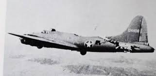
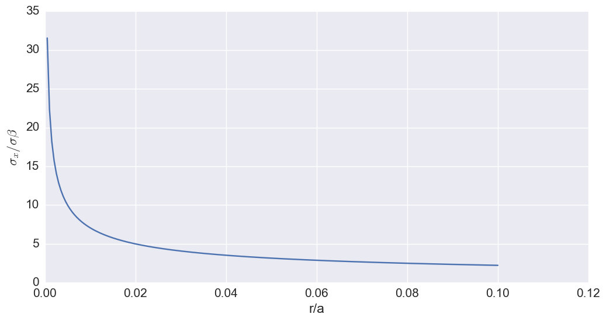
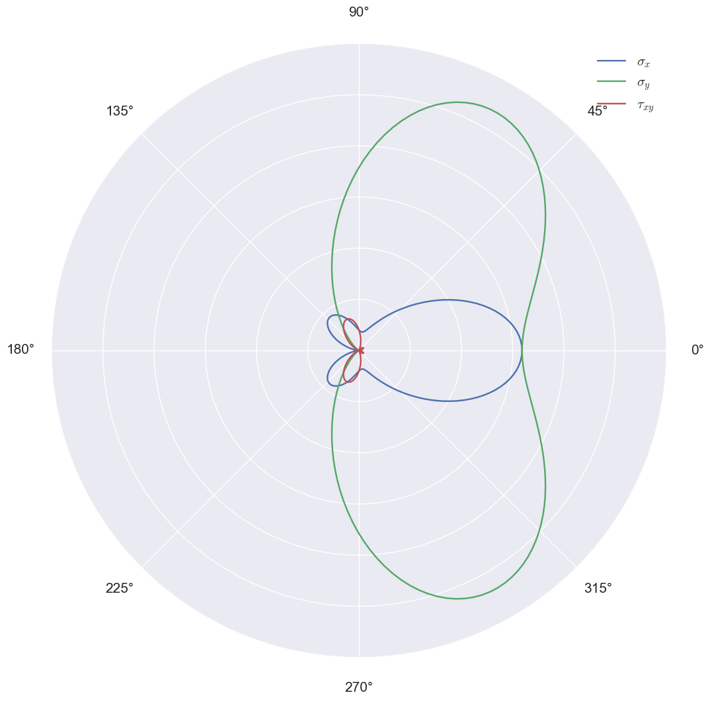

## AE 737: Mechanics of Damage Tolerance
Lecture 1 - Stress Intensity

Dr. Nicholas Smith

Wichita State University, Department of Aerospace Engineering

18 January 2022

---
## schedule

- 18 Jan - Introduction, Stress Intensity
- 20 Jan - Common Stress Intensity Factors
- 25 Jan - Superposition, Compounding
- 27 Jan - Curved Boundaries, HW 1 Due

----
## outline

- introduction
- syllabus
- overview
- fracture mechanics
- stress intensity
- making good plots

---
## about me

 <!-- .element width="40%" -->

----
## education

- B.S. in Mechanical Engineering from Brigham Young University
  - Worked with ATK to develop tab-less gripping system for tensile testing composite tow specimens
  - Needed to align the specimen, as well as grip it without causing a stress concentration

----
## education

- M.S. and Ph.D. from School of Aeronautics and Astronautics at Purdue University
  - Worked with Boeing to simulate mold flows
  - First ever mold simulation with anisotropic viscosity

----
## research

----
## research

----
## research

- No simulation is currently able to predict fiber orientation from these processes
- Part of the challenge is that we only have information from initial state and final state
- I want to quantify intermediate stages using a transparent mold

----
## research

  <ul>
  <li> Composites are being used in 3D printing now </li>
  <li> Printing patterns are optimized for isotropic materials </li>
  <li> Sometimes composites hurt more than they help when not utilized properly </li>

----
## introductions

- Name
- Student status (Undergrad, Masters, Ph.D)
- Full time or part time student?
- One interesting thing to remember you by

---
## course textbook

- Printed notes from Dr. Bert L. Smith and Dr. Walter J. Horn
- Bring $30 cash or check to AE offices to pick up your copy
- Make checks out to Wichita State University
- Homework will be administered via Blackboard
- Supplemental textbooks are listed in the syllabus and in the text for further study

----
## homework

- Homework will be posted and submitted via Blackboard assignments
- Homework will be self-graded: I will give you a score based only on completion
- One week (generally) after the Homework is due, a second Blackboard assignment will be due for the self-grade
- You need to go through the posted solutions and compare your work to the solutions
- This will also be graded only for completion

----
## office hours

- Fill out the Doodle link I have sent to indicate your office hours preference
- You can also schedule an in-person or remote office visit via e-mail

---
## tentative course outline

-  Section 1 - fracture mechanics
  -  Stress intensity (18 Jan)
  -  Plastic zone (25 Jan)
  -  Fracture toughness (1 Feb)
  -  Residual strength (8 Feb)
  -  Multiple Site Damage (15 Feb)
  -  Mixed-Mode Fracture (17 Feb)
  -  Exam 1 (1 Mar)

----
## tentative course outline

-  Section 2 - fatigue and propagation
  -  Fatigue analysis (22 Feb)
  -  Crack growth (22 Mar)
  -  Exam 2 (12 Apr)

----
## tentative course outline

- Section 3 - damage tolerance
  - Damage tolerance (12 Apr)
  - Test methods
  - Finite elements
  - Non Destructive Testing
  - Special topics
  - Final project (due 6 May)

----
## grades

- Homework 10%
- Exam 1 30%
- Exam 2 30%
- Final Project 30%

| A   | A-    | B+    | B     | B-    | C+    | C     | C-    | D+    | D     | D-    | F   |
|-----|-------|-------|-------|-------|-------|-------|-------|-------|-------|-------|-----|
| 93+ | 90-93 | 87-90 | 83-87 | 80-83 | 77-80 | 73-77 | 70-73 | 67-70 | 63-67 | 60-63 | <60 |

----
## final project

-  Perform residual strength, fatigue and damage tolerance analysis on a real part
-  Examples: car axle, fuselage panel, wing panel, landing gear, bike pedal
-  Individual project
-  More discussion after Exam 1

----
## class expectations

-  Consider the cost (to you or others) of your being in class
-  I ask that you refrain from distracting behaviors during class
-  When you have something more important than class to take care of, please take care of it outside of class

----
## software, in-class examples

-  This class will involve a great deal of multi-step calculations
-  While it is possible to do these by hand on paper, I STRONGLY recommend using some form of software
-  Excel, MATLAB, Python, Maple, Mathematica, etc. can all be used
-  Most of my in-class demos will use Python (and will be linked in notes)

---
## damage

-  In linear elasticity, we generally consider materials in their pristine state
-  Realities of manufacturing, cyclic loads, and unforeseen loads result in a material which is something other than pristine
-  In this course we will develop methods for predicting the strength of a material with some damage (residual strength)
-  We will learn to predict the rate at which damage will grow (fatigue)

----
## damage tolerance

-  There are many ways to address the problem of damage in a material
	1.  Infinite-life design
	2.  Safe-life design
	3.  Damage tolerant design
-  To ensure damage tolerant design, we must ensure that crack growth is always stable
-  Another important concept of damage tolerant design is to include multiple load paths, so failure in one part does not cause critical failure of the whole structure

----
## damage tolerance

----
## damage tolerance

----
## damage tolerance

-  A B-17 collided with a Germain plane during WWII
-  In spite of the damage, the B-17 was able to fly 90 minutes and land safely

----
## damage tolerance

----
## damage tolerance

-  An example of multiple damaged sites occurred on a Boeing 737 in 1988
-  Damage around multiple rivet holes connected and a full piece of the fuselage was blown off
-  The plane was able to land safely
-  This particular instance led to the study of "Multiple Site Damage"

---
## fracture mechanics

-  *Linear Elastic Fracture Mechanics* is the study of the propagation of cracks in materials
-  There are some corrections we add to account for plasticity
-  In this course we will not follow the full mathematical development of fracture mechanics (there is a separate course dedicated to that)
-  Instead we will take some results and apply them

----
## fracture mechanics

-  In fracture mechanics we consider three different modes
-  Mode I is known as the "opening mode"
-  Mode II is known as the "sliding mode"
-  Mode III is known as the "tearing mode"

----
## fracture mechanics

---
## stress intensity

-  A key finding from Linear Elastic Fracture Mechanics (LEFM) is known as the *Stress Intensity Factor*
-  The stress intensity factor is often written in this form

`$$ K = \sigma \sqrt{ \pi a} \beta $$`

-  Where *K* is the stress intensity factor, `$ \sigma $` is the applied stress, *a* is the crack length, and `$ \beta $` is a dimensionless parameter depending on geometry

----
## stress intensity

-  Be careful that although the notation is similar, the *Stress Intensity Factor* is different from the *Stress Concentration Factor* from strength of materials
-  We are usually most concerned with Mode I, but there will be a unique stress intensity factor for each mode, we label these `$ K_I $`, `$ K_{II} $`, and `$ K_{III} $`
-  If no subscript is given, assume Mode I

----
## stress intensity

-  For brittle materials (where "linear" fracture mechanics assumptions hold true) we can find the full stress field near the crack in terms of the stress intensity factor

`$$	\begin{aligned}
		\sigma_x &= \frac{K_I}{\sqrt{2\pi r}} \cos \frac{\theta}{2} \left(1-\sin \frac{\theta}{2}\sin \frac{3\theta}{2}\right)\\
		\sigma_y &= \frac{K_I}{\sqrt{2\pi r}} \cos \frac{\theta}{2} \left(1+\sin \frac{\theta}{2}\sin \frac{3\theta}{2}\right)\\
		\tau_{xy} &= \frac{K_I}{\sqrt{2\pi r}} \sin \frac{\theta}{2} \cos \frac{\theta}{2}\cos \frac{3\theta}{2}
\end{aligned} $$`

----
## mode II

-  Similarly for Mode II we find

`$$	\begin{aligned}
		\sigma_x &= \frac{-K_{II}}{\sqrt{2\pi r}} \sin \frac{\theta}{2} \left(2+\cos \frac{\theta}{2}\cos \frac{3\theta}{2}\right)\\
		\sigma_y &= \frac{K_{II}}{\sqrt{2\pi r}} \sin \frac{\theta}{2} \cos \frac{\theta}{2}\cos \frac{3\theta}{2}\\
		\tau_{xy} &= \frac{K_{II}}{\sqrt{2\pi r}} \cos \frac{\theta}{2} \left(1-\sin \frac{\theta}{2}\sin \frac{3\theta}{2}\right)
\end{aligned} $$`

----
## mode III

-  And for Mode III

`$$	\begin{aligned}
		\tau_{xz} &= \frac{-K_{III}}{\sqrt{2\pi r}} \sin \frac{\theta}{2} \\
		\tau_{yz} &= \frac{K_{III}}{\sqrt{2\pi r}} \cos \frac{\theta}{2}
\end{aligned} $$`

---
## plotting

-  Plotting is an important part of graduate work, and this course
-  There are many software programs which can generate good scientific plots
  -  Microsoft Excel
  -  MATLAB
  -  Maple
  -  Mathematica
  -  Python
  -  R
  -  Plot.ly

----
## plotting

-  You are welcome to use whatever software you desire, I will use Python for a quick demonstration
-  This demo is accessible [here](https://colab.research.google.com/drive/1GaAMFmEkYn7M8dNxCbT9jGGOdM8qSapK?usp=sharing)

----
## plotting

-  To make a good scientific plot, we must first decide what to plot, and which plot style will best illustrate our data
-  Let us consider the Mode I stress near a crack tip

`$$ \begin{aligned}
		\sigma_x &= \frac{K_I}{\sqrt{2\pi r}} \cos \frac{\theta}{2} \left(1-\sin \frac{\theta}{2}\sin \frac{3\theta}{2}\right)\\
		\sigma_y &= \frac{K_I}{\sqrt{2\pi r}} \cos \frac{\theta}{2} \left(1+\sin \frac{\theta}{2}\sin \frac{3\theta}{2}\right)\\
		\tau_{xy} &= \frac{K_I}{\sqrt{2\pi r}} \sin \frac{\theta}{2} \cos \frac{\theta}{2}\cos \frac{3\theta}{2}
\end{aligned} $$`

----
## plotting

-  One interesting plot could be to examine stress magnitudes along the crack propagation direction as we get farther away from the crack
-  In this case we would have `$ \theta = 0 $`.
-  Since `$ \theta $` is a constant, it is not ideal to use a polar plot, instead we will use a standard rectangular plot

----
## plotting

-  Since we are looking at stresses near the crack tip, it is convenient to normalize the distance by the crack length
-  If substitute for `$\theta$` and `$K_I$` we have

`$$\begin{aligned}
		\sigma_x &= \frac{\sigma\sqrt{\pi a} \beta}{\sqrt{2\pi r}} \\
		\sigma_y &= \frac{\sigma\sqrt{\pi a} \beta}{\sqrt{2\pi r}} \\
		\tau_{xy} &= 0
\end{aligned}$$`

----
## plotting

-  Since `$\sigma_x$` and `$\sigma_y$` are identical for this case, we consider only one, and normalize by the applied stress. After simplification

`$$
		\frac{\sigma_x}{\sigma\beta} = \frac{1}{\sqrt{2}} \frac{1}{\sqrt{(r/a)}}
$$`

----
## plotting

----
## plotting

-  Since we found `$\sigma_x = \sigma_y$` for `$\theta=0$`, we decide it might be better to look at a polar plot using `$\theta$` as a variable
-  To make a polar plot in this style, we need a function such that `$r = f(\theta)$`
-  To do this we consider a constant stress value, we will solve for and plot the distance, `$r$` at which the stress is equal to the same constant value for each of the three stress terms

----
## plotting

`$$ \begin{aligned}
  \sigma_x = C &= \frac{K_I}{\sqrt{2\pi r}} \cos \frac{\theta}{2} \left(1-\sin \frac{\theta}{2}\sin \frac{3\theta}{2}\right)\\
  \sigma_y = C &= \frac{K_I}{\sqrt{2\pi r}} \cos \frac{\theta}{2} \left(1+\sin \frac{\theta}{2}\sin \frac{3\theta}{2}\right)\\
  \tau_{xy} = C &= \frac{K_I}{\sqrt{2\pi r}} \sin \frac{\theta}{2} \cos \frac{\theta}{2}\cos \frac{3\theta}{2}
\end{aligned} $$`

----
## plotting

-  After solving for `$r$` we find

`$$ \begin{aligned}
		r &= \frac{K_I^2}{2 C^2 \pi} \cos^2 \frac{\theta}{2} \left(1-\sin \frac{\theta}{2}\sin \frac{3\theta}{2}\right)^2\\
		r &= \frac{K_I^2}{2 C^2 \pi} \cos^2 \frac{\theta}{2} \left(1+\sin \frac{\theta}{2}\sin \frac{3\theta}{2}\right)^2\\
		r &= \frac{K_I^2}{2 C^2 \pi} \sin^2 \frac{\theta}{2} \cos^2 \frac{\theta}{2}\cos^2 \frac{3\theta}{2}
\end{aligned} $$`

----
## plotting

 <!-- .element width="50%" -->
