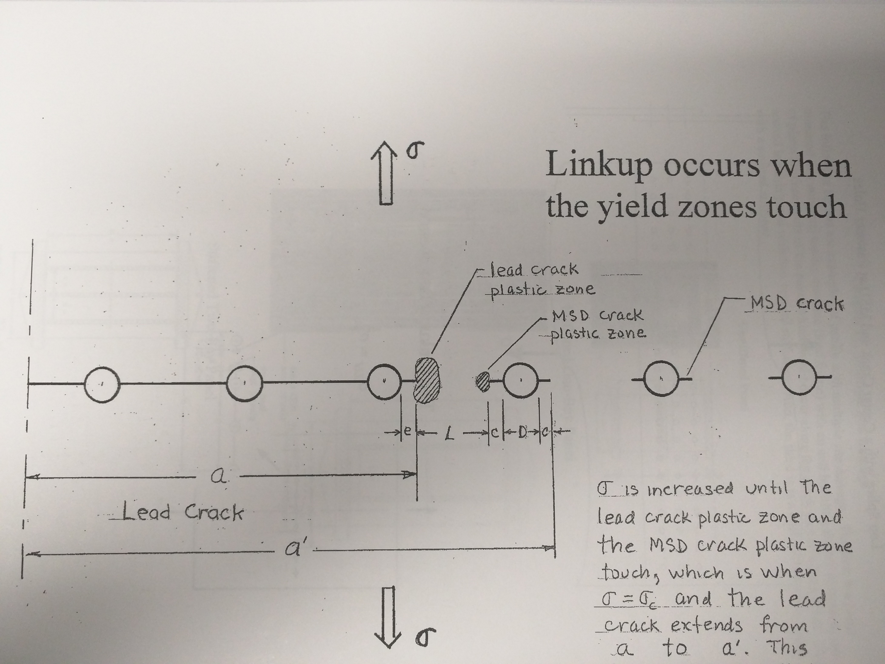

## AE 737: Mechanics of Damage Tolerance
Lecture 11 - Multiple Site Damage, Mixed-Mode Fracture

Dr. Nicholas Smith

Wichita State University, Department of Aerospace Engineering

8 March, 2021

----
## schedule

- 8 Mar - Multiple Site Damage, Mixed-Mode Fracture
- 10 Mar - Exam 1 Review
- 12 Mar - HW5 Due, HW4 Self-grade due
- 15 Mar - Exam 1 
- 17 Mar - Fatigue
- 19 Mar - HW5 Self-grade due

----
## outline
<!-- TOC START min:1 max:1 link:false update:true -->
- multiple site damage
- mixed mode fracture

<!-- TOC END -->

---
# multiple site damage

----
## multiple site damage

-   Often damage can accumulate among multiple sources
-   This is very common when there are a series of holes, each can develop cracks with a potential to link up
-   "link up" occurs when the plastic zones between two adjacent cracks touch

----
## linkup

 <!-- .element width="50%" -->

----
## linkup equation

-   We know that

`$$R_p = \frac{1}{2\pi}\left(\frac{K_{Ia}}{\sigma_{YS}}\right)^2$$`

`$$r_p = \frac{1}{2\pi}\left(\frac{K_{Il}}{\sigma_{YS}}\right)^2$$`

-   Where we define the stress intensity factors at a and L as

`$$K_{Ia} = \sigma \sqrt{\pi a} \beta_a$$`

`$$K_{Il} = \sigma \sqrt{\pi l} \beta_l$$`

----
## linkup equation

-   Since fast cracking occurs when `$R_p + r_p = L$` we solve for the condition where `$R_p + r_p < L$`
- 

`$$\begin{aligned}
  \frac{1}{2\pi}\left(\frac{K_{Ia}}{\sigma_{YS}}\right)^2 + \frac{1}{2\pi}\left(\frac{K_{Il}}{\sigma_{YS}}\right)^2 & < L\\
  \frac{1}{2\pi\sigma_{YS}^2} \left\[K_{Ia}^2 + K_{Il}^2\right\] & < L
\end{aligned}$$`

----
## linkup equation

`$$\begin{aligned}
  \frac{1}{2\pi\sigma_{YS}^2} \left\[\sigma^2 \pi a \beta_a^2 + \sigma^2 \pi l \beta_l^2\right\] & < L \\
  \frac{\sigma^2}{2\sigma_{YS}^2} \left\[a \beta_a^2 + l \beta_l^2\right\] & < L \\
          \sigma_c &= \sigma_{YS}\sqrt{\frac{2L}{a \beta_a^2 + l \beta_l^2}}
\end{aligned}$$`

----
## example

worked link-up example [here](../examples/Link-Up.html)

----
## modified linkup equations

-   We see that for a brittle material (with a small plastic zone) we predict no effect of "link-up"
-   This does not agree with test data
-   Even the 2024 predictions don't agree well with test data
-   WSU used some empirical parameters to modify the linkup equations and better predict residual strength when multiple site damage is present

----
## modified 2024

-   For 2024-T3 we use the following procedure
-   First find `$\sigma_c$` from the unmodified equation

`$$\sigma_{c,mod} = \frac{\sigma_c}{A_1 \ln (L) + A_2}$$`

-   Where *A*1 = 0.3065 and *A*2 = 1.3123 for A-basis yield strength and *A*1 = 0.3054 and *A*2 = 1.3502 for B-basis yield strength
-   The same equation can also be used for 2524 with *A*1 = 0.1905, *A*2 = 0.9683 for A-basis yield and *A*1 = 0.2024, *A*2 = 1.0719 for B-basis yield

----
## modified 7075

-   A similar modification was made for 7075

`$$\sigma_{c,mod} = \frac{\sigma_c}{B_1 + B_2 L}$$`

-   Where *B*1 = 1.377, *B*2 = 1.042 for A-basis yield strength and *B*1 = 1.417, *B*2 = 1.073 for B-basis yield strength

----
## modified 7075

-   However, since general fracture had a closer prediction to real failure than the linkup equation, it may make more sense to modify the brittle fracture equation

`$$\sigma_{c,mod} = \frac{K_c}{\sqrt{\pi a} (0.856 - 0.496 \ln(L))}$$`

---
# mixed mode fracture

----
## mixed-mode fracture

-   Most cracks are primarily Mode I, but sometimes Mode II can also have an effect
-   We can look at the combined stress field for Mode I and Mode II
-   Recall the stress field near the crack tip

----
## stress field

`$$\begin{aligned}
  \sigma_x &= \frac{K_I}{\sqrt{2\pi r}} \cos \frac{\theta}{2} \left(1-\sin \frac{\theta}{2}\sin \frac{3\theta}{2}\right)\\\\
  \sigma_y &= \frac{K_I}{\sqrt{2\pi r}} \cos \frac{\theta}{2} \left(1+\sin \frac{\theta}{2}\sin \frac{3\theta}{2}\right)\\\\
  \tau_{xy} &= \frac{K_I}{\sqrt{2\pi r}} \sin \frac{\theta}{2} \cos \frac{\theta}{2}\cos \frac{3\theta}{2}
\end{aligned}$$`

----
## mixed-mode fracture

-   For Mode II we have

`$$\begin{aligned}
  \sigma_x &= \frac{-K_{II}}{\sqrt{2\pi r}} \sin \frac{\theta}{2} \left(2+\cos \frac{\theta}{2}\cos \frac{3\theta}{2}\right)\\\\
  \sigma_y &= \frac{K_{II}}{\sqrt{2\pi r}} \sin \frac{\theta}{2} \cos \frac{\theta}{2}\cos \frac{3\theta}{2}\\\\
  \tau_{xy} &= \frac{K_{II}}{\sqrt{2\pi r}} \cos \frac{\theta}{2} \left(1-\sin \frac{\theta}{2}\sin \frac{3\theta}{2}\right)
\end{aligned}$$`

----
## polar coordinates

-   In mixed-mode fracture problems, the crack will generally propagate in a different direction from the initial crack plane
-   It is more convenient to handle this scenario in Polar Coordinates
-   We can convert stress from Cartesian coordinates to Polar Coordinates using the stress transformation equations

----
## polar coordinates

`$$\begin{aligned}
  \sigma_r &= \sigma_x \cos^2 \theta + \sigma_y \sin^2 \theta + 2\tau_{xy} \sin \theta \cos \theta\\\\
  \sigma_\theta &= \sigma_x \sin^2 \theta + \sigma_y \cos^2 \theta - 2\tau_{xy} \sin \theta \cos \theta\\\\
  \tau_{r\theta} &= -\sigma_x \sin \theta \cos \theta + \sigma_y \sin \theta \cos \theta + \tau_{xy} (\cos^\theta - \sin^2 \theta)
\end{aligned}$$`

----
## combined stress field

-   When we convert the stress fields from Mode I and Mode II into polar coordinates and combine them, we find

`$$\small{\begin{aligned}
  \sigma_r &= \frac{K_I}{\sqrt{2\pi r}} \left(\frac{5}{4}\cos \frac{\theta}{2} - \frac{1}{4}\cos \frac{3\theta}{2}\right) + \frac{K_{II}}{\sqrt{2\pi r}}\left(-\frac{5}{4}\sin \frac{\theta}{2} + \frac{3}{4}\sin \frac{3\theta}{2}\right)\\\\
  \sigma_\theta &= \frac{K_I}{\sqrt{2\pi r}} \left(\frac{3}{4}\cos \frac{\theta}{2} + \frac{1}{4}\cos \frac{3\theta}{2}\right) + \frac{K_{II}}{\sqrt{2\pi r}}\left(-\frac{3}{4}\sin \frac{\theta}{2} - \frac{3}{4}\sin \frac{3\theta}{2}\right)\\\\
  \tau_{r\theta} &= \frac{K_I}{\sqrt{2\pi r}} \left(\frac{1}{4}\sin \frac{\theta}{2} + \frac{1}{4}\sin \frac{3\theta}{2}\right) + \frac{K_{II}}{\sqrt{2\pi r}}\left(\frac{1}{4}\cos \frac{\theta}{2} + \frac{3}{4}\cos \frac{3\theta}{2}\right)
\end{aligned} }$$`

----
## max circumferential stress

-   The Maximum Circumferential Stress Criterion assumes that a crack will propagate in the principal direction
-   In this direction, the shear stress is 0
-   The fracture toughness is determined by the Mode I fracture toughness of the material

----
## max circumferential stress

-   **Note:** In this discussion, we will use *K**IC* to differentiate Mode I fracture toughness from Mode II fracture toughness. This does NOT necessarily mean we are referring to plane strain fracture toughness
-   Thus fracture begins when

`$$\sigma_{\theta}(\theta_P) = \sigma_\theta(\theta=0, K_{II}=0, K_I = K_{Ic}) = \frac{K_{IC}}{\sqrt{2\pi r}}$$`

----
## max circumferential stress

-   Following the above assumptions, we can solve these equations to find `$\theta_p$`
-   Note: This assumes that we know both *K**I* and *K**II*, in this class we have not discussed any Mode II stress intensity factors, so they will be given.

----
## max circumferential stress

-   In this case it simplifies to

`$$K_I \sin \theta_p + K_{II} (3\cos \theta_p -1) = 0$$`

-   and

`$$4K_{IC} = K_I\left(3\cos \frac{\theta}{2} + \cos \frac{3\theta}{2}\right) - 3K_{II}\left(\sin \frac{\theta}{2} + \sin \frac{3\theta}{2}\right)$$`

----
## maximum circumferential stress criterion

-   The general form for a Mode II stress intensity factor is

`$$K_{II} = \tau \sqrt{\pi a} \beta^\prime$$`

----
## example

Assuming `$\sigma = 4\tau$`, `$K_{IC} = 60 \text{ ksi} \sqrt{\text{in}}$`, and 2*a* = 1.5 in.

**Note:** Assume `$\beta = \beta^\prime = 1$`

----
## principal stress

-   In the maximum circumferential stress criterion, we found the principal stress direction near the crack tip in polar coordinates
-   We can also find the principal direction (if there were no crack) in Cartesian coordinates
-   **Note:** This is not mathematically rigorous, but much easier to calculate and sometimes it's close enough

----
## principal stress

-   If we make a free body cut along some angle `$\theta$` we find, from equilibrium

`$$\small{\begin{aligned}
      \begin{split}
  0 &= \sigma_\theta dA - \sigma_x dA \sin^2 \theta - \sigma_y dA \cos^2 \theta + 2\tau_{xy} dA \cos \theta \sin \theta\\\\
  \sigma_\theta &= \sigma_x \sin^2 \theta + \sigma_y \cos^2 \theta - 2 \tau_{xy} \sin \theta \cos \theta\\\\
  \frac{\partial \sigma_\theta}{\partial \theta} &= (\sigma_x - \sigma_y) \sin 2\theta_p - 2\tau_{xy} \cos 2\theta_P\\\\
  \tan 2\theta_P &= \frac{2 \tau_{xy}}{\sigma_x - \sigma_y}
  \end{split}
\end{aligned}}$$`

----
## principal stress

-   As before, we consider crack propagation purely due to Mode I
-   In the principal stress criterion, we find the maximum Mode I stress as a function of the remote applied stress

`$$\sigma_{P1} = C\sigma$$`

-   We then find the remote failure stress by

`$$\sigma_c = \frac{K_{IC}}{C\sqrt{\pi a}\beta}$$`

----
## example

Assuming `$\sigma = 4\tau$`, `$K_{IC} = 60 \text{ ksi} \sqrt{\text{in}}$`, and 2*a* = 1.5 in.

**Note:** Assume `$\beta = \beta^\prime = 1$`

----
## example

worked mixed-mode fracture example [here](../examples/Mixed%20Mode%20Fracture.html)
