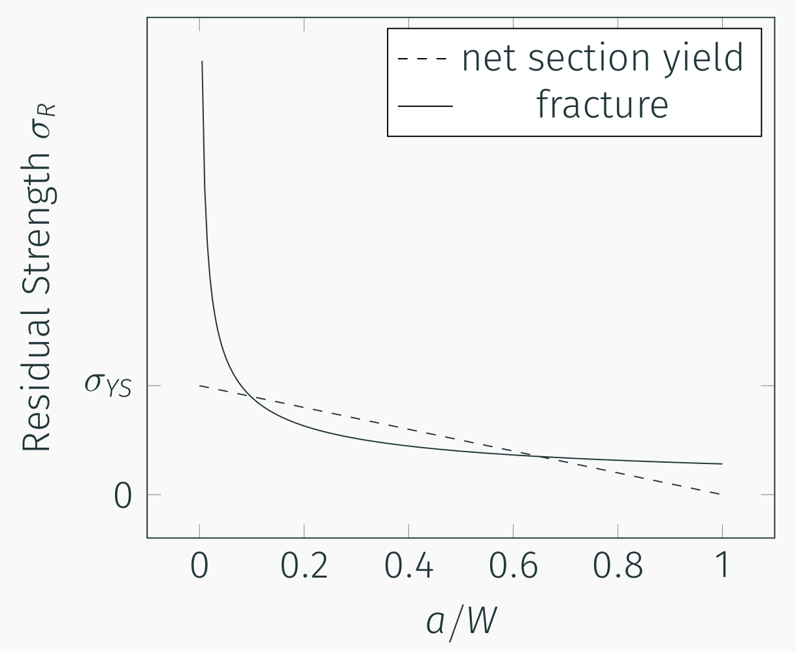

## AE 737: Mechanics of Damage Tolerance
Lecture 12 - Exam 1 Review

Dr. Nicholas Smith

Wichita State University, Department of Aerospace Engineering

February 27, 2020

----
## schedule

- 27 Feb - Exam Review, Homework 5 Due
- 3 Mar - Exam 1
- 5 Mar - Stress-based Fatigue
- 10 Mar - Stress-based fatigue

----
## outline

<!-- TOC START min:1 max:1 link:false update:true -->
- exam
- stress intensity
- plastic zone
- fracture toughness
- residual strength
- stiffeners
- multiple site damage
- mixed-mode fracture
- review problems
<!-- TOC END -->

---
# exam

----
## exam format

-   Look at the exam and equation sheet posted on Blackboard
-   Expect a mixture of quantitative and qualitative questions (some short answer justifications)
-   5 questions (current plan)
-   I curve all my exams linearly
-   Pay attention to what the question is asking for and be sure to answer all parts of the question
-   There will be no T/F section, but those questions in the text can still be useful for review

----
## equation sheet

-   The equation sheet for this exam will be the same as the previous equation sheet posted to Blackboard
-   Other specific information and formulas (mixed-mode fracture, stiffener data, etc.) will be given in the problem

----
## topics

-   Stress Intensity
-   Fracture Toughness
-   Residual Strength
-   Stiffeners
-   Multiple Site Damage
-   Mixed Mode Fracture

---
# stress intensity

----
## topics

-   Stress intensity
-   Compounding
-   Superposition
-   Cracks near curved boundaries

---
# plastic zone

----
## Irwin's first approximation

 <!-- .element width="50%" -->

----
## Irwin's second approximation

 <!-- .element width="50%" -->

---
# fracture toughness

----
## fracture toughness

-   The critical load at which a cracked specimen fails produces a critical stress intensity factor
-   The "critical stress intensity factor" is known as *K**c*
-   For Mode I, this is called *K**Ic*
-   The critical stress intensity factor is also known as fracture toughness

$$K\_{IC} = \\sigma\_c \\sqrt{\\pi a}\\beta$$

-   NOTE: "Fracture Toughness" can also refer to *G**Ic*, which is analogous to *K**Ic*, but not the same

----
## fracture toughness

-   Fracture toughness is a material property, but it is only well-defined in certain conditions
-   Brittle materials
-   Plane strain (smaller plastic zone)
-   In these cases ASTM E399-12 is used.

----
## fracture toughness

 <!-- .element width="50%" -->

----
## unstable cracks

-   Stable crack growth means the crack extends only with increased load
-   Unstable crack growth means the crack will continue to extend indefinitely under the same load
-   For a perfectly brittle material, there is no stable crack growth, as soon as a critical load is reached, the crack will extend indefinitely

----
## stable cracks

-   For an elastic-plastic material, once the load is large enough to extend the crack, it will extend slightly
-   The load must be continually increased until a critical value causes unstable crack growth

----
## fracture toughness

-   During an experiment, we will record the crack length and applied load (*P**i*, *a**i*) each time we increase the load
-   We can calculate a unique stress intensity factor *K**Ii* at each of these points
-   These are then used to create a "K-curve", plotting *K**I* vs. *a*

----
## K-curve

 <!-- .element width="60%" -->

---
# residual strength

----
## residual strength

-   In the last chapter we performed some basic residual strength analysis by checking for net section yield
-   As the crack grows, the area of the sample decreases, increasing the net section stress
-   The residual strength, `$\sigma_R$` is given in terms of the gross area, so as the crack grows the residual strength due to yield decreases
-   We can relate the net-section stress to `$\sigma_R$` by

$$\\sigma\_R = \\sigma\_{YS} \\frac{A\_{net}}{A\_{gross}}$$

----
## residual strength

 <!-- .element width="60%" -->

----
## residual strength

-   For brittle fracture to occur, we need to satisfy the condition

$$\\sigma\_R = \\sigma\_C = \\frac{K\_C}{\\sqrt{\\pi a}\\beta}$$

----
## residual strength

 <!-- .element width="60%" -->

----
## residual strength

-   Within the same family of materials (i.e. Aluminum), there is generally a trade-off between yield stress and fracture toughness
-   As we increase the yield strength, we decrease the fracture toughness (and vice versa)

---
# stiffeners

----
## crack growth

-   In general, residual strength curves do NOT give any information about crack growth
-   When $\sigma_R$ is exceeded, the panel fails due to unstable crack growth
-   Stiffeners reverse this trend to some extent, but causing some sections of residual strength curve to have positive slope
-   When the slope of the residual strength curve is positive, crack growth is stable
-   Thus in some cases, we can predict some amount of crack growth

----
## critical crack length sketch

----
## residual strength sketch

---
# multiple site damage

---
# mixed-mode fracture

---
# review problems

----
## review problems

----
## review

  <ul>
    <li>   p. 415 problem 6</li>
    <li>   p. 418 problem 9</li>
    <li>   p. 419 problem 10-11</li>
    <li>   p. 421 problem 13</li>
    <li>   p. 423 problem 17</li>
    <li>   p. 424 problem 3</li>
    <li>   p. 425 problem 5</li>
  </ul>

  <ul>
    <li>   p. 426 problem 1</li>
    <li>   p. 427 problem 3</li>
    <li>   p. 429 problem 6</li>
    <li>   p. 432 problem 9</li>
    <li>   p. 433 problem 14</li>
    <li>   p. 434 problem 3</li>
    <li>   p. 437 problem 8</li>
  </ul>

