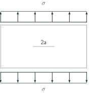
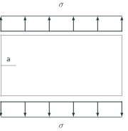
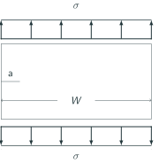
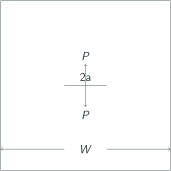

## AE 737: Mechanics of Damage Tolerance
Lecture 2 - Common Stress Intensity Factors

Dr. Nicholas Smith

Wichita State University, Department of Aerospace Engineering

20 January, 2022

----
## schedule

- 20 Jan - Common Stress Intensity Factors
- 25 Jan - Superposition, Compounding
- 27 Jan - Curved Boundaries, HW 1 Due
- 1 Feb - Plastic Zone

---
# review

----
## fracture mechanics

-  In fracture mechanics we consider three different modes
-  Mode I is known as the "opening mode"
-  Mode II is known as the "sliding mode"
-  Mode III is known as the "tearing mode"

----
## fracture mechanics

---
## stress intensity

-  A key finding from Linear Elastic Fracture Mechanics (LEFM) is known as the *Stress Intensity Factor*
-  The stress intensity factor is often written in this form

`$$ K = \sigma \sqrt{ \pi a} \beta $$`

-  Where *K* is the stress intensity factor, `$ \sigma $` is the applied stress, *a* is the crack length, and `$ \beta $` is a dimensionless parameter depending on geometry

----
## stress Intensity

-  Be careful that although the notation is similar, the *Stress Intensity Factor* is different from the *Stress Concentration Factor* from strength of materials
-  We are usually most concerned with Mode I, but there will be a unique stress intensity factor for each mode, we label these `$ K_I $`, `$ K_{II} $`, and `$ K_{III} $`
-  If no subscript is given, assume Mode I

----
## stress intensity

-  For brittle materials (where "linear" fracture mechanics assumptions hold true) we can find the full stress field near the crack in terms of the stress intensity factor

`$$	\begin{aligned}
	\sigma_x &= \frac{K_I}{\sqrt{2\pi r}} \cos \frac{\theta}{2} \left(1-\sin \frac{\theta}{2}\sin \frac{3\theta}{2}\right)\\
	\sigma_y &= \frac{K_I}{\sqrt{2\pi r}} \cos \frac{\theta}{2} \left(1+\sin \frac{\theta}{2}\sin \frac{3\theta}{2}\right)\\
	\tau_{xy} &= \frac{K_I}{\sqrt{2\pi r}} \sin \frac{\theta}{2} \cos \frac{\theta}{2}\cos \frac{3\theta}{2}
\end{aligned} $$`

----
## mode II

-  Similarly for Mode II we find

`$$	\begin{aligned}
	\sigma_x &= \frac{-K_{II}}{\sqrt{2\pi r}} \sin \frac{\theta}{2} \left(2+\cos \frac{\theta}{2}\cos \frac{3\theta}{2}\right)\\
	\sigma_y &= \frac{K_{II}}{\sqrt{2\pi r}} \sin \frac{\theta}{2} \cos \frac{\theta}{2}\cos \frac{3\theta}{2}\\
	\tau_{xy} &= \frac{K_{II}}{\sqrt{2\pi r}} \cos \frac{\theta}{2} \left(1-\sin \frac{\theta}{2}\sin \frac{3\theta}{2}\right)
\end{aligned} $$`

----
## mode III

-  And for Mode III

`$$	\begin{aligned}
	\tau_{xz} &= \frac{-K_{III}}{\sqrt{2\pi r}} \sin \frac{\theta}{2} \\
	\tau_{yz} &= \frac{K_{III}}{\sqrt{2\pi r}} \cos \frac{\theta}{2}
\end{aligned} $$`

---
# common stress intensity factors

----
## center crack, infinite width

`$$K_I = \sigma \sqrt{\pi a}$$`

----
## center crack, finite width

----
## center crack, finite width

`$$K_I = \sigma \sqrt{\pi a} \sqrt{\sec (\pi a/W)}$$`

- Accurate within 0.3% for `$2a/W \le 0.7$`
- within 1.0% for `$2a/W = -.8$`

`$$K_I = \sigma \sqrt{\pi a} \left[1.0 - 0.025\left(\frac{2a}{W}\right)^2 + 0.06\left(\frac{2a}{W}\right)^4\right]\sqrt{\sec (\pi a/W)}$$`

- Accurate within 0.1% for all crack lengths.

----
## edge crack, semi-infinite width

`$$K_I = 1.122 \sigma \sqrt{\pi a}$$`

----
## edge crack, finite width

----
## edge crack, finite width

`$$\beta = \left[1.122 - 0.231 \frac{a}{W} + 10.55 \left(\frac{a}{W}\right)^2 - 21.71 \left(\frac{a}{W}\right)^3 + 30.82 \left(\frac{a}{W}\right)^4\right]$$`

- Within 0.5% accuracy for `$\frac{a}{W} < 0.6$`

`$$\beta = \frac{0.752 + 2.02\frac{a}{W} + 0.37\left(1-\sin \frac{\pi a}{2W}\right)^3}{\cos \frac{\pi a}{2W}}\sqrt{\frac{2W}{\pi a} \tan \frac{\pi a}{2W}}$$`

- Within 0.5% accuracy for `$0 < \frac{a}{W} < 1.0$`

----
## edge crack, bending moment

----
## edge crack, bending moment

- The usual form for stress intensity still applies

`$$K_I = \sigma \sqrt{\pi a} \beta$$`

- Where `$\sigma = \frac{6M}{tW^2}$`

`$$\beta = 1.122 - 1.40 \left(\frac{a}{W}\right) + 7.33 \left(\frac{a}{W}\right)^2 - 13.08\left(\frac{a}{W}\right)^3 + 14.0 \left(\frac{a}{W}\right)^4$$`

- valid within 0.2% accuracy for `$\frac{a}{W} \le 0.6$`

----
## edge crack, bending moment

`$$\beta = \frac{0.923 + 0.199 \left(1-\sin \frac{\pi a}{2W}\right)^4}{\cos \frac{\pi a}{2W}}\sqrt{\frac{2W}{\pi a} \tan \frac{\pi a}{2W}}$$`

- valid within 0.5% for any `$\frac{a}{W}$`

----
## nominal bending stress

- The nominal bending stress is for rectangular cross-sections
- A more general form is given by `$\sigma = \frac{Mc}{I}$`
- Where for a rectangular cross-section, `$c=W/2$` and `$I=tW^3/12$` which simplifies as shown previously

----
## center crack, finite width, splitting forces

----
## center crack, finite width, splitting forces

- With an applied load we use a slightly modified form for the stress intensity factor `$K_I = \frac{P}{t \sqrt{\pi a}}\beta$`
- With `$\beta$` in this case given as

`$$\beta = \frac{1 - 0.5\left(\frac{a}{W}\right)+0.975\left(\frac{a}{W}\right)^2 - 0.16\left(\frac{a}{W}\right)^3}{\sqrt{1-\left(\frac{a}{W}\right)}}$$`

----
## offset crack

----
## offset crack

`$$K_{IA} = \sigma \sqrt{\pi a} \beta_c \beta_A \text{ and } K_{IB} = \sigma \sqrt{\pi a} \beta_c \beta_B$$`

`$$ \beta_c = \sqrt{\sec \frac{\pi a}{W}}$$`

----
## offset crack

`$$\begin{aligned}
  &\begin{aligned}
  {\beta_A} &= (1-0.025\lambda^2 + 0.6\lambda^4 - \gamma \lambda^{11})\\
  &\qquad \sqrt{\sec \left(\frac{\pi \lambda}{2}\right)\frac{\sin \left(2\lambda - 4\frac{a}{W}\right)}{2\lambda - 4\frac{a}{W}}}
  \end{aligned}\\
  &\begin{aligned}
  {\beta_B} &= (1-0.025\delta^2 + 0.06\delta^4 - \zeta \lambda^{30})\\
  &\qquad \left(1+\frac{\sqrt{\sec\left(\frac{2\pi \lambda + 1.5\pi \delta}{7}\right)-1}}{1+0.21\sin \left( 8 \tan^{-1} \left(\frac{\lambda - \delta}{\lambda + \delta}\right)^{0.9}\right)}\right)
  \end{aligned}
\end{aligned}$$`
`

----
## offset crack

- The parameters `$\lambda$`, `$\delta$` are given as

`$$\begin{aligned}
      \lambda &= \frac{a}{b}\\
      \delta &= \frac{a}{W-b}
\end{aligned}$$`

----
## offset crack

- And `$\gamma$` and `$\zeta$` can be looked up on a table

| `$\frac{b}{W}$` | `$\gamma$` | `$\zeta$` |
| ---             | ---        | ---       |
| 0.1             | 0.382      | 0.114     |
| 0.25            | 0.136      | 0.286     |
| 0.4             | 0.0        | 0.0       |
| 0.5             | 0.0        | 0.0       |

----
## non-uniform stress, infinite width

----
## non-uniform stress, infinite width

- Stress intensity will be different at points $A$ and $B$

`$$\begin{aligned}
    K_{IA} &= \int_{-a}^{a} \frac{p(x)}{\sqrt{\pi a}}\frac{\sqrt{a-x}}{\sqrt{a+x}}dx\\
    K_{IB} &= \int_{-a}^{a} \frac{p(x)}{\sqrt{\pi a}}\frac{\sqrt{a+x}}{\sqrt{a-x}}dx
\end{aligned}$$`

----
## cracks around a hole

----
## cracks around a hole

- For symmetric through cracks under uniform applied stress, we have

`$$\begin{aligned}
    \beta &= \beta_1 + \beta_2\\
    \beta_1 &= F_{c/R}F_wF_{ww}\\
    \beta_2 &= \frac{\sigma_{br}}{\sigma} F_3 F_w F_{ww}\\
    F_{c/R} &= \frac{3.404 + 3.8172 \frac{c}{R}}{1 + 3.9273\frac{c}{R} - 0.00695 \left(\frac{c}{R}\right)^2 }\\
    F_w &= \sqrt{\sec \frac{\pi R}{W} \sec \frac{\pi (R+c)}{W}}
\end{aligned}$$`

----
## cracks around a hole

`$$\begin{aligned}
    &\begin{aligned}
    F_{ww} &= 1- \left(\left(1.32 \frac{W}{D} - 0.14\right)^{-(.98+\left(0.1\frac{W}{D}\right)^{0.1})}-0.02\right)\\
    &\qquad \left(\frac{2c}{W-D}\right)^N
    \end{aligned}\\
    F_3 &= 0.098 + 0.3592 e^{-3.5089\frac{c}{R}} + 0.3817 e^{-0.5515 \frac{c}{R}}
\end{aligned}$$`

----
## cracks around a hole

-  Note that

`$$\begin{aligned}
  \sigma_{br} &= \frac{P}{Dt}\\
  N &= \frac{W}{D} + 2.5 \qquad \text{when} \qquad \frac{W}{D} < 2\\
  N &= 4.5 \qquad \qquad \text{otherwise}
\end{aligned}$$`

- Also `$R$` is the radius, `$R= \frac{D}{2}$`

----
## cracks around a hole

----
## cracks around a hole

`$$\begin{aligned}
    \beta &= \beta_1 + \beta_2\\
    \beta_1 &= \beta_3 F_w F_{ww}\\
    \beta_2 &= \frac{\sigma_{br}}{\sigma} F_4 F_w F_{ww}\\
    &\begin{aligned}
    \beta_3 &= 0.7071 + 0.7548 \frac{R}{R+c} + 0.3415 \left(\frac{R}{R+C}\right)^2 + \\
    &\qquad 0.6420 \left(\frac{R}{R+c}\right)^3 + 0.9196\left(\frac{R}{R+c}\right)^4
    \end{aligned}\\
    F_4 &= 0.9580 + 0.2561 \frac{c}{R} - 0.00193 \left(\frac{c}{R}\right)^{2.5} - 0.9804 \left(\frac{c}{R}\right)^{0.5}
\end{aligned}$$`

----
## cracks around a hole

`$$\begin{aligned}
  F_w &= \sqrt{\sec \frac{\pi R}{W} \sec \frac{\pi (R + c/2)}{W-c}}\\
  F_{ww} &= 1 - N^{-\frac{W}{D}} \left(\frac{2c}{W-D}\right)^{\frac{W}{D} + 0.5}\\
  N &= 2.65 - 0.24\left(2.75 - \frac{W}{D}\right)^2\\
  N &\ge 2.275 \qquad \text{(if }N < 2.275\text{, let }N=2.275)
\end{aligned}$$`

Also note that `$R$` indicates radius, `$R=\frac{D}{2}$`

---
## group problems

1.  Find `$K_I$` for a center-cracked panel with `$W/2a = 3$` and a
    uniformly applied remote stress, `$\sigma$`.

2.  Find `$K_I$` for an edge-cracked panel with `$W/a = 3$` and a uniformly
    applied remote stress, `$\sigma$`.

3.  Find `$K_I$` for an edge-cracked panel with `$W/a = 3$` and a remote
    bending moment, `$M = tW^2\sigma/6$`.

----
## group problems

4.  Find `$K_I$` for a center-cracked panel with `$W/2a = 3$` and a
    concentrated splitting force, `$P = \sigma a t$`.

5.  What do you think causes the difference (if any) in stress intensity
    between these panels?

---
## example 1

 <!-- .element width="70%" -->

----
## example 1

 <!-- .element width="70%" -->

---
# 2D crack shapes

----
## crack depth

- The previous stress intensity factors all assume a 2D problem (with a 1D crack)
- Through the thickness, it is assumed that the crack length is the same
- In many cases this is not an accurate assumption
- We will now consider 2D crack shapes and their effect on the stress intensity factor

----
## elliptical flaw, infinite solid

 <!-- .element width="90%" -->

 <!-- .element width="90%" -->

----
## elliptical flaw, infinite solid

-   For an ellipse the stress intensity factor will vary with the angle, `$\phi$`

`$$\begin{aligned}
  K_I &= \sigma \sqrt{\pi a} \beta\\
  \beta &= \sqrt{\frac{1}{Q}} f_\phi\\
  Q &= 1+ 1.464 \left(\frac{a}{c}\right)^{1.65} \qquad \text{if} a/c \le 1
\end{aligned}$$`

----
## elliptical flaw, infinite solid

-   For an ellipse the stress intensity factor will vary with the angle, `$\phi$`

`$$\begin{aligned}
  Q &= 1+ 1.464 \left(\frac{c}{a}\right)^{1.65} \qquad \text{if} a/c > 1\\
  f_\phi &= \left(\left(\frac{a}{c}\right)^2 \cos^2 \phi + \sin^2 \phi \right)^{1/4}\qquad \text{if} a/c \le 1\\
  f_\phi &= \left(\cos^2 \phi + \left(\frac{c}{a}\right)^2 \sin^2 \phi \right)^{1/4}\qquad \text{if} a/c > 1
\end{aligned}$$`

----
## elliptical flaw, finite solid

	
 <!-- .element width="90%" -->

	
 <!-- .element width="90%" -->

----
## finite solid

`$$\begin{aligned}
  \beta &= \sqrt{\frac{1}{Q}} F_e\\
  F_e &= \left(M_1 + M_2 \left(\frac{a}{t}\right)^2 + M_3 \left(\frac{a}{t}\right)^4\right)g f_\phi f_w\\
  f_w &= \sqrt{\sec\left(\frac{\pi c}{2b}\sqrt{\frac{a}{t}}\right)}\\
  g &= 1 - \frac{\left(\frac{a}{t}\right)^4\left(2.6-2\frac{a}{t}\right)^{1/2}}{1+4\frac{a}{c}}\cos \phi
\end{aligned}$$`

----
## elliptical flaw, finite solid

`$$\begin{aligned}
    M_2 &= \frac{0.05}{0.11+\left(\frac{a}{c}\right)^{3/2}}\\
    M_3 &= \frac{0.29}{0.23\left(\frac{a}{c}\right)^{3/2}}
\end{aligned}$$`

----
## elliptical flaw, finite solid

- If `$a/c \le 1$`

`$$\begin{aligned}
  M_1 &= 1\\
  Q &= 1+1.464\left(\frac{a}{c}\right)^{1.65}\\
  f_\phi &= \left(\left(\frac{a}{c}\right)^2 \cos^2 \phi + \sin^2 \phi \right)^{1/4}
\end{aligned}$$`

----
## elliptical flaw, finite solid

- Otherwise (`$a/c > 1$`)

`$$\begin{aligned}
  M_1 &= \left(\frac{c}{a}\right)^{1/2}\\
  Q &= 1+1.464\left(\frac{c}{a}\right)^{1.65}\\
  f_\phi &= \left(\cos^2 \phi + \left(\frac{c}{a}\right)^2 \sin^2 \phi \right)^{1/4}
\end{aligned}$$`

----
## semi-elliptical surface flaw, finite body

	
 <!-- .element width="90%" -->

	
 <!-- .element width="90%" -->

----
## semi-elliptical surface flaw, finite body

`$$\begin{aligned}
  K_I &= \sigma \sqrt{\pi a} \beta\\
  \beta &= \sqrt{\frac{1}{Q}} F_s\\
  F_s &= \left(M_1 + M_2 \left(\frac{a}{t}\right)^2 + M_3 \left(\frac{a}{t}\right)^4\right)g f_\phi f_w\\
  f_w &= \sqrt{\sec\left(\frac{\pi c}{2b}\sqrt{\frac{a}{t}}\right)}
\end{aligned}$$`

----
## surface flaw, `$\frac{a}{c} \le 1$`

`$$\begin{aligned}
  M_1 &= 1.13 - 0.09 \left(\frac{a}{c}\right)\\
  M_2 &= -0.52 + \frac{0.89}{0.2 + \frac{a}{c}}\\
  M_3 &= 0.5 - \frac{1}{0.65 + \frac{a}{c}} + 14 \left(1-\frac{a}{c}\right)^4
\end{aligned}$$`

----
## surface flaw, `$\frac{a}{c} \le 1$`

`$$\begin{aligned}
  Q &= 1 + 1.464\left(\frac{a}{c}\right)^{1.65}\\
  f_\phi &= \left(\left(\frac{a}{c}\right)^2 \cos^2 \phi + \sin^2 \phi \right)^{1/4}\\
  g &= 1 + \left(0.1 + 0.35 \left(\frac{a}{t}\right)^2\right)\left(1-\sin \phi\right)^2
\end{aligned}$$`

----
## surface flaw, `$\frac{a}{c} > 1$`

`$$\begin{aligned}
  M_1 &= \left(\frac{c}{a}\right)^{1/2} \left(1 + 0.04 \frac{c}{a}\right)\\
  M_2 &= 0.2 \left(\frac{c}{a}\right)^4\\
  M_3 &= -0.11 \left(\frac{c}{a}\right)^4
\end{aligned}$$`

----
## surface flaw, `$\frac{a}{c} > 1$`

`$$\begin{aligned}
  Q &= 1 + 1.464\left(\frac{c}{a}\right)^{1.65}\\
  f_\phi &= \left(\cos^2 \phi + \left(\frac{c}{a}\right)^2 \sin^2 \phi \right)^{1/4}\\
  g &= 1 + \left(0.1 + 0.35 \left(\frac{c}{a}\right)\left(\frac{a}{t}\right)^2\right)\left(1-\sin \phi\right)^2
\end{aligned}$$`

----
## corner flaw, finite body

	
 <!-- .element width="90%" -->

	
 <!-- .element width="90%" -->

----
## corner flaw, finite body

`$$\begin{aligned}
  K_I &= \sigma \sqrt{\pi a} \beta\\
  \beta &= \sqrt{\frac{1}{Q}} F_c\\
  F_c &= \left(M_1 + M_2 \left(\frac{a}{t}\right)^2 + M_3 \left(\frac{a}{t}\right)^4\right)g_1 g_2 f_\phi f_w\\
  f_w &= 1 - 0.2 \lambda + 9.4 \lambda^2 - 19.4 \lambda^3 + 27.1 \lambda^4\\
  \lambda &= \left(\frac{c}{b}\right)\left(\frac{a}{t}\right)^{1/2}
\end{aligned}$$`

----
## corner flaw, finite body, `$\frac{a}{c} \le 1$`

`$$\begin{aligned}
  M_1 &= 1.08 - 0.03 \left(\frac{a}{c}\right)\\
  M_2 &= -0.44 + \frac{1.06}{0.3 + \frac{a}{c}}\\
  M_3 &= -0.5 + 0.25 \frac{a}{c} + 14.8 \left(1-\frac{a}{c}\right)^{1.5}\
\end{aligned}$$`

----
## corner flaw, finite body, `$\frac{a}{c} \le 1$`

`$$\begin{aligned}
  Q &= 1 + 1.464\left(\frac{a}{c}\right)^{1.65}\\
  f_\phi &= \left(\left(\frac{a}{c}\right)^2 \cos^2 \phi + \sin^2 \phi \right)^{1/4}\\
  g_1 &= 1 + \left(0.08 + 0.4 \left(\frac{a}{t}\right)^2\right)\left(1-\sin \phi\right)^3\\
  g_2 &= 1 + \left(0.08 + 0.15 \left(\frac{a}{t}\right)^2\right)\left(1-\cos \phi\right)^3
\end{aligned}$$`

----
## corner flaw, finite body, `$\frac{a}{c} > 1$`

`$$\begin{aligned}
  M_1 &= \left(\frac{c}{a}\right)^{1/2} \left(1.08 - 0.03 \frac{c}{a}\right)\\
  M_2 &= 0.375 \left(\frac{c}{a}\right)^4\\
  M_3 &= -0.25 \left(\frac{c}{a}\right)^2
\end{aligned}$$`

----
## corner flaw, finite body, `$\frac{a}{c} > 1$`

`$$\begin{aligned}
  Q &= 1 + 1.464\left(\frac{c}{a}\right)^{1.65}\\
  f_\phi &= \left(\cos^2 \phi + \left(\frac{c}{a}\right)^2 \sin^2 \phi \right)^{1/4}\\
  g_1 &= 1 + \left(0.08 + 0.4 \left(\frac{c}{t}\right)^2\right)\left(1-\sin \phi\right)^3\\
  g_2 &= 1 + \left(0.08 + 0.15 \left(\frac{c}{t}\right)^2\right)\left(1-\cos \phi\right)^3
\end{aligned}$$`

---
## example 2

 

- Find maximum value of `$K_I$` for semi-elliptical surface flaw
- `$\sigma = 20 \text{ kpsi}$` (in opening direction)

----
## example 2

- Here we will use the formula for a semi-elliptical surface flaw
- In the first step we find `$a/c = 0.4/0.6 < 1$`, so we use that set of formulae
- A worked python notebook of this example can be found [here](../examples/Finite%20Width.html)

---
# 2D cracks at a hole

----
## when to consider 2D crack shape

- When do we need to worry about 2D crack shape?
- The important factor is ratio of crack length to thickness
- When crack length is less than 5 times thickness, 2D shape effects are not negligible

----
## cracks around a hole

 <!-- .element width="40%" -->

----
## remote stress

`$$\begin{aligned}
  K_{I} &= \sigma \sqrt{\pi a} \beta\\
  \beta &= \sqrt{\frac{1}{Q}} F_{ch}\\
  F_{ch} &= \left(M_1 + M_2 \left(\frac{a}{t}\right)^2 + M_3 \left(\frac{a}{t}\right)^4\right)g_1 g_2 g_3 g_4 f_\phi f_w\\
  f_w &= \sqrt{\sec \left(\frac{\pi r}{2b}\right)\sec \left(\frac{\pi (2r + nc)}{4(b-c) + 2nc} \sqrt{\frac{a}{t}}\right)}
\end{aligned}$$`

----
## remote stress

`$$\begin{aligned}
  g_2 &= \frac{1+0.358\lambda+1.425\lambda^2 - 1.578\lambda^3+2.156\lambda^4}{1+0.13\lambda^2}\\
  \lambda &= \frac{1}{1+(c/r)\cos \left(0.85 \phi \right)}
\end{aligned}$$`
Where `$n = $` number of cracks (1 or 2)

----
## remote stress when `$a/c \le 1$`

`$$\begin{aligned}
  M_1 &= 1.13 - 0.09 \left(a/c\right)\\
  M_2 &= -0.54 + \frac{0.89}{0.2 + a/c}\\
  M_3 &= 0.5 - \frac{1}{0.65 + a/c}+ 14 \left(1-a/c\right)^{24}\\
  Q &= 1+1.464\left(a/c\right)^{1.65}
\end{aligned}$$`

----
## remote stress when `$a/c \le 1$`

`$$\begin{aligned}
  g_1 &= 1 + \left(0.1+0.35 \left(a/t\right)^2\right)(1-\sin \phi)^2\\
  g_3 &= (1+0.04 (a/c))\left(1+0.1(1-\cos \phi)^2\right)\left(0.85+0.15(a/t)^{1/4}\right)\\
  g_4 &= 1 - 0.7(1-a/t)(a/c-0.2)(1-a/c)\\
  f_\phi &= \left(\left(a/c\right)^2 \cos^2 \phi + \sin^2 \phi \right)^{1/4}
\end{aligned}$$`

----
## remote stress when `$a/c > 1$`

`$$\begin{aligned}
  M_1 &= \sqrt{c/a}(1+0.04 (c/a))\\
  M_2 &= 0.2(c/a)^4\\
  M_3 &= -0.11(c/a)^4\\
  Q &= 1+1.464\left(\frac{c}{a}\right)^{1.65}
\end{aligned}$$`

----
## remote stress when `$a/c > 1$`

`$$\begin{aligned}
  g_1 &= 1 + \left(0.1+0.35 (c/a)\left(a/t\right)^2\right)(1-\sin \phi)^2\\
  g_3 &= (1.13-0.09 (c/a))\left(1+0.1(1-\cos \phi)^2\right)\left(0.85+0.15(a/t)^{1/4}\right)\\
  g_4 &= 1 \\
  f_\phi &= \left(\cos^2 \phi + \left(\frac{c}{a}\right)^2 \sin^2 \phi \right)^{1/4}
\end{aligned}$$`

----
## remote stress

- The same formulas apply for both symmetric cracks (`$n=2$`) and a single crack (`$n=1$`) with one additional correction factor applied to the single crack case

`$$K_{I,single} = \sqrt{\frac{4/\pi + ac/2tr}{4/\pi + ac/tr}}K_{I,symmetric}$$`

----
## surface cracks around a hole

 <!-- .element width="35%" -->

----
## remote stress

`$$\begin{aligned}
  K_{I} &= \sigma \sqrt{\pi a} \beta\\
  \beta &= \sqrt{\frac{1}{Q}} F_{sh}\\
  F_{sh} &= \left(M_1 + M_2 \left(\frac{a}{t}\right)^2 + M_3 \left(\frac{a}{t}\right)^4\right)g_1 g_2 g_3 f_\phi f_w\\
  f_w &= \sqrt{\sec \left(\frac{\pi r}{2b}\right)\sec \left(\frac{\pi (2r + nc)}{4(b-c) + 2nc} \sqrt{\frac{a}{t}}\right)}
\end{aligned}$$`

----
## remote stress

`$$\begin{aligned}
  M_2 &= \frac{0.05}{0.11 + (a/c)^{3/2}}\\
  M_3 &= \frac{0.29}{0.23 + (a/c)^{3/2}}
\end{aligned}$$`
Where `$n = $` number of cracks (1 or 2)

----
## remote stress

`$$\begin{aligned}
  g_1 &= 1- \frac{(a/t)^4(2.6-2a/t)^{1/2}}{1+4a/c}\cos \phi\\
  g_2 &= \frac{1+0.358\lambda+1.425\lambda^2 - 1.578\lambda^3+2.156\lambda^4}{1+0.08\lambda^2}\\
  \lambda &= \frac{1}{1+(c/r)\cos \left(0.9 \phi \right)}\\
  g_3 &= 1+0.1(1-\cos \phi)^2 (1-a/t)^{10}
\end{aligned}$$`

----
## remote stress `$a/c \le 1$`

`$$\begin{aligned}
  Q &= 1 + 1.464(a/c)^{1.65}\\
  M_1 &= 1\\
  f_\phi &= \left(\left(\frac{a}{c}\right)^2 \cos^2 \phi + \sin^2 \phi \right)^{1/4}
\end{aligned}$$`

----
## remote stress `$a/c > 1$`

`$$\begin{aligned}
  Q &= 1 + 1.464(c/a)^{1.65}\\
  M_1 &= \sqrt{c/a}\\
  f_\phi &= \left(\cos^2 \phi + \left(\frac{c}{a}\right)^2 \sin^2 \phi \right)^{1/4}
\end{aligned}$$`

----
## single-crack correction

- When the surface crack is only on one side of the hole, we use the same correction as for corner cracks

`$$K_{I,single} = \sqrt{\frac{4/\pi + ac/2tr}{4/\pi + ac/tr}}K_{I,symmetric}$$`

----
## edge crack on a lug

 <!-- .element width="30%" -->

----
## edge crack on a lug

`$$\begin{aligned}
  K_I &= \sigma_{br} \sqrt{\pi c} \beta\\
  \sigma_{br} &= P/Dt\\
  \beta &= \left(\frac{G_0 D}{2W} + G_1\right)G_w G_L G_2\\
  z &= \left(1+\frac{2C}{D}\right)^{-1}\\
  G_0 &= 0.7071 + 0.7548z + 0.3415z^2 + 0.642z^3 + 0.9196z^4\\
  G_1 &= 0.078z + 0.7588z^2 - 0.4293z^3 + 0.0644z^4 + 0.651z^5\\
  G_L &= \left(\sec \left(\frac{\pi D}{2W}\right)\right)^{1/2}
\end{aligned}$$`

----
## edge crack on a lug

`$$\begin{aligned}
  \lambda &= \frac{\pi}{2} \left(\frac{D+c}{W-c}\right)\\
  G_w &= \left(\sec \lambda \right)^{1/2}\\
  b &= \frac{W-D}{2}\\
  A_1 &= 0.688 + 0.772 \frac{D}{W} + 0.613 \left(\frac{D}{W}\right)^2\\
  A_2 &= 4.948 - 17.318 \frac{D}{W} + 16.785 \left(\frac{D}{W}\right)^2
\end{aligned}$$`

----
## edge crack on a lug

`$$\begin{aligned}
    A_3 &= -14.297 + 62.994 \frac{D}{W} - 69.818 \left(\frac{D}{W}\right)^2\\
    A_4 &= 12.35 - 58.644 \frac{D}{W} + 66.387 \left(\frac{D}{W}\right)^2\\
    G_2 &= A_1 + A_2 \frac{c}{b} + A_3 \left(\frac{c}{b}\right)^2 + A_4 \left(\frac{c}{b}\right)^3
\end{aligned}$$`

----
## corner crack on a lug

 <!-- .element width="30%" -->

----
## corner crack on a lug

`$$\begin{aligned}
  \beta &= \left(\frac{G_0 D}{2W} + G_1\right)G_w\\
  z &= \left(1 + 2\frac{c}{D} \cos (0.85 \phi)\right)^{-1}\\
  f_0(z) &= 0.7071 + 0.7548z + 0.3415z^2 + 0.642z^3 + 0.9196z^4\\
  f_1(z) &= 0.078z + 0.7588z^2 - 0.4293z^3 + 0.0644z^4 + 0.651z^5\\
  G_0 &= \frac{f_0(z)}{d_0}\\
  d_0 &= 1 + 0.13z^2
\end{aligned}$$`

----
## corner crack on a lug

`$$\begin{aligned}
  g_p &= \left(\frac{W+D}{W-D}\right)^{1/2}\\
  G_1 &= f_1(z) \left(\frac{g_p}{d_0}\right)\\
  G_w &= M_0 g_1 g_3 g_4 f_\phi f_w f_x\\
  v &= \frac{a}{t}
\end{aligned}$$`

----
## corner crack on a lug

`$$\begin{aligned}
  \lambda &= \frac{\pi}{2} \sqrt{v} \left(\frac{D+c}{W-c}\right)\\
  f_w &= \left(\sec \lambda \sec \frac{\pi D}{2W}\right)^{1/2}\\
  x &= \frac{a}{c}
\end{aligned}$$`

----
## corner crack on a lug `$a/c \le 1$`

`$$\require{color}
\begin{aligned}
  f_\phi &= \left(\left(\frac{a}{c}\cos \phi\right)^2 + \sin^2 \phi \right)^{1/4}\\
  f_x &= \left(1+1.464 \left(\frac{a}{c}\right)^{1.65}\right)^{-1/2}\\
  &\begin{aligned}
    M_0 &= (1.13 - 0.09x) + \left(-0.54 + \frac{0.89}{0.2 + x}\right)v^2 {    \colorbox{red}{+}} \\
    &\qquad \left(0.5 - \frac{1}{.65-x} + 14(1-x^{24})\right)v^4
  \end{aligned}
\end{aligned}$$`

----
## corner crack on a lug `$a/c \le 1$`

`$$\begin{aligned}
  g_1 &= 1 + \left(0.1 + 0.35 v^2\right)\left(1-\sin \phi\right)^2\\
  g_3 &= \left(1+0.04x\right)\left(1 + 0.1 \left(1-\cos \phi \right)^2\right)\left(0.85 + 0.15v ^{1/4}\right)\\
  g_4 &= 1 - 0.7 \left(1-v\right)\left(x - 0.2\right)\left(1-x\right)
\end{aligned}$$`

----
## corner crack on a lug `$a/c > 1$`

`$$\begin{aligned}
  f_\phi &= \left(\left(\frac{ac}{c} \sin \phi \right)^2 + \cos^2 \phi \right)^{1/4}\\
  f_x &= \left(1 + 1.464 \left(\frac{c}{a}\right)^{1.65}\right)^{-1/2}\\
  M_0 &= x^{-1/2} + 0.04 x^{-3/2} + 0.2 x^{-4} v^2  - 0.11 x^{-4}v^4
\end{aligned}$$`

----
## corner crack on a lug `$a/c > 1$`

`$$\begin{aligned}
  g_1 &= 1 + \left(0.1 + \frac{0.35}{x}v^2\right)\left(1-\sin \phi \right)^2\\
  g_3 &= \left(1.13 + \frac{0.09}{x}\right)\left(1+0.1(1-\cos \phi)^2\right)\left(0.85 + 0.15v^{1/4}\right)\\
  g_4 &= 1
\end{aligned}$$`

----
## symmetric corner cracks under bending

 <!-- .element width="30%" -->

----
## corner cracks under bending

`$$\begin{aligned}
  \sigma_b &= \frac{Mt}{2 I}\\
  I &= \frac{bt^3}{6}\\
  \beta &= H_{ch} \left(\frac{a}{cQ}\right)^{1/2} F_{ch}
\end{aligned}$$`

----
## corner cracks under bending

`$$\begin{aligned}
  H_{ch} &= H_1 + (H_2 - H_1) \sin ^p \phi\\
  H_1 &= 1 + G_{11} (a/t) + G_{12} (a/t)^2 + G_{13} (a/t)^3\\
  H_2 &= 1 + G_21 (a/t) + G_{22}(a/t)^2 + G_{23}(a/t)^3
\end{aligned}$$`

----
## corner cracks under bending

`$$\begin{aligned}
  F_{ch} &= \left(M_1 + M_2(a/t)^2 + M_3(a/t)^4\right)g_1 g_2 g_3 g_4 f_\phi f_w\\
  \lambda &= \frac{1}{1 + (c/r) \cos (0.85 \phi)}\\
  g_2 &= \frac{1 + .358 \lambda + 1.425 \lambda^2 - 1.578 \lambda^3 + 2.156 \lambda^4}{1 + 0.13\lambda^2}
\end{aligned}$$`

----
## corner cracks under bending `$a/c \le 1$`

`$$\begin{aligned}
  M_1 &= 1.13 - 0.09 (a/c)\\
  M_2 &= -0.54 + \frac{0.89}{0.2 + a/c}\\
  M_3 &= 0.5 - \frac{1}{0.65+a/c} + 14(1-a/c)^4\\
  Q &= 1 + 1.464(a/c)1.65
\end{aligned}$$`

----
## corner cracks under bending `$a/c \le 1$`

`$$\begin{aligned}
  g_1 &= 1 + \left(0.1 + (a/t) v^2\right)\left(1-\sin \phi\right)^2\\
  g_3 &= \left(1+0.04 (a/c) \right)\left(1 + 0.1 \left(1-\cos \phi \right)^2\right)\left(0.85 + 0.15(a/t) ^{1/4}\right)\\
  g_4 &= 1 - 0.7 \left(1-a/t\right)\left(a/c - 0.2\right)\left(1-a/c\right)
\end{aligned}$$`

----
## corner cracks under bending

`$$\begin{aligned}
  f_\phi &= \left(\left(\frac{a}{c}\cos \phi\right)^2 + \sin^2 \phi \right)^{1/4}\\
  G_{11} &= -0.43 - 0.74 a/c - 0.84 (a/c)^2\\
  G_{12} &= 1.25 - 1.19 a/c + 4.39 (a/c)^2\\
  G_{13} &= -1.94 + 4.22 a/c - 5.51 (a/c)^2
\end{aligned}$$`

----
## corner cracks under bending

`$$\begin{aligned}
  G_{21} &= -1.5 - 0.04 a/c - 1.73 (a/c)^2\\
  G_{22} &= 1.71 - 3.17 a/c + 6.84 (a/c)^2\\
  G_{23} &= -1.28 + 2.71 a/c - 5.22 (a/c)^2\\
  p &= 0.1 + 1.3 a/t + 1.1 a/c - 0.7 (a/c) (a/t)
\end{aligned}$$`

----
## corner cracks under bending `$a/c > 1$`

`$$\begin{aligned}
  M_1 &= (c/a)^{1/2}(1+0.04 c/a)\\
  M_2 &= 0.2 (c/a)^4\\
  M_3 &= -0.11 (c/a)^4\\
  Q &= 1+ 1.464(c/a)^{1.65}\\
  g_1 &= 1 + \left(0.1 0.35(c/a)(a/t)^2\right)\left(1-\sin \phi\right)^2\\
  g_3 &= \left(1.13 - 0.09(c/a)\right)\left(1+ 0.1(1-\cos \phi)^2\right)\left(0.85 + 0.15(a/t)^{1/4}\right)\\
  g_4 &= 1
\end{aligned}$$`

----
## corner cracks under bending

`$$\begin{aligned}
  f_\phi &= \left(\left(\cos^2 \phi + \frac{c}{a}\sin \phi\right)^2  \right)^{1/4}\\
  G_{11} &= -2.07 + 0.06 c/a\\
  G_{12} &= 4.35 + 0.16 c/a\\
  G_{13} &= -2.93 - 0.3c/a
\end{aligned}$$`

----
## corner cracks under bending

`$$\begin{aligned}
  G_{21} &= -3.64 + 0.37c/a\\
  G_{22} &= 5.87 - 0.49c/a\\
  G_{23} &= -4.32 + 0.53c/a\\
  p &= 0.2 + c/a + 0.6a/t
\end{aligned}$$`

---
## example 3

 <!-- .element width="40%" -->

----
## example

-   Case 1 - symmetric through cracks
-   Case 2 - single through crack
-   Case 3 - symmetric corner cracks
-   Case 4 - single corner crack
-   Case 5 - symmetric surface cracks
-   Case 6 - single surface crack
-   Viewable [here](https://colab.research.google.com/drive/1fmI1vs1Rpwn9BkXPz-8FV6-IqHnVvQu0?usp=sharing)
