## AE 737: Mechanics of Damage Tolerance
Lecture 3 - Superposition, Compounding

Dr. Nicholas Smith

Wichita State University, Department of Aerospace Engineering

January 28, 2020

----
## schedule

- 28 Jan - Superposition, Compounding
- 30 Jan - Curved Boundaries, Homework 1 Due
- 4 Feb - Plastic Zone
- 6 Feb - Plastic Zone

----
## office hours

-   Office hours will be Tuesdays 3:00 - 4:00
-   As a back-up, AE 333 Office Hours are Fridays 2:00 - 3:00
-   Take advantage of office hours, this is time that I have already set aside for you
-   If the regular office hours do not work for your schedule, send me an e-mail and we can work out a time to meet

----
## homework notes

-   Watch units (beam problem, foot-lbs vs. in-lbs)
-   Significant figures
-   My grading philosophy
-   Individual work

----
## outline

- Review
- Superposition
- Compounding

---
# review

----
## example

----
## example

-   Case 1 - symmetric through cracks
-   Case 2 - single through crack
-   Case 3 - symmetric corner cracks
-   Case 4 - single corner crack
-   Case 5 - symmetric surface cracks
-   Case 6 - single surface crack
-   Viewable [here](../examples/Cracks%20Around%20a%20Hole.ipynb)

---
# superposition

----
## superposition

-   Since the stress intensity factor is derived using Linear Elasticity, the principle of superposition applies
-   Multiple applied loads can be superposed to find the effective stress intensity factor of the combined loading

----
## superposition

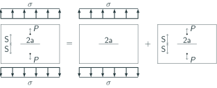<!-- .element width="80%" -->

----
## superposition

$$\\begin{aligned}
  K\_I &= K\_{I(\\sigma)} + K\_{I(P)}\\\\
  K\_I &= \\sigma\\sqrt{\\pi a} + \\frac{P}{t\\sqrt{\\pi a}}\\frac{1 - 0.5\\left(\\frac{a}{W}\\right)+0.975\\left(\\frac{a}{W}\\right)^2 - 0.16\\left(\\frac{a}{W}\\right)^3}{\\sqrt{1-\\left(\\frac{a}{W}\\right)}}
\\end{aligned}$$

----
## superposition

-   Sometimes, the superposition needed to solve a problem is not obvious
-   It can be helpful to subtract a known solution from the problem
-   Note: Every super-posed solution must satisfy equilibrium.

----
## superposition

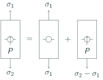<!-- .element width="70%" -->

----
## example - pressurized crack

<!-- .element width="80%" -->

----
## example - pressurized crack

-   We can find the stress intensity for a pressurized crack using a non-obvious superposition
-   An un-cracked panel with remote stress would be equal to a cracked panel under remote stress with a negative pressure applied to the crack

----
## example - pressurized crack

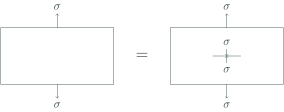<!-- .element width="80%" -->

----
## group problems

-   Purpose of group problems is not just to solve a problem
-   By teaching or explaining concepts to other members of your group, you also reinforce the concept yourself
-   When problems are discussed as a group, you will find questions and problems you might not have otherwise found

----
## group 1

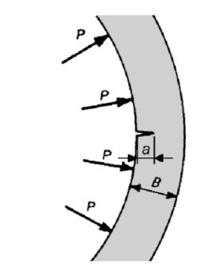

----
## group 2

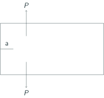<!-- .element width="60%" -->

----
## group 3

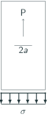<!-- .element width="20%" -->

----
## group 4

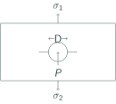<!-- .element width="60%" -->

---
# compounding

----
## superposition vs. compounding

-   In this course, we use *superposition* to combine loading conditions
-   We use *compounding* to combine edge effects
-   Both are very powerful tools and important concepts

----
## compounding

-   Different types of boundaries create different correction factors to the usual stress intensity factor
-   We often use `$\beta$` to indicate the total correction factor
-   When multiple boundaries are present, we can combine them into one effective correction factor
-   There are two general methods we use to create a compound correction factor

----
## method 1

-   The first method uses linear superposition, and thus is restricted to cases where the effect of each boundary can be assumed to add linearly
-   While in most cases this is not strictly true, it provides a reasonable approximation
$$K\_r = \\bar{K} + \\sum\_{i=1}^{N}(K\_i - \\bar{K})$$

----
## method 1
-   Where *N* is the number of boundaries, $\\bar{K}$ is the stress intensity factor with no boundaries present and `$K_i$` is the stress intensity factor associated with the `$i^\text{th}$` boundary.

----
## method 1

-   We can rewrite this equation as
$$K\_r = \\sigma \\sqrt{\\pi a} \\beta\_r = \\sigma \\sqrt{\\pi a} + \\sum\_{i=1}^{N}(\\sigma \\sqrt{\\pi a}\\beta\_i - \\sigma \\sqrt{\\pi a})$$
-   Which leads to an expression for `$\beta_r$` as
$$\\beta\_r = 1+\\sum\_{i=1}^{N} (\\beta\_i - 1)$$

----
## method 2

-   An alternative empirical method approximates the boundary effect as
`$$\beta_r = \beta_1 \beta_2 ... \beta_N$$`
-   If there is no interaction between the boundaries, method 1 and method 2 will give the same result

----
## p. 68 - example 1

-   A crack in a finite-width panel is centered between two stiffeners
-   Assume the $\beta$ correction factor for this stiffener configuration is `$\beta_s$` = 0.9
-   Assume the $\beta$ correction factor for this finite-width panel is `$\beta_w$` = 1.075
-   Use both compounding methods to estimate the stress intensity
-   How accurate do you expect this to be?

----
## p. 69 - example 3

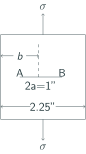 <!-- .element width="60%" -->

$b=1$ inch

----
## group 1

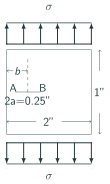 <!-- .element width="70%" -->

$b=0.4$ inches

----
## group 2

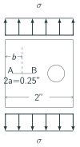 <!-- .element width="70%" -->

$b=0.4$ inches  

Hole diameter is 0.5 inches and spaced 0.5 inches away from the crack tip

----
## group 3

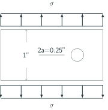<!-- .element width="100%" -->

Hole diameter is 0.5 inches and spaced 0.5 inches away from the crack tip

----
## group 4

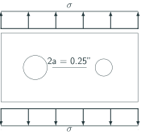<!-- .element width="100%" -->

The right crack tip is 0.5 inches away from a 0.5 inch diameter hole and the left crack tip is 0.25 inches away from a 1 inch diameter hole.

---
# errata and supplemental charts

----
## textbook notes

-   on p. 64 there is a + missing between two terms, see Lecture 2 for the fix
-   Also on p. 64, in equation 29 it is not clear, but use the `$f_w$` from a previous equation, on p. 56
-   Some of the black and white figures can be difficult to use, we have scanned and re-created the plots online
-   Interactive versions of compounding figures from p. 50, 71-73 can be found at [here](../examples/Compounding%20Figures.ipynb)

----
## finite height - p. 50

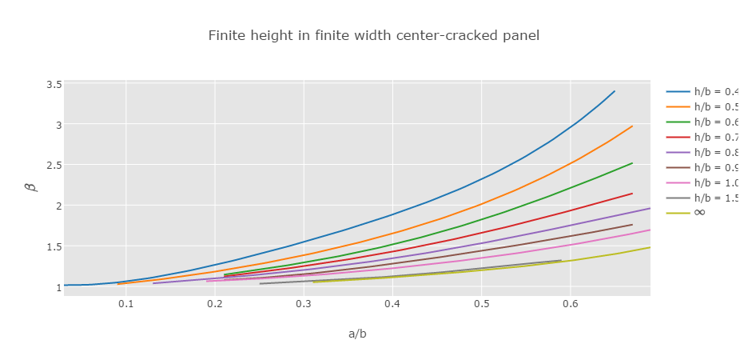

----
## offset crack - p. 71

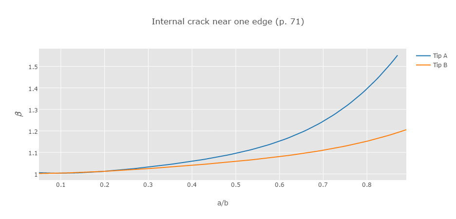

----
## crack near hole - p. 72

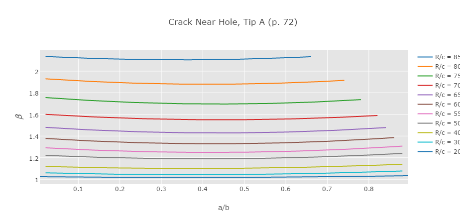

----
## crack near hole - p. 73

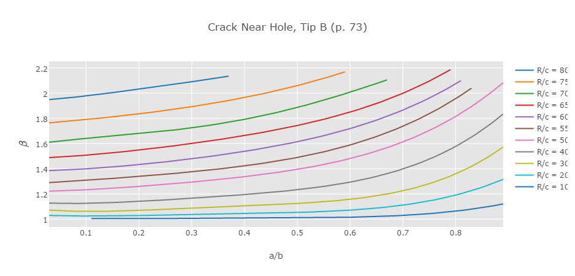
