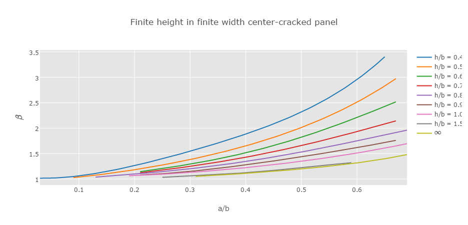
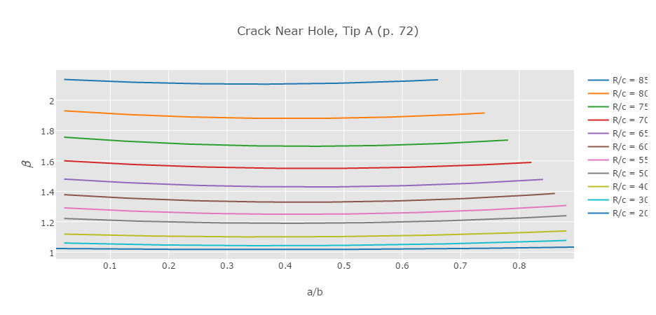
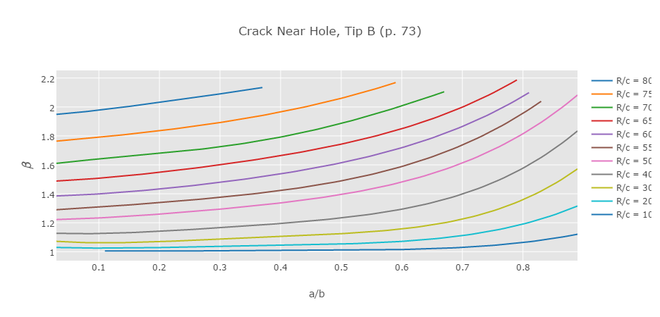

## AE 737: Mechanics of Damage Tolerance
Lecture 4 - Curved Boundaries

Dr. Nicholas Smith

Wichita State University, Department of Aerospace Engineering

27 January 2022

----
## schedule

- 27 Jan - Curved Boundaries, HW 1 Due
- 1 Feb - Plastic Zone
- 3 Feb - Plastic Zone, HW 2 Due, HW 1 Self-grade due
- 8 Feb - Fracture Toughness

----
## outline

- curved boundaries
- stress concentration factors

---
# errata and supplemental charts

----
## textbook notes

-   on p. 64 there is a + missing between two terms, see Lecture 2 for the fix
-   Also on p. 64, in equation 29 it is not clear, but use the `$f_w$` from a previous equation, on p. 56
-   Some of the black and white figures can be difficult to use, we have scanned and re-created the plots online
-   Interactive versions of compounding figures from p. 50, 71-73 can be found at [here](http://ndaman.github.io/damagetolerance/examples/Compounding%20Figures.html)

----
## finite height - p. 50

----
## offset crack - p. 71

----
## crack near hole - p. 72

----
## crack near hole - p. 73

---
# curved boundaries

----
## short cracks on curved boundaries

-   For short cracks, we can use the *stress concentration factor* on a curved boundary to determine the stress intensity factor
-   The stress concentration factor only gives the maximum stress at the curved boundary, thus the longer the crack is, the farther away from the curved boundary (and maximum stress) it is.
-   Stress concentration factors can be found: pp. 82-85 in the text
-   Also see supplemental text on Blackboard or [here](http://ndaman.github.io/damagetolerance/classdocs/stress_concentrations.pdf)

----
## short cracks on curved boundaries

-   Suppose we want to determine the stress intensity on a panel, panel B
-   We find a similar panel with a known stress intensity factor, panel A
-   We adjust the applied load on panel A such that `$K_{I,A} = K_{I,B}$`
-   The magnitude of this load adjustment is determined using the *stress concentration factors* in panels B and A
Note: the notation: `$K_t$` for stress concentration factor, `$K_I$` for stress intensity factor

----
## short cracks on curved boundaries

<!-- .element width="40%" -->

----
## short cracks on curved boundaries

-   Since *A* is a fictional panel, we set the applied stress, `$\sigma_A$` such that

`$$\sigma_{max,B} = \sigma_{max,A}$$`

-   Substituting stress concentration factors

`$$K_{t,B} \sigma_B = K_{t,A} \sigma_A$$`

-   Solving for `$\sigma_A$`

`$$\sigma_A = \frac{K_{t,B}}{K_{t,A}}\sigma_B$$`

----
## short cracks on curved boundaries

-   Since the crack is short and `$\sigma_{max, A} = \sigma_{max, B}$` we can say

`$$\begin{aligned}
  K_{I,B} &= K_{I,A}\\
  &= \sigma_A \sqrt{\pi c} \beta_A\\
  &= \frac{K_{t,B}}{K_{t,A}}\sigma_B \sqrt{\pi c} \beta_A
\end{aligned}$$`

----
## example 6 (p. 86)

----
## long cracks on curved boundaries

-   As a crack becomes very large, the effect of the curved boundary diminishes
-   We find expressions for `$\beta_L$` (long crack) and `$\beta_S$` (short crack)
-   We connect `$\beta_S$` to `$\beta_L$` using a straight line from `$\beta_S$` to a tangent intersection with `$\beta_L$`

----
## long cracks on curved boundaries

<!-- .element width="20%"-->

---
## example

-   Example [here](https://colab.research.google.com/drive/1bq0pXDgYL-xTPwUAQ0tffKBcMoS8sgry?usp=sharing)

----
## group one

 <!-- .element width="70%" -->

-  _c_ = 0.75, *e* = 2.25, *r* = 0.5
-  assume *a* is short and calculate `$\beta$` for this case
-  calculate in terms of `$\beta$` for known state

----
## group two

 <!-- .element width="70%" -->

-  _c_ = 0.75, *e* = 2.25, *r* = 0.5
-   assume *a* is long and calculate `$\beta$` for this case
-   calculate in terms of `$\beta$` for known state

----
## group three

 <!-- .element width="70%" -->

-  *c* = 0.75, *e* = 2.25, *r* = 0.5
-   assume *a* is short and calculate `$\beta$` for this case
-   calculate in terms of `$\beta$` for known state

----
## group four

 <!-- .element width="70%" -->

-  _c_ = 0.75, *e* = 2.25, *r* = 0.5
-   assume *a* is long and calculate `$\beta$` for this case
-   calculate in terms of `$\beta$` for known state

----
## discussion

Draw a sketch to show how we could use this method to find cracks of intermediate length near a curved boundary

---
# stress concentration factors

----
## centered hole tension - p. 82

`$K_{tg}$` uses stress for the cross-sectional area if no hole was present, `$K_{tn}$` uses stress at the net section (subtracting hole area). *a* is the hole diameter, *W* is specimen width.

----
## off-center hole tension - p. 83

<!-- .element width="40%" -->

`$K_{tg}$` uses stress for the cross-sectional area if no hole was present, `$K_{tn}$` uses stress at the net section (subtracting hole area). c is the distance from the closest edge to the center of the hole, e is the distance from the farthest edge to the center of the hole, r is hole radius.

----
## bending of a bar with u-shaped notch - p. 84

Nominal stress used for `$K_t$` is given by `$\sigma_{nom} = 6M/hd^2$` where *M* is applied bending moment, *h* is thickness, *d* is the net-section height (height minus notch depth). *D* is the height of the panel without a notch and *r* is the notch radius.

----
## tension of a stepped bar with shoulder fillets - p. 85

<!-- .element width="70%" -->

*D* is the larger width (before the step), *d* is the width after the step. Nominal stress is `$\sigma_{nom} = P/hd$`, where *h* is specimen thickness. *r* is the fillet radius.

----
## interactive page

-   An interactive page with these plots can be accessed [here](http://ndaman.github.io/damagetolerance/examples/Stress%20Concentration%20Factors.html)
