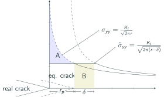
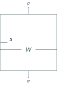

## AE 737: Mechanics of Damage Tolerance
Lecture 5 - Plastic Zone

Dr. Nicholas Smith

Wichita State University, Department of Aerospace Engineering

1 February 2022

----
## schedule

- 1 Feb - Plastic Zone
- 3 Feb - Plastic Zone, HW 2 Due, HW 1 Self-grade due
- 8 Feb - Fracture Toughness
- 10 Feb - Fracture Toughness, HW3 Due, HW 2 Self-grade due

----
## outline

- plastic zone

---
# plastic zone

----
## plastic zone

-   Previous developments assumed perfectly elastic materials
-   Most common materials have some plasticity
-   Any stress above the yield stress will undergo plastic deformation (no stress higher than `$\sigma_y$` will be present in the material)

----
## plastic zone

-   Plasticity helps retard crack propagation due to residual stresses
-   After an overload, elastic regions will contract back to their undeformed shape
-   The region which has undergone plastic deformation, however, holds its deformed shape
-   This introduces a region of residual compressive stress near the crack tip
-   Before the crack can propagate, a stress needs to overcome this residual stress

----
## 2D problems

-   We often simplify the full 3D elasticity equations for planar problems
-   For very thin panels, we assume that all out-of-plane stresses are 0
-   This is called plane stress

----
## plane stress

`$$\begin{aligned}
  \sigma_z &= \tau_{xz} = \tau_{zy} = 0\\
  \epsilon_x &= \frac{\sigma_x}{E} - \nu \frac{\sigma_y}{E}\\
  \epsilon_y &= -\nu \frac{\sigma_x}{E} + \frac{\sigma_y}{E}\\
  \epsilon_z &= -\nu \frac{\sigma_x}{E} - \nu \frac{\sigma_y}{E}\\
  \gamma_{xy} &= \frac{\tau_{xy}}{G}\\
  \gamma_{xz} &= \gamma_{yz} = 0
\end{aligned}$$`

----
## 2D problems

-   When instead a panel is very thick, we assume that any strains through the thickness are small relative to other strains
-   `$\epsilon_z = \gamma_{xz} = \gamma_{yz} = 0$`
-   This is known as plane strain

----
## plane strain

`$$\begin{aligned}
  \epsilon_x &= \frac{\sigma_x}{E} - \nu \frac{\sigma_y}{E} - \nu \frac{\sigma_z}{E}\\
  \epsilon_y &= -\nu \frac{\sigma_x}{E} + \frac{\sigma_y}{E} - \nu \frac{\sigma_z}{E}\\
  0 &= -\nu \frac{\sigma_x}{E} - \nu \frac{\sigma_y}{E} + \frac{\sigma_z}{E}\\
  \gamma_{xy} &= \frac{\tau_{xy}}{G}\\
  \gamma_{xz} &= \gamma_{yz} = 0
\end{aligned}$$`

----
## Irwin

-   If we recall the equation for opening stress (`$\sigma_y$`) near the crack tip

`$$\sigma_y = \frac{K_I}{\sqrt{2\pi r}} \cos \frac{\theta}{2} \left(1+\sin \frac{\theta}{2}\sin \frac{3\theta}{2}\right) \tag{1.2}$$`

-   In the plane of the crack, when `$\theta=0$` we find
 
`$$\sigma_y = \frac{K_I}{\sqrt{2\pi r}}$$`

----
## Irwin

 <!-- .element width="50%" -->

----
## Irwin

- We use *C*, the *Plastic Constraint Factor* to convert between Plane Strain and Plane Stress solutions
- The plastic zone size can now be approximated

`$$\begin{aligned}
  \sigma_{yy}(r=r_p) &= C\sigma_{YS}\\
  \frac{K_I}{\sqrt{2\pi r_p}} &= C\sigma_{YS}\\
  r_p &= \frac{1}{2\pi} \left(\frac{K_I}{C\sigma_{YS}}\right)^2
\end{aligned}$$`

----
## Irwin

-   For plane stress (thin panels) we let `$C=1$` and find `$r_p$` as

`$$r_p = \frac{1}{2\pi} \left(\frac{K_I}{\sigma_{YS}}\right)^2$$`

-   And for plane strain (thick panels) we let `$C=\sqrt{3}$` and find
 
`$$r_p = \frac{1}{6\pi} \left(\frac{K_I}{\sigma_{YS}}\right)^2$$`

----
## Intermediate panels

-   For panels which lie between plane strain and plane stress states, we use the following expression to estimate the plastic zone size

`$$r_p = \frac{1}{I\pi} \left(\frac{K_I}{\sigma_{YS}}\right)^2$$`

-   Where *I* is defined as

`$$I = 6.7 - \frac{1.5}{t}\left(\frac{K_I}{\sigma_{YS}}\right)^2$$`

-   And `$2 \le I \le 6$`

---
# Irwin's second approximation

----
## Irwin 

-   If our material is perfectly elastic-plastic, no stresses above `$C\sigma_{ys}$` will exist in the material
-   This ignores the strain energy (represented by the area under the curve) in the plastic zone

----
## Irwin

 <!-- .element width="50%" -->

----
## Irwin

-   To account for the additional strain energy, Irwin considered a plastic zone size increased by some `$\delta$`
-   He also needed to adjust the stress function, and considered an equivalent crack tip in these calculations

----
## Irwin

 <!-- .element width="50%" -->

----
## Irwin

We need *A*=*B*, so we set them equivalent and solve for `$\delta$`.

`$$\begin{aligned}
  A &= \int_{0}^{r_p} \sigma_{yy} dr - r_p \sigma_{YS}\\
  &= \int_{0}^{r_p} \frac{K_I}{\sqrt{2\pi r}} dr - r_p \sigma_{YS}\\
  &= \frac{K_I}{\sqrt{2\pi}}\int_{0}^{r_p} r^{-1/2} dr - r_p \sigma_{YS}\\
  &= \frac{2K_I \sqrt{r_p}}{\sqrt{2\pi}}- r_p \sigma_{YS}
\end{aligned}$$`

----
## Irwin

-   We have already found `$r_p$` as

`$$r_p = \frac{1}{2\pi} \left(\frac{K_I}{\sigma_{YS}}\right)^2$$`

-   If we solve this for `$K_I$` we find

`$$K_I = \sqrt{2\pi r_p} \sigma_{YS}$$`

----
## Irwin

-   We can now substitute back into the strain energy of A

`$$\begin{aligned}
  A &= \frac{2\sqrt{2\pi r_p} \sigma_{YS} \sqrt{r_p}}{\sqrt{2\pi}}- r_p \sigma_{YS}\\
  &= 2 \sigma_{YS} r_p- r_p \sigma_{YS}\\
  &= r_p \sigma_{YS}
\end{aligned}$$`

----
## Irwin

-   B is given simply as `$B=\delta \sigma_{ys}$` so we equate A and B to find `$\delta$`

`$$\begin{aligned}
  A &= B\\
  r_p \sigma_{YS} &= \delta \sigma_{YS}\\
  r_p &= \delta
\end{aligned}$$`

----
## Irwin

-   This means the plastic zone size is simply `$2r_p$`
-   However, it also means that the effective crack length is `$a+r_p$`
-   Since `$r_p$` depends on `$K_I$`, we must iterate a bit to find the "real" `$r_p$` and `$K_I$`

---
## Example

----
## equations

`$$\begin{aligned}
  \beta &= \left[1.122 - 0.231 \frac{a}{W} + 10.55 \left(\frac{a}{W}\right)^2 - 21.71 \left(\frac{a}{W}\right)^3 + 30.82 \left(\frac{a}{W}\right)^4\right] \\
  I &= 6.7 - \frac{1.5}{t}\left(\frac{K_I}{\sigma_{YS}}\right)^2 \\
  r_p &= \frac{1}{I\pi} \left(\frac{K_I}{\sigma_{YS}}\right)^2
\end{aligned}$$`

