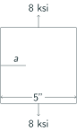

## AE 737: Mechanics of Damage Tolerance
Lecture 6 - Plastic Zone

Dr. Nicholas Smith

Wichita State University, Department of Aerospace Engineering

3 February 2022

----
## schedule

- 3 Feb - Plastic Zone, HW 2 Due, HW 1 Self-grade due
- 8 Feb - Fracture Toughness
- 10 Feb - Fracture Toughness, HW3 Due, HW 2 Self-grade due
- 15 Feb - Residual Strength

----
## outline

- plastic stress intensity ratio
- plastic zone shape
- group problems

---
# plastic stress intensity ratio

----
## plastic stress intensity ratio

-   Engineers often use stress intensity to decide which material to use for a certain application
-   The ratio of plastic stress intensity to elastic stress intensity, as a function of yield stress over applied stress, can help illustrate the effects of plasticity for different materials.

----
## plastic stress intensity ratio

For an infinitely wide center-cracked panel, we can solve for `$K_{Ie}/K_I$` symbolically, in plane stress

`$$\begin{aligned}
  K_I &= \sigma \sqrt{\pi a}\\
  K_{Ie} &= \sigma \sqrt{\pi(a+r_p)}\\
  r_p &= \frac{1}{2\pi} \left( \frac{K_{Ie}}{\sigma_{YS}}\right)^2\\
  K_{Ie} &= \sigma \sqrt{\pi \left(a+\frac{1}{2\pi} \left( \frac{K_{Ie}}{\sigma_{YS}}\right)^2\right)}
\end{aligned}$$`

----
## stress intensity ratio

`$$\begin{aligned}
  K_{Ie}^2 &= \sigma^2 \pi \left(a+\frac{1}{2\pi} \left( \frac{K_{Ie}}{\sigma_{YS}}\right)^2\right)\\
  K_{Ie}^2 &= \sigma^2 \pi a+\frac{\sigma^2}{2} \left( \frac{K_{Ie}}{\sigma_{YS}}\right)^2\\
  K_{Ie}^2 - \frac{\sigma^2}{2} \left( \frac{K_{Ie}}{\sigma_{YS}}\right)^2 &= \sigma^2 \pi a\\
  K_{Ie}^2\left(1 - \frac{\sigma^2}{2 \sigma_{YS}^2}\right) &= \sigma^2 \pi a
\end{aligned}$$`

Note: square both sides

----
## plastic stress intensity ratio

`$$\begin{aligned}
  K_{Ie}^2 &= \frac{\sigma^2 \pi a}{1 - \frac{\sigma^2}{2 \sigma_{YS}^2}}\\
  K_{Ie} &= \frac{\sigma \sqrt{\pi a}}{\sqrt{1 - \frac{\sigma^2}{2 \sigma_{YS}^2}}}\\
  K_{Ie} &= \frac{K_I}{\sqrt{1 - \frac{\sigma^2}{2 \sigma_{YS}^2}}}\\
  \frac{K_{Ie}}{K_I} &= \frac{1}{\sqrt{1 - \frac{\sigma^2}{2 \sigma_{YS}^2}}}
\end{aligned}$$`

Note: We divide both sides by `$\left(1 - \frac{\sigma^2}{2 \sigma_{YS}^2}\right)$`

----
## plastic stress intensity ratio

-   We can also find the plastic stress intensity ratio numerically for finite width panels
-   Panel thickness, yield stress, panel width, crack length could all be variables in this case
-   Different heat treatments of metal alloys can give a different yield stress, with most other properties remaining the same
-   Typical crack lengths can vary based on inspection cycles

----
## example

- You are asked to design an inspection cycle for a panel 
- Consider the plastic stress intensity ratio, and the effect of varying crack lengths on it

 <!-- .element width="70%"-->

----
## example

online example [here](https://colab.research.google.com/drive/1Bb-eznneklW_BILR8po3_fQROB_t56_w?usp=sharing)

---
# plastic zone shape

----
## plastic zone shape

-   Although we drew a circle to give a rough idea of the plastic zone in Irwin's method, this solution was only 1D
-   We considered `$\theta=0$`.
-   It is advantageous to model the plastic zone shape, we will do so using two different yield theories
-   Von Mises and Tresca

----
## principal stresses

-   Principal stresses are often used in yield theories
-   We can determine the principal stresses near the crack tip as

`$$\begin{aligned}
  \label{eq:principal}
  \sigma_1 &= \frac{K_I}{\sqrt{2\pi r}}\cos \frac{\theta}{2}\left(1+\sin \frac{\theta}{2}\right)&\\
  \sigma_2 &= \frac{K_I}{\sqrt{2\pi r}}\cos \frac{\theta}{2}\left(1-\sin \frac{\theta}{2}\right)&\\
  \sigma_3 &= 0 &\qquad \text{(plane stress)}\\
  \sigma_3 &= \frac{2\nu K_I}{\sqrt{2\pi r}}\cos \frac{\theta}{2} &\qquad \text{(plane strain)}
\end{aligned}$$`

----
## Von Mises yield theory

-   The Von Mises yield theory is also known as the Distortion Energy Yield Theory
-   In this yield theory, we assume that failure or yielding occurs when the strain energy exceeds some threshold
-   It has been observed that hydrostatic pressure does not generally cause yielding
-   We separate the strain energy into two parts, volumetric and distortional
-   Only the distortional strain energy is used to determine the yield strength

----
## Von Mises yield theory

-   The distortional strain energy is given by

`$$ W_d = \frac{1}{12}G\left[\left(\sigma_1 - \sigma_2\right)^2 + \left(\sigma_2 - \sigma_3\right)^2 +\left(\sigma_3 - \sigma_1\right)^2\right]$$`

-   Which for a uniaxially loaded point becomes

`$$W_d = \frac{1}{6}G\sigma_{YS}^2$$`

-   We can equate the two cases and solve

`$$\begin{aligned}
  \frac{1}{6}G\sigma_{YS}^2 &= \frac{1}{12}G\left[\left(\sigma_1 - \sigma_2\right)^2 + \left(\sigma_2 - \sigma_3\right)^2 + \left(\sigma_3 - \sigma_1\right)^2\right]\\
  2 \sigma_{YS}^2 &= \left(\sigma_1 - \sigma_2\right)^2 + \left(\sigma_2 - \sigma_3\right)^2 + \left(\sigma_3 - \sigma_1\right)^2
\end{aligned}$$`

----
## Von Mises yield theory

-   We can find the plastic zone size, `$r_p$` by substituting the principal stress relations into the distortional strain energy equation
-   In plane stress we find

`$$\begin{aligned}
  2 \sigma_{YS}^2 &= \left( \sigma_1 - \sigma_2 \right)^2 + \left( \sigma_2 - 0 \right)^2 + \left(0 - \sigma_1\right)^2
\end{aligned}$$`

----
## Von Mises yield theory

`$$\small{\begin{aligned}
  2 \sigma_{YS}^2 &= \left(\frac{K_I}{\sqrt{2\pi r_p}}\cos \frac{\theta}{2}\left(1+\sin \frac{\theta}{2}\right) -\right .\\
  &\left .\frac{K_I}{\sqrt{2\pi r_p}}\cos \frac{\theta}{2}\left(1-\sin \frac{\theta}{2}\right)\right)^2 + \\
  &\left(\frac{K_I}{\sqrt{2\pi r_p}}\cos \frac{\theta}{2}\left(1-\sin \frac{\theta}{2}\right) - 0\right)^2 + \\
  &\left(0 - \frac{K_I}{\sqrt{2\pi r_p}}\cos \frac{\theta}{2}\left(1+\sin \frac{\theta}{2}\right)\right)^2
\end{aligned}}$$`

----
## Von Mises yield theory

-   After solving we find

`$$r_p = \frac{K_I^2}{2\pi \sigma^2_{YS}} \cos^2 \frac{\theta}{2} \left(1 + 3\sin^2 \frac{\theta}{2}\right)$$`

-   We can similarly solve for `$r_p$` in plane strain to find

`$$r_p = \frac{K_I^2}{2\pi \sigma^2_{YS}} \cos^2 \frac{\theta}{2} \left(1 -4\nu + 4\nu^2 + 3\sin^2 \frac{\theta}{2}\right)$$`

----
## Tresca yield theory

-   Tresca yield theory assumes that yielding begins when the maximum shear stress reaches a critical value
-   In uniaxial tension this gives

`$$\tau_0 = \tau_{max} = \frac{1}{2}\left(\sigma_{max} - \sigma_{min}\right) = \frac{1}{2} \left(\sigma_{YS} - 0\right) = \frac{\sigma_{YS}}{2}$$`

----
## Tresca yield theory

-   Using the results for principal stress we found previously, we see that

`$$\begin{aligned}
  \sigma_{max} &= \frac{K_I}{\sqrt{2\pi r}}\cos \frac{\theta}{2}\left(1+\sin \frac{\theta}{2}\right)\\
  \sigma_{min} &= 0
\end{aligned}$$`

-   We can substitute and solve as before to find

`$$r_p = \frac{K_I^2}{2 \pi \sigma_{YS}^2}\cos^2 \frac{\theta}{2}\left(1+\sin \frac{\theta}{2}\right)^2$$`

----
## Tresca yield theory

-   In plane strain, it is not clear whether `$\sigma_2$` or `$\sigma_3$` will be `$\sigma_{min}$`
-   We can solve for when `$\sigma_2$` will be `$\sigma_{min}$`

`$$\begin{aligned}
  \sigma_2 &< \sigma_3\\
  \frac{K_I}{\sqrt{2\pi r}}\cos \frac{\theta}{2}\left(1-\sin \frac{\theta}{2}\right) &< \frac{2\nu K_I}{\sqrt{2\pi r}}\cos \frac{\theta}{2}\\
  1-\sin \frac{\theta}{2} &< 2\nu\\
  \theta_t &> 2 \sin^{-1} (1-2\nu)
\end{aligned}$$`

----
## Tresca yield theory

-   When `$2\pi - \theta_t < \theta < \theta_t$`, `$\sigma_2$` is the minimum, otherwise `$\sigma_3$` is the minimum
-   Note: Error(s) in text p. 101
-   Once we have chosen the appropriate minimum stress (`$\sigma_2$` or `$\sigma_3$`), we can solve for `$r_p$` as before

----
## Tresca yield theory

`$$\begin{aligned}
  r_p &= \frac{2 K_I^2}{\pi \sigma_{YS}^2} \cos^2 \frac{\theta}{2} \sin^2 \frac{\theta}{2} & \theta_t &lt; \theta &lt; 2\pi - \theta_t\\
  r_p &= \frac{K_I^2}{2\pi \sigma_{YS}^2}\cos^2 \frac{\theta}{2}\left(1 - 2\nu + \sin \frac{\theta}{2}\right)^2 & \theta &lt; \theta_t, \theta &gt; 2\pi - \theta_t
\end{aligned}$$`

----
## 3D plastic zone shape

----
## example

online example [here](https://colab.research.google.com/drive/1ALdCMw3BzNDn-5clui2nrvfHfWMcN7-5?usp=sharing)

---
# group problems

----
## group one

-   Calculate the plastic zone size for an infinitely wide, center-cracked panel
-   Consider a crack-length of 4 cm, and a yield strength of `$\sigma_{YS}=55 \text{ MPa}$`, with an applied load of `$\sigma = 20 \text{ MPa}$`
-   Assume the panel is very thin

----
## group two

-   Calculate the plastic zone size for an infinitely wide, center-cracked panel
-   Consider a crack-length of 4 cm, and a yield strength of `$\sigma_{YS}=55 \text{ MPa}$`, with an applied load of `$\sigma = 20 \text{ MPa}$`
-   Assume the panel is very thick

----
## group three

-   Calculate the plastic zone size for an infinitely wide, center-cracked panel
-   Consider a crack-length of 4 cm, and a yield strength of `$\sigma_{YS}=55 \text{ MPa}$`, with an applied load of `$\sigma = 20 \text{ MPa}$`
-   The panel thickness is *t* = 0.65 cm

----
## group four

-   Find the plastic stress intensity ratio for an infinitely wide, center-cracked panel
-   What factors will increase or decrease the plastic stress intensity ratio?
