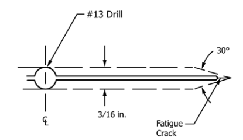

## AE 737: Mechanics of Damage Tolerance
Lecture 7 - Fracture Toughness

Dr. Nicholas Smith

Wichita State University, Department of Aerospace Engineering

February 11, 2020

----
## schedule

- 11 Feb - Fracture Toughness
- 13 Feb - Fracture Toughness, Homework 3 Due
- 18 Feb - Residual Strength
- 20 Feb - Residual Strength, Homework 4 Due

----
## outline
- plastic zone review
- fracture toughness
- plain strain
- plain stress

---
# plastic zone review

----
## Irwin's first approximation

-   If we recall the equation for opening stress (`$\sigma_y$`) near the crack tip

$$\\sigma\_y = \\frac{K\_I}{\\sqrt{2\\pi r}} \\cos \\frac{\\theta}{2} \\left(1+\\sin \\frac{\\theta}{2}\\sin \\frac{3\\theta}{2}\\right) \\tag{1.2}$$

-   In the plane of the crack, when `$\theta=0$` we find

$$\\sigma\_y = \\frac{K\_I}{\\sqrt{2\\pi r}}$$

----
## Irwin's first approximation

 <!-- .element width="50%" -->

----
## Irwin's first approximation

- We use *C*, the *Plastic Constraint Factor* to convert between Plane Strain and Plane Stress solutions
- The plastic zone size can now be approximated

$$\\begin{aligned}
  \\sigma\_{yy}(r=r\_p) &= C\\sigma\_{YS}\\\\
  \\frac{K\_I}{\\sqrt{2\\pi r\_p}} &= C\\sigma\_{YS}\\\\
  r\_p &= \\frac{1}{2\\pi} \\left(\\frac{K\_I}{C\\sigma\_{YS}}\\right)^2
\\end{aligned}$$

----
## Irwin's first approximation

-   For plane stress (thin panels) we let $C=1$ and find *r**p* as

$$r\_p = \\frac{1}{2\\pi} \\left(\\frac{K\_I}{\\sigma\_{YS}}\\right)^2$$

-   And for plane strain (thick panels) we let $C=\\sqrt{3}$ and find

$$r\_p = \\frac{1}{6\\pi} \\left(\\frac{K\_I}{\\sigma\_{YS}}\\right)^2$$

----
## Intermediate panels

-   For panels which lie between plane strain and plane stress states, we use the following expression to estimate the plastic zone size

$$r\_p = \\frac{1}{I\\pi} \\left(\\frac{K\_I}{\\sigma\_{YS}}\\right)^2$$

-   Where *I* is defined as

$$I = 6.7 - \\frac{1.5}{t}\\left(\\frac{K\_I}{\\sigma\_{YS}}\\right)^2$$

-   And `$2 \le I \le 6$`

----
## Irwin's second approximation

-   If our material is perfectly elastic-plastic, no stresses above $C\sigma_{ys}$ will exist in the material
-   This ignores the strain energy (represented by the area under the curve) in the plastic zone

----
## Irwin's second approximation

 <!-- .element width="50%" -->

----
## Irwin's second approximation

-   To account for the additional strain energy, Irwin considered a plastic zone size increased by some $\delta$
-   He also needed to adjust the stress function, and considered an equivalent crack tip in these calculations

----
## Irwin's second approximation

 <!-- .element width="50%" -->

----
## Irwin's second approximation

-   This means the plastic zone size is simply 2*r**p*
-   However, it also means that the effective crack length is *a*+*r**p*
-   Since *r**p* depends on *K**I*, we must iterate a bit to find the "real" *r**p* and *K**I*

----
## plastic stress intensity ratio

For an infinitely wide center-cracked panel, we can solve for *K**Ie*/*K**I* symbolically, in plane stress

$$\\begin{aligned}
  K\_I &= \\sigma \\sqrt{\\pi a}\\\\
  K\_{Ie} &= \\sigma \\sqrt{\\pi(a+r\_p)}\\\\
  r\_p &= \\frac{1}{2\\pi} \\left( \\frac{K\_{Ie}}{\\sigma\_{YS}}\\right)^2\\\\
  K\_{Ie} &= \\sigma \\sqrt{\\pi \\left(a+\\frac{1}{2\\pi} \\left( \\frac{K\_{Ie}}{\\sigma\_{YS}}\\right)^2\\right)}
\\end{aligned}$$

----
## stress intensity ratio

$$\\begin{aligned}
  K\_{Ie}^2 &= \\sigma^2 \\pi \\left(a+\\frac{1}{2\\pi} \\left( \\frac{K\_{Ie}}{\\sigma\_{YS}}\\right)^2\\right)\\\\
  K\_{Ie}^2 &= \\sigma^2 \\pi a+\\frac{\\sigma^2}{2} \\left( \\frac{K\_{Ie}}{\\sigma\_{YS}}\\right)^2\\\\
  K\_{Ie}^2 - \\frac{\\sigma^2}{2} \\left( \\frac{K\_{Ie}}{\\sigma\_{YS}}\\right)^2 &= \\sigma^2 \\pi a\\\\
  K\_{Ie}^2\\left(1 - \\frac{\\sigma^2}{2 \\sigma\_{YS}^2}\\right) &= \\sigma^2 \\pi a
\\end{aligned}$$
Note: square both sides

----
## plastic stress intensity ratio

$$\\begin{aligned}
  K\_{Ie}^2 &= \\frac{\\sigma^2 \\pi a}{1 - \\frac{\\sigma^2}{2 \\sigma\_{YS}^2}}\\\\
  K\_{Ie} &= \\frac{\\sigma \\sqrt{\\pi a}}{\\sqrt{1 - \\frac{\\sigma^2}{2 \\sigma\_{YS}^2}}}\\\\
  K\_{Ie} &= \\frac{K\_I}{\\sqrt{1 - \\frac{\\sigma^2}{2 \\sigma\_{YS}^2}}}\\\\
  \\frac{K\_{Ie}}{K\_I} &= \\frac{1}{\\sqrt{1 - \\frac{\\sigma^2}{2 \\sigma\_{YS}^2}}}
\\end{aligned}$$

Note: We divide both sides by $\\left(1 - \\frac{\\sigma^2}{2 \\sigma\_{YS}^2}\\right)$

----
## 3D plastic zone shape

---
# group problems

----
## group one

-   Calculate the plastic zone size for an infinitely wide, center-cracked panel
-   Consider a crack-length of 4 cm, and a yield strength of `$\sigma_{YS}=55 \text{ MPa}$`, with an applied load of `$\sigma = 20 \text{ MPa}$`
-   Assume the panel is very thin

----
## group two

-   Calculate the plastic zone size for an infinitely wide, center-cracked panel
-   Consider a crack-length of 4 cm, and a yield strength of `$\sigma_{YS}=55 \text{ MPa}$`, with an applied load of `$\sigma = 20 \text{ MPa}$`
-   Assume the panel is very thick

----
## group three

-   Calculate the plastic zone size for an infinitely wide, center-cracked panel
-   Consider a crack-length of 4 cm, and a yield strength of `$\sigma_{YS}=55 \text{ MPa}$`, with an applied load of `$\sigma = 20 \text{ MPa}$`
-   The panel thickness is *t* = 0.65 cm

----
## group four

-   Find the plastic stress intensity ratio for an infinitely wide, center-cracked panel
-   What factors will increase or decrease the plastic stress intensity ratio?

---
# fracture toughness

----
## fracture toughness

-   The critical load at which a cracked specimen fails produces a critical stress intensity factor
-   The "critical stress intensity factor" is known as *K**c*
-   For Mode I, this is called *K**Ic*
-   The critical stress intensity factor is also known as fracture toughness
$$K\_{IC} = \\sigma\_c \\sqrt{\\pi a}\\beta$$
-   Note: "Fracture Toughness" can also refer to *G**Ic*, which is analogous to *K**Ic*, but not the same

----
## fracture toughness

-   Fracture toughness is a material property, but it is only well-defined in certain conditions
-   Brittle materials
-   Plane strain (smaller plastic zone)
-   In these cases ASTM E399-12 is used.

----
## fracture toughness

 <!-- .element width="50%" -->

----
## unstable cracks

-   Stable crack growth means the crack extends only with increased load
-   Unstable crack growth means the crack will continue to extend indefinitely under the same load
-   For a perfectly brittle material, there is no stable crack growth, as soon as a critical load is reached, the crack will extend indefinitely

----
## stable cracks
-   For an elastic-plastic material, once the load is large enough to extend the crack, it will extend slightly
-   The load must be continually increased until a critical value causes unstable crack growth

----
## fracture toughness

-   During an experiment, we will record the crack length and applied load (*P**i*, *a**i*) each time we increase the load
-   We can calculate a unique stress intensity factor *K**Ii* at each of these points
-   These are then used to create a "K-curve", plotting *K**I* vs. *a*

----
## K-curve

 <!-- .element width="60%" -->

----
## K-curve

-   Materials will generally not be as flat as the perfectly brittle example
-   Plane strain conditions and brittle materials will tend towards a "flat" K-curve
-   *K**IC* for brittle/plane strain is very well defined
-   *K**C* for plane stress can refer to two things
-   Either the maximum *K**C* during a test, or tangent point on *K**R*-curve (R-curve)

----
## example

-  In composites, and adhesives, some work is needed to ensure stable crack growth
-  The Double-Cantilever Beam (DCB) experiment to find *G**IC* illustrates this

$$\\begin{aligned}
  C &= \\frac{\\delta}{P}\\\\
  C &= \\frac{2a^3}{3EI}\\\\
  G &= \\frac{P^2}{2b}\\frac{dC}{da}\\\\
  G &= \\frac{P^2a^2}{bEI}
\\end{aligned}$$

----
## example

-   For crack growth to be stable we need

$$\\frac{dG}{da} \\le 0$$

-   Under fixed-load conditions, we find

$$\\frac{dG}{da} = \\frac{2P^2a}{bEI}$$

-   This is always positive, and thus results in unstable crack growth

----
## example

-   Under fixed-displacement conditions, we substitute for *P*
-   We find

$$\\frac{dG}{da} = -\\frac{9\\delta^2EI}{ba^3}$$

-   Which is always stable, so for DCB tests, displacement control is generally used

---
# plane strain, brittle

----
## plane strain, brittle

- For relatively brittle materials, we don’t need to worry about the R-curve
- Specimens are made according to these specifications

$$\\begin{aligned}
  a \\ge 2.5 \\left(\\frac{K\_{IC}}{\\sigma\_{YS}}\\right)^2\\\\
  b \\ge 2.5 \\left(\\frac{K\_{IC}}{\\sigma\_{YS}}\\right)^2\\\\
  W \\ge 5 \\left(\\frac{K\_{IC}}{\\sigma\_{YS}}\\right)^2
\\end{aligned}$$

----
## ASTM E399

1.  Select specimen size
2.  Select specimen type (Compact Tension or Single Edge Notched Bend)

----
## ASTM E399

 <!-- .element width="50%" -->

----
## ASTM E399

 <!-- .element width="70%" -->

----
## ASTM E399

 <!-- .element width="60%" -->

----
## ASTM E399

<ol start="3">
  <li>Machine specimen</li>
  <li>Fatigue crack specimen *K**f* &lt; 0.6*K**IC*</li>
  <ul>
    <li>This is to ensure that the plastic zone size during fatigue is smaller than the plastic zone size during testing</li>
    <li>If *K**IC* has not yet been determined, you may have to guess the first time</li>
  </ul>
</ol>

----
## ASTM E399

<ol start="5">
  <li>Mount specimen, attach gage</li>
  <li>Load rate should ensure "static" load conditions. (30 - 150 ksi$\\sqrt{\\text{in.}}$/min.)</li>
  <li>Determine the "provisional" value of *K**IC* (known as *K**Q*)</li>
</ol>

----
## ASTM E399

 <!-- .element width="70%" -->

----
## ASTM E399

- If the load-displacement curve is like the first figure, with some non-linearity, we let *P**Q* be the point of intersection between the load-displacement curve and a line whose slope is 5% lower than the slope in the elastic region
- "Pop-in" occurs when there is stable crack extension before the plasticity begins. We let *P**Q* bet the point where stable crack extension begins.

----
## ASTM E399

- For a perfectly linear material, *P**Q* = *P**max*.

$$\\begin{aligned}
  K\_Q &= \\frac{P\_Q}{BW^{1/2}}f\\left(\\frac{a}{W}\\right) & \\text{Compact Tension}\\\\
  K\_Q &= \\frac{P\_Q}{BW^{3/2}}g\\left(\\frac{a}{W}\\right) & \\text{SENB}
\\end{aligned}$$

----
## ASTM E399

<ol start="8">
  <li>Ensure that your specimen is still valid
  $$\\begin{aligned}
    a & \\ge 2.5 \\left(\\frac{K\_Q}{\\sigma\_{YS}}\\right)^2\\\\
    b & \\ge 2.5 \\left(\\frac{K\_Q}{\\sigma\_{YS}}\\right)^2\\\\
    W & \\ge 5 \\left(\\frac{K\_Q}{\\sigma\_{YS}}\\right)^2
  \\end{aligned}$$</li>
</ol>

----
## ASTM E399

-   For stable crack extension, check the *P**max*

$$\\frac{P\_{max}}{P\_Q} \\le 1.10$$

-   Check for symmetric crack front, *a*1, *a*2, and *a*3 must be within 5% of *a*. *a**s* must be within 10% of *a*.

$$\\frac{a\_1 + a\_2 + a\_3}{3} = a$$

-   Load-displacement should have an initial slope between 0.7 and 1.5

---
# plane stress, ductile

----
## R-curve

-   For materials with some plasticity, the *K**R* Curve, or R Curve, is very important
-   Sometimes called a "resistance curve" it is generally dependent on
    -   Thickness
    -   Temperature
    -   Strain rate

----
## R-curve

-   When done correctly, *K**R* curves are not dependent on initial crack size or the specimen type used
-   ASTM E561 describes a general procedure

----
## ASTM E561

-   Compact Tension (CT or C(T)) specimens may be used for plane stress *K**R* curves
-   The other specimen which is permitted is a middle-cracked tension specimen (M(T))
-   M(T) specimens are preferred in many cases due to a more uniform stress distribution (particularly important for anisotropic materials)

----
## ASTM E561

----
## minimum sample dimensions

----
## minimum sample dimensions

----
## effective crack length

-   ASTM E561 describes three ways to obtain the effective crack length during testing
    1.  Measure the crack length visually and calculate *r**p*
    2.  Measure crack length using "unloading compliance" and adding plastic zone size
    3.  Measure the effective crack size directly using "secant compliance"

----
## secant compliance

 <!-- .element width="40%" -->

----
## secant compliance M(T)

-   Using the slope data from our load-displacement curve, we can calculate the effective crack length using

$$\\begin{gathered}
  EB\\left(\\frac{\\Delta v}{\\Delta P}\\right) = \\frac{2 Y}{W} \\sqrt{\\frac{\\pi a / W}{\\sin (\\pi a / W)}} \\\\
  \\qquad \\left\[\\frac{2W}{\\pi Y} \\cosh^{-1} \\left(\\frac{\\cosh(\\pi Y/W)}{\\cos (\\pi a / W)}\\right) - \\frac{1+\\nu}{\\sqrt{1 + \\left(\\frac{\\sin(\\pi a/W)}{\\sinh (\\pi Y/W)}\\right)^2}}+\\nu\\right\]
\\end{gathered}$$

----
## secant compliance M(T)

-   This equation is difficult to solve directly for *a* (for M(T) specimens)
-   Instead it is generally solved iteratively
-   The following equations are used to give a good initial guess to use in iterations

----
## secant compliance M(T)

$$\\begin{aligned}
  X &= 1 - \\exp \\left\[\\frac{-\\sqrt{\[EB(\\Delta v/ \\Delta P)\]^2 - (2Y/W)^2}}{2.141}\\right\]\\\\
  &\\begin{aligned}
  \\frac{2a}{W} &= 1.2235X - 0.699032X^2 + 3.25584X^3 - 6.65042X^4 + \\\\
  &\\qquad 5.54X^5 - 1.66989X^6
  \\end{aligned}
\\end{aligned}$$

----
## secant compliance M(T)

  In the above equations, the following are the definitions of parameters used

$$\\begin{aligned}
  E &= \\qquad \\text{Young's Modulus}\\\\
  \\Delta v / \\Delta P &= \\qquad \\text{specimen compliance}\\\\
  B &= \\qquad \\text{specimen thickness}\\\\
  W &= \\qquad \\text{specimen width}\\\\
  Y &= \\qquad \\text{half span}\\\\
  a &= \\qquad \\text{effective crack length}\\\\
  \\nu &= \\qquad \\text{Poisson's ratio}
\\end{aligned}$$

----
## secant compliance C(T)

-   For C(T) specimens, we use the following equations

$$EB\\frac{\\Delta v}{\\Delta P} = A\_0 + A\_1\\left(\\frac{a}{W}\\right) + A\_2\\left(\\frac{a}{W}\\right)^2 + A\_3\\left(\\frac{a}{W}\\right)^3 + A\_4\\left(\\frac{a}{W}\\right)^4$$

-   The coefficients will differ based on where the displacement is measured from

----
## secant compliance C(T)

 <!-- .element width="50%" -->

----
## secant compliance C(T)

|         loc     |  *A*0|  *A*1|  *A*2|  *A*3|  *A*4|
|----------------:|----------------:|----------------:|----------------:|----------------:|----------------:|
|  *V*0|            120.7|          -1065.3|           4098.0|          -6688.0|           4450.5|
|  *V*1|            103.8|           -930.4|           3610.0|          -5930.5|           3979.0|

----
## secant compliance C(T)

|         loc     |  *C*0|  *C*1|  *C*2|  *C*3|  *C*4|  *C*5|
|----------------:|----------------:|----------------:|----------------:|----------------:|----------------:|----------------:|
|  *V*0|           1.0010|          -4.6695|           18.460|          -236.82|          1214.90|          -2143.6|
|  *V*1|           1.0008|          -4.4473|           15.400|          -180.55|           870.92|          -1411.3|

----
## secant compliance C(T)

-   Where the initial guess for *a* is provided by

$$\\frac{a}{W} = C\_0 + C\_1 U + C\_2 U^2 + C\_3 U^3 + C\_4 U^4 + C\_5 U^5$$

-   and *U* is given by

$$U = \\frac{1}{1 + \\sqrt{EB\\frac{\\Delta v}{\\Delta P}}}$$

----
## buckling

-   If the test is stopped and re-started frequently (to measure crack length by hand or to use the compliance method of crack measurement) buckling can interfere with results

----
## buckling

 <!-- .element width="40%" -->

----
## buckling

-   If buckling is shown to be present in the test, supports can be used to prevent buckling
-   These supports can introduce friction
-   They should be well-lubricated for accurate test results

----
## net section stress

-   One final consideration when dealing with plane stress fracture mechanics is the net section stress
-   For the test to be valid, failure must occur due to fracture, not general static failure
-   Static failure will occur when `$\sigma_N = \sigma_{YS}$`

----
## generate *K**R* curve

-   Once the effective crack length and *K**Ie* has been determined for the test, we can generate the *K**R* curve
-   The *K**R* curve is quite simply a plot of *K**Ie* vs. *a* for the test performed (i.e. with varying stress and increasing crack length)

----
## initial crack length

-   When the test is performed correctly, the *K**R* curve is not a function of the initial crack length
-   For this reason, we often plot *K**Ie* vs. $\Delta a$, to subtract the initial crack length
-   We can superpose constant-stress *K*-curves on this graph, the curve which intersects at a tangent point creates the most "standard" definition for *K**C*

----
## example

 <!-- .element width="60%" -->

----
## example

 <!-- .element width="60%" -->
