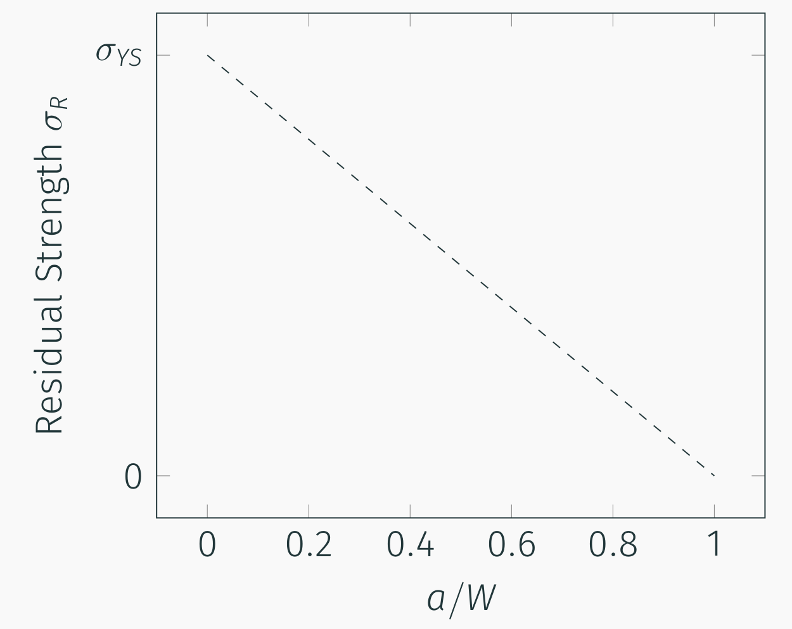
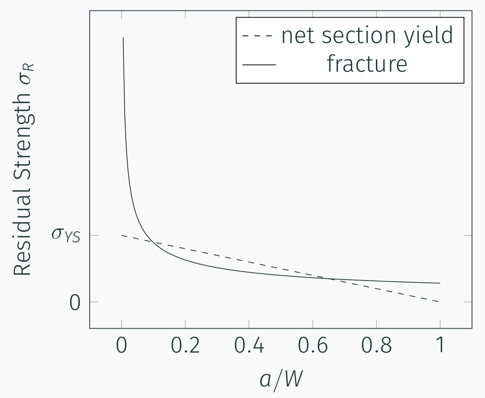
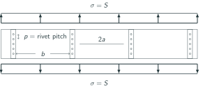
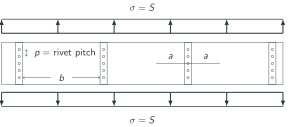

## AE 737: Mechanics of Damage Tolerance
Lecture 9 - Residual Strength

Dr. Nicholas Smith

Wichita State University, Department of Aerospace Engineering

February 18, 2020

----
## schedule

- 18 Feb - Residual Strength
- 20 Feb - Residual Strength, Homework 4 Due
- 25 Feb - Multiple Site Damage
- 27 Mar - Mixed-Mode Fracture, Homework 5 Due

----
## outline
<!-- TOC START min:1 max:1 link:false update:true -->
- residual strength
- fedderson approach
- proof testing
- residual strength review
- stiffeners

<!-- TOC END -->

---
# residual strength

----
## residual strength

-   As the crack grows, the area of the sample decreases, increasing the net section stress
-   The residual strength, `$\sigma_R$` is given in terms of the gross area, so as the crack grows the residual strength due to yield decreases
-   We can relate the net-section stress to `$\sigma_R$` by

$$\\sigma\_R = \\sigma\_{YS} \\frac{A\_{net}}{A\_{gross}}$$

----
## residual strength

 <!-- .element width="60%" -->

----
## residual strength

-   For brittle fracture to occur, we need to satisfy the condition
		
$$\\sigma\_R = \\sigma\_C = \\frac{K\_C}{\\sqrt{\\pi a}\\beta}$$

----
## residual strength

 <!-- .element width="60%" -->

----
## residual strength

-   Within the same family of materials (i.e. Aluminum), there is generally a trade-off between yield stress and fracture toughness
-   As we increase the yield strength, we decrease the fracture toughness (and vice versa)
-   Consider a comparison of the following aluminum alloys
    1.  7178-T6, $K\_C = 43 \\text{ ksi} \\sqrt{\\text{in.}}$, `$\sigma_{YS} = 74$` ksi
    2.  7075-T6, $K\_C = 68 \\text{ ksi} \\sqrt{\\text{in.}}$, `$\sigma_{YS} = 63$` ksi
    3.  2024-T3, $K\_C = 144 \\text{ ksi} \\sqrt{\\text{in.}}$, `$\sigma_{YS} = 42$` ksi

----
## residual strength

-   As an example let us consider an edge-cracked panel with $W=6"$ and $t=0.1"$
-   The net section yield condition will be given by

$$\\sigma\_C = \\sigma\_{YS} \\frac{W-a}{W} = \\sigma\_{YS}\\frac{6-a}{6}$$

-   And the fracture condition by

$$\\sigma\_C = \\frac{K\_C}{\\sqrt{\\pi a} \\beta}$$

With

$$\\small\{\\beta = 1.12 - 0.231\\left(\\frac{a}{W}\\right) + 10.55 \\left(\\frac{a}{W}\\right)^2 - 21.72 \\left(\\frac{a}{W}\\right)^3 + 30.39 \\left(\\frac{a}{W}\\right)^4\}$$

----
## 7178-T6

<!--
{
  "initialize": "function(container) {
  function makeArr(startValue, stopValue, numVals) {
      var arr = [];
      var currValue = startValue;
      var step = (stopValue-startValue)/(numVals-1);
      for (var i = 1; i < numVals; i++) {
        arr.push(currValue + step*i);
      }
      return arr;
    }
  function toughness(k,x) {
    var y = [];
    for (var i = 0; i < x.length; i++) {
      y.push(k/(Math.PI*x[i]*6)**.5/(1.12-.231*x[i]+10.55*x[i]**2-21.72*x[i]**3+30.39*x[i]**4));
    }
    return y;
  }
  function netsection(s,x) {
    var y = [];
    for (var i = 0; i < x.length; i++){
      y.push(s*(1-x[i]));
    }
    return y;
  }
  var trace1 = {
    x: makeArr(0,1,200),
    y: [],
    mode: 'lines',
    type: 'scatter',
    name: 'fracture'
  };
  trace1.y = toughness(43,trace1.x);
  var trace2 = {
    x: makeArr(0,1,200),
    y: [],
    mode: 'lines',
    type: 'scatter',
    name: 'yield'
  };
  trace2.y = netsection(74,trace2.x);
  var data = [trace1, trace2];
  layout = {
    xaxis: {
      title: 'a/W'
    },
    yaxis: {
      title: 'residual strength',
      range: [0,80]
    }
  };
  Plotly.newPlot('7178', data, layout);
	}"
}
-->

----
## 7075-T6

<!--
{
  "initialize": "function(container) {
  function makeArr(startValue, stopValue, numVals) {
      var arr = [];
      var currValue = startValue;
      var step = (stopValue-startValue)/(numVals-1);
      for (var i = 1; i < numVals; i++) {
        arr.push(currValue + step*i);
      }
      return arr;
    }
  function toughness(k,x) {
    var y = [];
    for (var i = 0; i < x.length; i++) {
      y.push(k/(Math.PI*x[i]*6)**.5/(1.12-.231*x[i]+10.55*x[i]**2-21.72*x[i]**3+30.39*x[i]**4));
    }
    return y;
  }
  function netsection(s,x) {
    var y = [];
    for (var i = 0; i < x.length; i++){
      y.push(s*(1-x[i]));
    }
    return y;
  }
  var trace1 = {
    x: makeArr(0,1,200),
    y: [],
    mode: 'lines',
    type: 'scatter',
    name: 'fracture'
  };
  trace1.y = toughness(68,trace1.x);
  var trace2 = {
    x: makeArr(0,1,200),
    y: [],
    mode: 'lines',
    type: 'scatter',
    name: 'yield'
  };
  trace2.y = netsection(63,trace2.x);
  var data = [trace1, trace2];
  layout = {
    xaxis: {
      title: 'a/W'
    },
    yaxis: {
      title: 'residual strength',
      range: [0, 80]
    }
  };
  Plotly.newPlot('7075', data, layout);
	}"
}
-->

----
## 2024-T3

<!--
{
  "initialize": "function(container) {
  function makeArr(startValue, stopValue, numVals) {
      var arr = [];
      var currValue = startValue;
      var step = (stopValue-startValue)/(numVals-1);
      for (var i = 1; i < numVals; i++) {
        arr.push(currValue + step*i);
      }
      return arr;
    }
  function toughness(k,x) {
    var y = [];
    for (var i = 0; i < x.length; i++) {
      y.push(k/(Math.PI*x[i]*6)**.5/(1.12-.231*x[i]+10.55*x[i]**2-21.72*x[i]**3+30.39*x[i]**4));
    }
    return y;
  }
  function netsection(s,x) {
    var y = [];
    for (var i = 0; i < x.length; i++){
      y.push(s*(1-x[i]));
    }
    return y;
  }
  var trace1 = {
    x: makeArr(0,1,200),
    y: [],
    mode: 'lines',
    type: 'scatter',
    name: 'fracture'
  };
  trace1.y = toughness(144,trace1.x);
  var trace2 = {
    x: makeArr(0,1,200),
    y: [],
    mode: 'lines',
    type: 'scatter',
    name: 'yield'
  };
  trace2.y = netsection(42,trace2.x);
  var data = [trace1, trace2];
  layout = {
    xaxis: {
      title: 'a/W'
    },
    yaxis: {
      title: 'residual strength',
      range: [0, 80]
    }
  };
  Plotly.newPlot('2024', data, layout);
	}"
}
-->

----
## comparison

<!--
{
  "initialize": "function(container) {
  function makeArr(startValue, stopValue, numVals) {
      var arr = [];
      var currValue = startValue;
      var step = (stopValue-startValue)/(numVals-1);
      for (var i = 1; i < numVals; i++) {
        arr.push(currValue + step*i);
      }
      return arr;
    }
  function toughness(k,x) {
    var y = [];
    for (var i = 0; i < x.length; i++) {
      y.push(k/(Math.PI*x[i]*6)**.5/(1.12-.231*x[i]+10.55*x[i]**2-21.72*x[i]**3+30.39*x[i]**4));
    }
    return y;
  }
  function netsection(s,x) {
    var y = [];
    for (var i = 0; i < x.length; i++){
      y.push(s*(1-x[i]));
    }
    return y;
  }
  function minval(k,s,x) {
    var y = [];
    for (var i = 0; i < x.length; i++) {
      var tough = toughness(k,[x[i]])[0];
      var net = netsection(s,[x[i]])[0];
      if (net < tough) {
        y.push(net);
      }
      else {
        y.push(tough);
      }
    }
    return y;
  }
  var trace1 = {
    x: makeArr(0,1,200),
    y: [],
    mode: 'lines',
    type: 'scatter',
    name: '7178'
  };
  trace1.y = minval(43,74,trace1.x);
  var trace2 = {
    x: makeArr(0,1,200),
    y: [],
    mode: 'lines',
    type: 'scatter',
    name: '7075'
  };
  trace2.y = minval(68,63,trace2.x);
  var trace3 = {
    x: makeArr(0,1,200),
    y: [],
    mode: 'lines',
    type: 'scatter',
    name: '2024'
  };
  trace3.y = minval(144,42,trace3.x);
  var data = [trace1, trace2, trace3];
  layout = {
    xaxis: {
      title: 'a/W'
    },
    yaxis: {
      title: 'residual strength',
      range: [0,80]
    }
  };
  Plotly.newPlot('comparison', data, layout);
	}"
}
-->

----
## using MIL-handbook

-   Uses a different grain nomenclature

| *K**C* | `$\sigma_{YS}$` |
|:-----------------:|:---------------:|
|        L-T        |           L     |
|        T-L        |          L-T    |

-   A-Basis vs. B-Basis values are reported (A = 99% of population will meet/exceed value, B = 90% of population)
-   S-Basis - no statistical information available, standard value to be used

----
## using MIL-handbook

-   *F**tu* - ultimate tensile strength
-   *F**ty* - tensile yield strength
-   *F**cy* - compressive yield strength
-   *F**su* - ultimate shear strength
-   *F**bru* - ultimate bearing strength
-   *F**bry* - bearing yield strength
-   *E* - tensile Young's Modulus
-   *E**c* - compressive Young's Modulus
-   *G* - shear modulus
-   $\mu$ - Poisson's ratio

----
## data

-   Fracture data is on pp. 111-121
-   Tensile data is on pp. 138-143
-   *K**c* charts are also available in interactive versions [here](../examples/Fracture%20Toughness%20Figures.ipynb)

---
# fedderson approach

----
## Fedderson approach

-   Unfortunately, the method we described above does not quite match experimental results
-   Fedderson proposed an alternative, where we connect the net-section yield and brittle fracture curves with a tangent line
-   This approach agrees very well with experimental data
-   Note: We could do something similar when the crack is very long, but we are generally less concerned with this region (failure will have already occurred)

----
## Fedderson example

worked example [here](../examples/Fedderson%20Approach.ipynb)

---
# proof testing

----
## proof testing

-   Proof testing is a way to use the concept of residual strength to check the size of a defect from manufacturing
-   Due to the fatigue life of a certain panel, and/or an inspection cycle that we have prescribed for that part, we determine an "acceptable" initial flaw size, *a*0

----
## proof testing

-   We then determine a load which would cause failure at this crack length
-   This is the "proof load"
-   If the part does not fail in the proof test, we can assume that the largest flaw in the material is *a*0

----
## example

-   Suppose we are concerned about edge cracks in a panel with $\sigma_{YS}=65$ ksi, $W=5$"
-   We have determined that the largest allowable crack is 0.4"
-   The fracture toughness of this panel is $K\_c = 140 \\text{ ksi} \\sqrt{\\text{in.}}$

----
## example
-   We can find the proof load

$$\\begin{aligned}
  \\sigma\_c &= \\frac{K\_c}{\\sqrt{\\pi a\_0} \\beta}\\\\
  &= \\frac{140}{\\sqrt{\\pi 0.4} (1.161)}\\\\
  &= 107.6
\\end{aligned}$$

-   So the proof load would need to induce a gross section stress of 107.6 ksi.

---
# residual strength review

----
## residual strength review

-   Group 1 - Sketch a residual strength curve for a single material (include fracture and net-section yield)
-   Group 2 - Sketch and describe the difference in residual strength between stiff/brittle materials and ductile/tough materials
-   Group 3 - Find the proof load needed to ensure no center-cracks less than 0.01" are present in a material with $K\_C = 120 \\text{ ksi}\\sqrt{\\text{in.}}$

----
## residual strength review
-   Group 4 - Sketch the Fedderson approach to residual strength. How is this different from the traditional approach? Why is it beneficial?

---
# stiffeners

----
## stiffened panels

-   In aircraft the skin/stringer system provides many benefits (resistance to buckling)
-   Stringers also act as stiffeners to resist crack propagation in the skin
-   Panels in these configurations are generally very wide relative to expected crack dimensions
-   Cracks are generally modeled either as centered between stiffeners or centered under a stiffener
-   We need to consider the residual strength of the panel, the stiffener, and the rivets

----
## centered between stiffeners

 <!-- .element width="80%" -->

----
## centered under stiffener
 <!-- .element width="80%" -->

----
## remote stress

-   For displacement continuity, we know that

$$\\left(\\frac{PL}{AE}\\right)\_{Skin} = \\left(\\frac{PL}{AE}\\right)\_{Stiffener}$$

-   Since *L* is the same, we find

$$\\frac{S}{E} = \\frac{S\_S}{E\_S}$$

-   Where the subscript *S* indicates stiffener values, we can express the remote stress in the stiffener as

$$S\_S = S \\frac{E\_S}{E}$$

----
## skin

-   The critical stress in the skin is determined the same way as it was in the residual strength chapter
-   The only exception is that the stiffener contributes to $\beta$

$$S\_C = \\frac{K\_C}{\\sqrt{\\pi a} \\beta}$$

----
## stiffener

-   The maximum stress in a stiffener will be increased near a crack
-   We represent the ratio of maximum force in stiffener to remote force with the Stiffener Load Factor, *L*

----
## stiffener

$$\\small{\\begin{aligned}
  L &= \\frac{\\text{max force in stiffener}}{\\text{remote force applied to stiffener}}\\\\
  &= \\frac{S\_{S,max}A\_S}{S\_S A\_S}\\\\
  &= \\frac{S\_{S,max}}{S \\frac{E\_S}{E}}\\\\
  L S \\frac{E\_S}{E} &= S\_{S,max}\\\\
  L S \\frac{E\_S}{E} &= \\sigma\_{YS}\\\\
  S\_C &= \\frac{\\sigma\_{YS} E}{L E\_S}
\\end{aligned}}$$

----
## rivet

-   We can define a similar rivet load factor to relate maximum stress in the rivet to remote stress in the skin

$$\\begin{aligned}
  L\_R &= \\frac{\\tau\_{max} A\_R}{S b t}\\\\
  L\_R &= \\frac{\\tau\_{YS} A\_R}{S b t}\\\\
  S\_c &= \\frac{\\tau\_{YS} A\_R}{L\_R b t}
\\end{aligned}$$

----
## finite element analysis

-   CC Poe found that panels could be related by a parameter he defines as $\mu$
$$\\mu = \\frac{A\_S E\_S}{A\_S E\_S + A E}$$
-   Where *A**S* is the cross-sectional area of a stiffener, *E**S* is stiffener modulus
-   *A* is the skin cross-sectional area (per stiffener) *A*=*bt* and *E* is the modulus of the skin

----
## finite element analysis

-   pp 167 - 178 give $\beta$, *L* and *L**R* for various skin/stiffener configurations
-   These values were determined using a finite element model

----
## examples

-   quantitative example (p. 179-180)
-   qualitative notes on behavior (p. 181-182)
-   [worked](../examples/stiffener%20example.ipynb)
