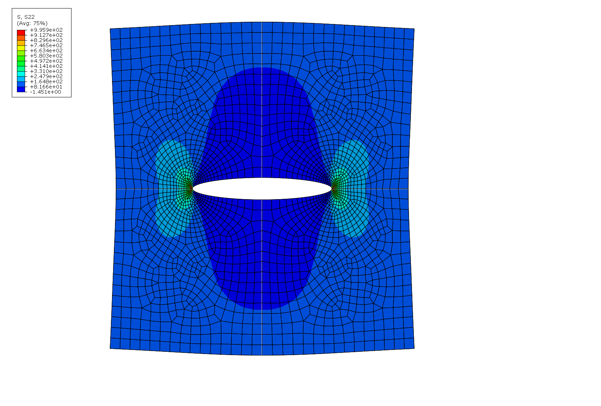

##  AE 737: Mechanics of Damage Tolerance
Lecture 21-22 - Finite Elements

Dr. Nicholas Smith

Wichita State University, Department of Aerospace Engineering

April 12-14, 2021

----
##  schedule

- 12 Apr - Finite Elements in Fracture
- 14 Apr - Finite Elements in Fracture
- 16 Apr - Homework 7 Self-grade, Homework 8 Due
- 19 Apr - Exam Review
- 21 Apr - Exam 2

---
# finite element techniques

----
## finite element methods in fracture

-   Direct method (use near-tip stress field)
    -   Requires very fine mesh near the tip to be accurate
    -   Can be made feasible with specialty elements

----
## fem in fracture

-   Crack closure method
    -   An energy based method
    -   Calculate energy to close crack one element away from crack tip
    -   Can have a courser mesh than direct method

----
## more information

- More information can be found in my AE837 Notes
  - direct method theory [link](https://ndaman.github.io/fracture/exam%202/lecture11.html)
  - direct method screencast demos [link](https://ndaman.github.io/fracture/exam%202/lecture12.html)

----
## fem in fracture

- J-integral method
    - Many FE codes give a convenient method to calculate the J-integral
    - Learn about this in 837, but gives a mesh-independent way to calculate stress intensity
    - [link](https://ndaman.github.io/fracture/exam%202/lecture13.html)

----
## fem in fracture

-   Cohesive elements
    -   Specialty elements act like an adhesive between two materials
    -   Used to model crack propagation when crack path (and material behavior) are known

----
## fem in fracture

-   XFEM
    -   eXtended Finite Element Method
    -   Can predict crack growth in any direction
    -   Adds extra physics model inside an element (fine mesh not necessarily required)

----
## direct method

-   We already know that the stress field near the crack tip is
    
`$$\sigma_{yy} = \frac{K_I}{\sqrt{2 \pi x}}$$`

-   We can solve this for `$K_I$` and we should (in theory) be able to calculate `$K_I$`
-   We will get a unique `$K_I$` value for every point (*x*) along crack plane

----
## direct method

-   For this method to be accurate, we need to capture the singularity at crack tip
-   This requires a very fine mesh (computationally expensive)
-   Alternatively, many FE packages include “singularity” elements which allow a coarse(r) mesh

----
## modeling tips

-   Use symmetry in your model to reduce node count
-   Center-crack can be modeled using on 1/4 of the model
-   Use biased node seeding (more nodes near tip)

----
## symmetry

 <!-- .element width="60%" -->

----
## symmetry

 <!-- .element width="60%" -->

----
## analyzing results

-   If our results are accurate, we should be able to calculate the same `$K_I$` at any point
-   To ensure convergence, we plot the calculated `$K_I$` vs. *x* (distance from crack tip)
-   In the region where this plot is a horizontal line, we consider a converged `$K_I$`

----
## analyzing results

-   It is also possible to consider the crack opening displacement

`$$u_y = \frac{K_I(\kappa + 1)}{4 G \pi}\sqrt{-2 \pi x}$$`

-   Where `$\kappa$` is to easily differentiate between plane stress and plane strain
    
`$$\begin{aligned}
  \kappa &= 3 - 4\nu & \text{(plane strain)}\\
  \kappa &= \frac{3-\nu}{1+\nu} & \text{(plane stress)}
\end{aligned}$$`

----
## a few other examples

- Mixed-mode fracture [link](https://ndaman.github.io/fracture/exam%202/lecture16.html)
- Plasticity [link](https://ndaman.github.io/fracture/exam%202/plasticity.html)
