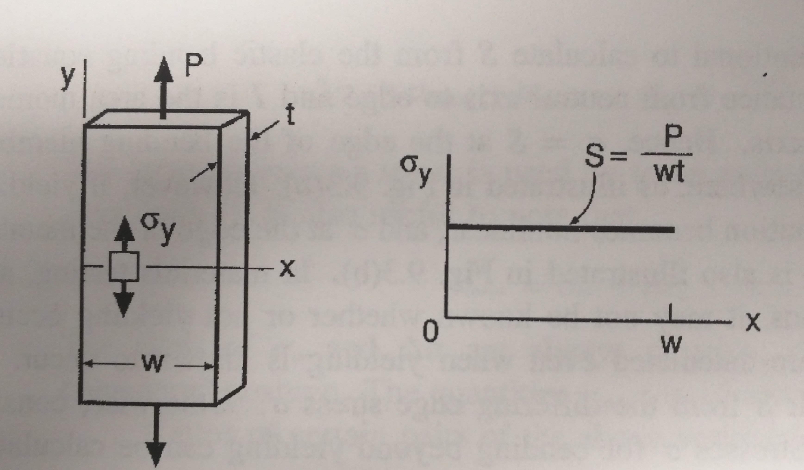
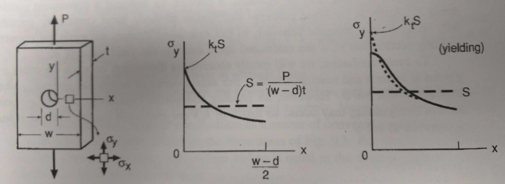

## AE 737: Mechanics of Damage Tolerance
Lecture 14 - Stress based fatigue 

Dr. Nicholas Smith

Wichita State University, Department of Aerospace Engineering

March 21, 2019

----
## schedule

- 21 Mar - Stress-based fatigue
- 26 Mar - Stress-based fatigue, Project Abstract Due
- 28 Mar - Strain-based fatigue
- 2 Apr - Crack growth, HW6 Due

----
## outline

---
# exam

----
## curve

-   Precurve: 
-   Post-curve:
-   High Score: 
-   Curve formula: (old score) x 

---
# final project

----
## general description

-   This is in place of a final exam
-   Should demonstrate your understanding of the course as a whole
-   Choose any real object
-   Needs to undergo some cyclic loading (for fatigue)
-   Materials, loads, and any other “given” data can be made up

----
## overview

-   Estimate stress intensity factor at some critical location
-   Estimate residual strength (use a “typical” crack length)
-   Estimate fatigue life 
-   Estimate crack propagation
-   Suggest reasonable inspection cycle for safe use
-   Suggest an improvement to make part more damage tolerant

----
## grade breakdown

-   Per course syllabus, project will be worth 25% of final grade
-   5% Project abstract submission and approval
-   15% for each major component
    -   stress intensity factor
    -   residual strength
    -   fatigue
    -   crack propagation
    -   inspection cycle
-   10% for damage tolerant improvement
-   10% general presentation, organization, and grammar

----
## project abstract

-   Main purpose of abstract is for you to make sure your idea fits with project purpose
-   I will give you feedback on how to tweak your proposed idea to better meet project purpose
-   Abstract submission should be 1-2 pages
-   Briefly describe your chosen part, how it undergoes cyclic loading, what location you intend to consider for the stress intensity factor.
-   This is like a proposal: convince me that your idea has what it takes to be a great final project

----
## justify assumptions

-   You will need to make many assumptions in order to complete this project
-   Clearly state your assumptions and justify them (i.e. if you assume plane strain conditions, justify that by showing how thick your part is)
-   Although will not have experimental or FE analysis specific to your part, use concepts from other data in the text (stiffeners, multiple site damage) in a qualitative manner

----
## figures

-   Figures can greatly enhance your project report, if you use them well
-   Many readers will jump to figures in a report, include sufficient information in caption and axis labels so a reader with general damage tolerance understanding can understand your figure
-   This will interest them in the rest of your paper

----
## examples

-   Last year I did not curve final project grades
-   Some examples of a couple of good project reports have been posted to blackboard
-   You should not use their projects, but they have very good use of figures, as well as an appropriate balance of both depth and breadth in the their analysis

---
# fatigue

----
## fatigue

-   We refer to damage from repeated, or cyclic loads as fatigue damage
-   Some of the earliest work on fatigue began in the 1800’s
-   Chains, railway axles, etc.
-   An estimated 80% of failure expenses are due to fatigue

----
## fatigue

-   There are three main approaches to fatigue analysis
	-   Stress based fatigue analysis
	-   Strain based fatigue analysis
	-   Fracture mechanics fatigue analysis

----
## stress based fatigue

-   One of the simplest assumptions we can make is that a load cycles between a constant maximum and minimum stress value
-   This is a good approximation for many cases (axles, for example) and can also be easily replicated experimentally
-   This is referred to as constant amplitude stressing

----
## constant amplitude stressing

TODO: figure

----
## constant amplitude stressing

-   `$\delta \sigma$` is known as the stress range, and is the difference between max and min stress
-   `$\sigma_m$` is the mean stress, and can sometimes be zero, but this is not always the case
-   `$\sigma_a$` is the stress amplitude, and is the variation about the mean
-   We can express all of these in terms of the maximum and minimum stress
    $$\\begin{aligned}
            \\Delta \\sigma &= \\sigma\_{max} - \\sigma\_{min}\\\\
            \\sigma\_m &= \\frac{\\sigma\_{max} + \\sigma\_{min}}{2}\\\\
            \\sigma\_a &= \\frac{\\sigma\_{max}- \\sigma\_{min}}{2}
            \\end{aligned}$$

----
## constant amplitude stressing

-   It is also common to describe some ratios
-   The stress ratio, *R* is defined as
    $$R = \\frac{\\sigma\_{min}}{\\sigma\_{max}}$$
-   And the amplitude ratio, *A* is defined as
    $$A = \\frac{\\sigma\_a}{\\sigma\_m}$$

----
## useful relations

-   There are some useful relationships between the above equations
    $$\\begin{aligned}
                \\Delta \\sigma &= 2 \\sigma\_a = \\sigma\_{max}(1-R)\\\\
                \\sigma\_m &= \\frac{\\sigma\_{max}}{2}(1+R)\\\\
                R &= \\frac{1-A}{1+A}\\\\
                A &= \\frac{1-R}{1+R}
                \\end{aligned}$$

---
# nominal and local stress

----
## definition and notation

-   It is important to distinguish between the nominal (global) stress and the local stress at some point of interest
-   We use $\sigma$ for the stress at a point (local stress)
-   We use *S* as the nominal (global) stress
-   In simple tension, $\sigma=S$ 
-   For many cases (bending, notches), $\sigma \ne S$ in general
-   We must also be careful to note `$\sigma_y$`, in some cases `$S < \sigma_y$` but at some locations `$\sigma > \sigma_y$`

----
## simple tension

----
## bending

----
## notches

---
# fatigue tests

----
## rotating cantilever beam

----
## rotating four-point bend

----
## fatigue tests

-   The above rotating methods are very common, but in their current configurations can only be used for zero mean stress

-   a reciprocating bend test can be used for non-zero mean stress

----
## reciprocating bend test

----
## axial fatigue test

----
## fatigue tests

-   The length of a fatigue test is determined by two factors

    1.  How many cycles it takes for the specified load to cause failure

    2.  The speed of the motor controlling the test

-   Servohydraulic machines generally have a speed of 10 - 100 Hz.

-   At a speed of 100 Hz, it would take 28 hours for 107 cycles, 12 days for 108 cycles, and nearly 4 months for 109 cycles

-   While some machines can test at very high speeds, the inertia of the sample can interfere with results

fatigue life analysis
=====================

----
## stress life curves

-   Stress-life curves, or S-N curves, are generated from test data to predict the number of cycles to failure

-   In general, one set (or family) of S-N curves is generated using the same *σ**m*

-   Usually *S**a* (the nominal stress equivalent of *σ**a*) is plotted versus *N* (the number of cycles)

----
## stress life curves

-   Each individual point on an S-N curve represents one fatigue experiment

-   To find enough data to form statistical significance, as well as to fit a curve across all levels of fatigue is very time-consuming

-   In the following plot, if only one test was performed for each point, the total number of cycles tested would be about 7.3*x*107

-   For a 100 Hz machine, this represents over 200 hours of consecutive testing

-   Each repetition would further increase the test time required

----
## stress life curves

coordinates ----
##  (50043.42952596336,304.3384885916487) (61810.2778157969,275.4565502529583) (64649.06882505588,262.997448795745) (169586.85224960672,247.7449948831778) (565161.8625105635,233.04313985499925) (761338.8628672551,220.14010003026843) (1579862.092639026,191.8692976260827) (3173264.1073141545,178.55402931722847) (3682937.77739026,205.51896106891124) (9552328.626265539,185.27652459677992) (18242638.367873847,164.96778564118816) (35011737.76351732,165.60774874241474) ;

----
## stress life curves

-   On a linear scale, the data appear not to agree well with any standard fit

-   It is also very difficult to differentiate between low-cycle fatigue failure stresses

-   Instead S-N curves are often plotted on a semi-log or log-log scale, so pay attention to the axes

----
## stress life curves

coordinates ----
##  (50043.42952596336,304.3384885916487) (61810.2778157969,275.4565502529583) (64649.06882505588,262.997448795745) (169586.85224960672,247.7449948831778) (565161.8625105635,233.04313985499925) (761338.8628672551,220.14010003026843) (1579862.092639026,191.8692976260827) (3173264.1073141545,178.55402931722847) (3682937.77739026,205.51896106891124) (9552328.626265539,185.27652459677992) (18242638.367873847,164.96778564118816) (35011737.76351732,165.60774874241474) ;

----
## curve fits

-   If the curve is nearly linear on a log-linear plot, we use the following form to fit the data

-   
    *σ**a* = *C* + *D*log*N**f*

-   When the data are instead linear on a log-log scale, the following form is generally used

-   
    *σ**a* = *σ**f*′(2*N**f*)*b*

-   *σ**f*′ and *b* are often considered material properties and can often be looked up on a table (p. 235)

----
## curve fit

coordinates ----
##  (50043.42952596336,304.3384885916487) (61810.2778157969,275.4565502529583) (64649.06882505588,262.997448795745) (169586.85224960672,247.7449948831778) (565161.8625105635,233.04313985499925) (761338.8628672551,220.14010003026843) (1579862.092639026,191.8692976260827) (3173264.1073141545,178.55402931722847) (3682937.77739026,205.51896106891124) (9552328.626265539,185.27652459677992) (18242638.367873847,164.96778564118816) (35011737.76351732,165.60774874241474) ; ;

----
## stress life curves

coordinates ----
##  (50043.42952596336,304.3384885916487) (61810.2778157969,275.4565502529583) (64649.06882505588,262.997448795745) (169586.85224960672,247.7449948831778) (565161.8625105635,233.04313985499925) (761338.8628672551,220.14010003026843) (1579862.092639026,191.8692976260827) (3173264.1073141545,178.55402931722847) (3682937.77739026,205.51896106891124) (9552328.626265539,185.27652459677992) (18242638.367873847,164.96778564118816) (35011737.76351732,165.60774874241474) ; ;

fatigue limit
=============

----
## fatigue limit

-   The fatigue limit, or endurance limit, is a feature of some materials where below a certain stress, no fatigue failure is observed

-   Below the fatigue limit, this material is considered to have infinite life

-   This most notably occurs in plain-carbon and low-alloy steels

-   In these materials, *σ**e* is considered to be a material property

-   This phenomenon is not typical of aluminum or copper alloys, but is sometimes arbitrarily assigned using whatever the failure stress is at some large number of cycles (107 or 108)

----
## fatigue limit

coordinates ----
##  (15335.57305076729,755.3980800096908) (17120.563873524803,756.1781896368977) (17030.666340686137,720.548741709821) (22930.156230029723,720.2495381726781) (35394.72596452449,685.9598437358045) (48178.50680065504,650.9057872263105) (60015.34650935311,651.5756639714122) (85619.60323966984,616.4743647981587) (96991.95509887673,615.4580418521547) (111725.20919888247,616.2066563701887) (310167.4766824342,514.5113715514369) (380171.36929461616,514.3066533418128) (465974.9357903219,514.1019351321886) (207329.98874026354,548.7695708791375) (246290.6168802425,548.5963477786863) (517751.44153305655,480.1429393416311) (615045.2363433094,479.96971624117987) (693804.9505813519,445.1046303867236) (905347.6109897072,444.8369219587535) (2075614.3484015197,444.00230156567034) (2545405.291185992,444.68792586535835) (3106869.8968525752,437.3604675812362) (2677489.704626086,424.14705793283065) (6497638.107517564,413.4556797189666) (82022604.86227266,436.74025620059956) (82752208.82434484,425.1500560249538) (80830258.5708036,411.81066593985645) ;

----
## high and low cycle fatigue

-   Some other important terms are high cycle fatigue and low cycle fatigue

-   “High cycle fatigue” generally is considered anything above 103 cycles, but varies somewhat by material

-   High cycle fatigue occurs when the stress is sufficiently low that yielding effects do not dominate behavior

-   When yielding effects do dominate behavior, the strain-based approach is more appropriate

