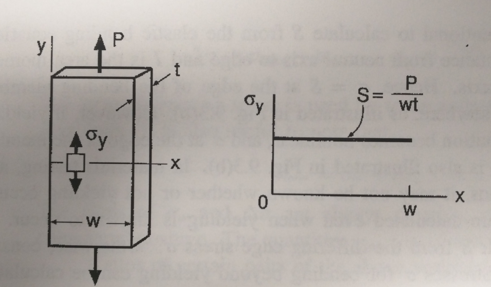
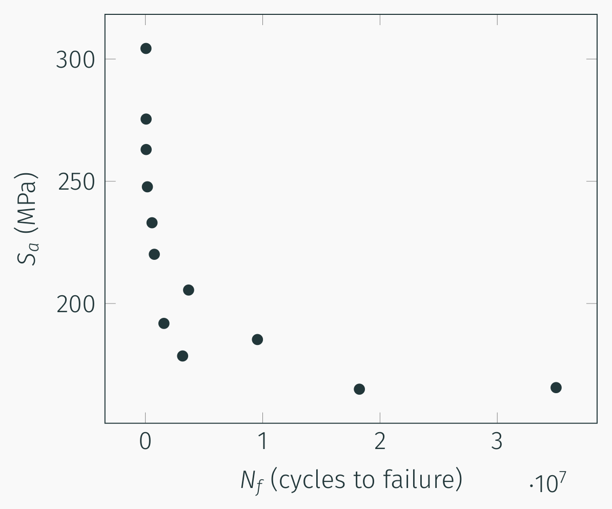

## AE 737: Mechanics of Damage Tolerance
Lecture 14 - Stress based fatigue

Dr. Nicholas Smith

Wichita State University, Department of Aerospace Engineering

March 10, 2020

----
## schedule

- 10 Mar - Stress-based fatigue
- 12 Mar - Stress-based fatigue, Project Abstract Due
- 17 Mar - Strain-based fatigue
- 19 Mar - Crack growth, HW6 Due

----
## outline
<!-- TOC START min:1 max:1 link:false update:true -->
- fatigue
- nominal and local stress
- fatigue tests
- fatigue life analysis

<!-- TOC END -->

---
# fatigue

----
## fatigue

-   We refer to damage from repeated, or cyclic loads as fatigue damage
-   Some of the earliest work on fatigue began in the 1800's
-   Chains, railway axles, etc.
-   An estimated 80% of failure expenses are due to fatigue

----
## fatigue

-   There are three main approaches to fatigue analysis
	-   Stress based fatigue analysis
	-   Strain based fatigue analysis
	-   Fracture mechanics fatigue analysis

----
## stress based fatigue

-   One of the simplest assumptions we can make is that a load cycles between a constant maximum and minimum stress value
-   This is a good approximation for many cases (axles, for example) and can also be easily replicated experimentally
-   This is referred to as constant amplitude stressing

----
## constant amplitude stressing

 <!-- .element width="50%" -->

----
## constant amplitude stressing

-   `$\Delta \sigma$` is known as the stress range, and is the difference between max and min stress
-   `$\sigma_m$` is the mean stress, and can sometimes be zero, but this is not always the case
-   `$\sigma_a$` is the stress amplitude, and is the variation about the mean

----
## constant amplitude stressing

-   We can express all of these in terms of the maximum and minimum stress

$$\\begin{aligned}
  \\Delta \\sigma &= \\sigma\_{max} - \\sigma\_{min}\\\\
  \\sigma\_m &= \\frac{\\sigma\_{max} + \\sigma\_{min}}{2}\\\\
  \\sigma\_a &= \\frac{\\sigma\_{max}- \\sigma\_{min}}{2}
\\end{aligned}$$

----
## constant amplitude stressing

-   It is also common to describe some ratios
-   The stress ratio, *R* is defined as

$$R = \\frac{\\sigma\_{min}}{\\sigma\_{max}}$$

-   And the amplitude ratio, *A* is defined as

$$A = \\frac{\\sigma\_a}{\\sigma\_m}$$

----
## useful relations

-   There are some useful relationships between the above equations

$$\\begin{aligned}
  \\Delta \\sigma &= 2 \\sigma\_a = \\sigma\_{max}(1-R)\\\\
  \\sigma\_m &= \\frac{\\sigma\_{max}}{2}(1+R)\\\\
  R &= \\frac{1-A}{1+A}\\\\
  A &= \\frac{1-R}{1+R}
\\end{aligned}$$

---
# nominal and local stress

----
## definition and notation

-   It is important to distinguish between the nominal (global) stress and the local stress at some point of interest
-   We use $\sigma$ for the stress at a point (local stress)
-   We use *S* as the nominal (global) stress
-   In simple tension, $\sigma=S$

----
## notation

-   For many cases (bending, notches), $\sigma \ne S$ in general
-   We must also be careful to note `$\sigma_y$`, in some cases `$S < \sigma_y$` but at some locations `$\sigma > \sigma_y$`

----
## simple tension

 <!-- .element width="50%" -->

----
## bending

 <!-- .element width="50%" -->

----
## notches

 <!-- .element width="50%" -->

---
# fatigue life analysis

----
## stress life curves

-   Stress-life curves, or S-N curves, are generated from test data to predict the number of cycles to failure
-   In general, one set (or family) of S-N curves is generated using the same `$\sigma_m$`
-   Usually *S**a* (the nominal stress equivalent of `$\sigma_a$`) is plotted versus *N* (the number of cycles)

----
## stress life curves

-   Each individual point on an S-N curve represents one fatigue experiment
-   To find enough data to form statistical significance, as well as to fit a curve across all levels of fatigue is very time-consuming
-   In the following plot, if only one test was performed for each point, the total number of cycles tested would be about 7.3*x*107
-   For a 100 Hz machine, this represents over 200 hours of consecutive testing

----
## stress life curves

 <!-- .element width="50%" -->

----
## stress life curves

-   On a linear scale, the data appear not to agree well with any standard fit
-   It is also very difficult to differentiate between low-cycle fatigue failure stresses
-   Instead S-N curves are often plotted on a semi-log or log-log scale, so pay attention to the axes

----
## stress life curves

<!-- .element width="50%" -->

----
## curve fits

-   If the curve is nearly linear on a log-linear plot, we use the following form to fit the data

`$$\sigma_a = C + D \log N_f$$`

-   When the data are instead linear on a log-log scale, the following form is generally used

`$$\sigma_a = \sigma^\prime_f(2N_f)^b$$`

-   `$\sigma^\prime_f$` and *b* are often considered material properties and can often be looked up on a table (p. 235)

----
## curve fit

 <!-- .element width="50%" -->

----
## stress life curves

 <!-- .element width="50%" -->

---
# fatigue limit

----
## fatigue limit

-   The fatigue limit, or endurance limit, is a feature of some materials where below a certain stress, no fatigue failure is observed
-   Below the fatigue limit, this material is considered to have infinite life
-   This most notably occurs in plain-carbon and low-alloy steels
-   In these materials, `$\sigma_e$` is considered to be a material property

----
## fatigue limit

-   This phenomenon is not typical of aluminum or copper alloys
-   It is sometimes arbitrarily assigned using whatever the failure stress is at some large number of cycles (107 or 108)

----
## fatigue limit

 <!-- .element width="50%" -->

----
## high and low cycle fatigue

-   Some other important terms are high cycle fatigue and low cycle fatigue
-   "High cycle fatigue" generally is considered anything above 103 cycles, but varies somewhat by material

----
## high and low cycle fatigue
-   High cycle fatigue occurs when the stress is sufficiently low that yielding effects do not dominate behavior

---
# modeling real loads

----
## real loads

-   Static loads are constant and do not vary. While they are not generally considered “fatigue” loads, they can be present during fatigue loads, which will change the response.
-   Working loads change with time as a function of the normal operation of a component
-   Vibratory loads occur at a higher frequency than working loads and may be caused by the environment or secondary effects of normal operation.
-   Accidental loads can occur at a much lower frequency than working loads

----
## real loads

----
## real loads

----
## simplified load sketch book p 239

----
## effect of variable amplitude

-   We know that variable loads can often occur in real scenarios, but how can we model the effect?
-   Miner’s Rule is often used to approximate the effect of variable amplitude load
-   We consider each load amplitude (and the number of cycles at that amplitude) as having used up a percentage of a part’s life

$$\\frac{N\_1}{N\_{f1}} + \\frac{N\_2}{N\_{f2}} + \\frac{N\_3}{N\_{f3}} + ... = \\sum \\frac{N\_i}{N\_{fi}} = 1$$

----
## effect of variable amplitude

-   Often there are “blocks” of variable amplitude loads which repeat
-   A typical flight cycle is a good example of this
-   A flight will have working loads, vibrations, as well as storms/turbulence, but each flight should have similar loading
-   If we call the number of “block” *B* then we have

$$B \\left\[\\sum \\frac{N\_i}{N\_{if}}\\right\]\_{rep} = 1$$

----
## mean stress effects

-   It is possible for each variable load case to have a different mean stress
-   This would mean generating a different S-N curve for each potential mean stress
-   Much work has been done to instead convert a zero-mean stress curve to different mean stress amplitudes

---
# mean stress effects

----
## mean stress

-   Since mean stress has an effect on fatigue life, sometimes a family of S-N curves at varying mean stress values is created
-   S-N curves for these are reported in different ways, but commonly *σ**max* replaces *σ**a* on the y-axis
-   One useful way of representing these data, instead of many S-N curves, is a constant-life diagram
-   It is created by taking points from the S-N curves and plotting a line through constant *N**f* values

----
## S-N curves at variable *σ**m*

 <!-- .element width="60%" -->

----
## constant life diagram

 <!-- .element width="45%" -->

----
## normalizing

-   One very useful way to plot this data is to normalize the amplitude by the zero-mean amplitude
-   We call the zero-mean amplitude as *σ**ar*
-   Plotting *σ**a*/*σ**ar* vs. *σ**m* provides a good way to group all the data together on one plot with the potential to fit a curve

----
## normalized amplitude-mean diagram

 <!-- .element width="45%" -->

----
## Goodman line

-   The first work on this problem was done by Goodman, who proposed the line

$$\\frac{\\sigma\_a}{\\sigma\_{ar}} + \\frac{\\sigma\_m}{\\sigma\_u} = 1$$

-   This equation can also be used for fatigue limits, since they are just a point on the S-N curves

$$\\frac{\\sigma\_e}{\\sigma\_{er}} + \\frac{\\sigma\_m}{\\sigma\_u} = 1$$

----
## modifications

-   While the Goodman line gives a good approximation to convert non-zero mean stress S-N curves, it is somewhat overly conservative at high mean stresses
-   It is also non-conservative for negative mean stresses
-   An alternative fit is known as the Gerber Parabola

$$\\frac{\\sigma\_a}{\\sigma\_{ar}} + \\left(\\frac{\\sigma\_m}{\\sigma\_u}\\right)^2 = 1$$

-   In general, the Goodman line is a good fit for brittle materials (steels) while the Gerber parabola is a better fit for more ductile materials

----
## modifications

-   The Goodman line can also be improved by replacing *σ**u* with the corrected true fracture strength $\\tilde{\\sigma}\_{fB}$ or the constant *σ**f*′ from the S-N curve fit

$$\\frac{\\sigma\_a}{\\sigma\_{ar}} + \\frac{\\sigma\_m}{\\sigma\_f^\\prime} = 1$$

-   This is known as the Morrow Equation
-   For steels, $\\sigma\_f^\\prime \\approx \\tilde{\\sigma}\_{fB}$, but for aluminums these values can be significantly different, and better agreement is found using $\\tilde{\\sigma}\_{fB}$.

----
## modifications

-   One more relationship that has shown particularly good results with aluminum alloys is the Smith, Watson, and Topper equations (SWT)

$$\\sigma\_{ar} = \\sqrt{\\sigma\_{max}\\sigma\_a}$$

-   In general, it is best to use a form that matches your data
-   If data is lacking, the SWT and Morrow equations generally provide the best fit

---
# scatter

----
## fatigue scatter

-   One of the challenges with fatigue is that there is generally considerable scatter in the data
-   Quantifying this scatter requires many repetitions, which makes for time consuming tests
-   In general, the scatter follows a lognormal distribution (or a normal distribution in log(*N**f*))

----
## S-N-P Curve

---
# general stress

----
## general stress

-   Often combined loads from different sources introduce stresses which are not uni-axial
-   For ductile materials, good agreement has been found using an effective stress amplitude, similar to the octahedral shear yield criterion

$$\\bar{\\sigma}\_a = \\frac{1}{\\sqrt{2}}\\sqrt{(\\sigma\_{xa}-\\sigma\_{ya})^2 + (\\sigma\_{ya}-\\sigma\_{za})^2 + (\\sigma\_{za}-\\sigma\_{xa})^2 + 6(\\tau\_{xy}^2 + \\tau\_{yz}^2 + \\tau\_{zx}^2)}$$

-   The effective mean stress is given by

$$\\bar{\\sigma}\_m = \\bar{\\sigma}\_{xm} + \\bar{\\sigma}\_{ym} + \\bar{\\sigma}\_{zm}$$

----
## effective stress

-   This effective stress can be used in all other relationships, including mean stress relationships
-   Note that mean shear stress has no effect on the effective mean stress
-   This is surprising, but agrees well with experiments
-   When yielding effects do dominate behavior, the strain-based approach is more appropriate
