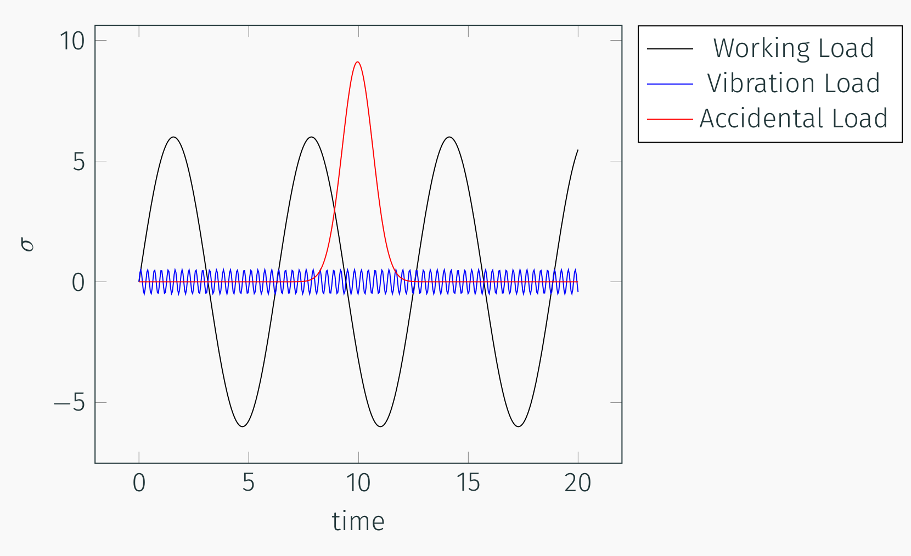
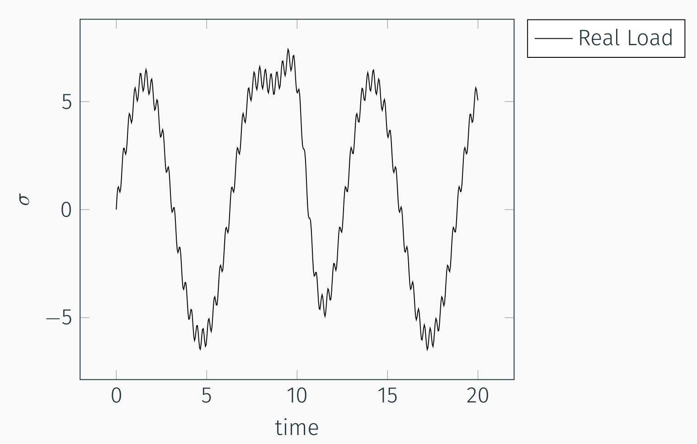

## AE 737: Mechanics of Damage Tolerance
Lecture 15 - Stress based fatigue

Dr. Nicholas Smith

Wichita State University, Department of Aerospace Engineering

March 26, 2019

----
## schedule

- 26 Mar - Stress-based fatigue, Project Abstract Due
- 28 Mar - Strain-based fatigue
- 2 Apr - Crack growth, HW6 Due
- 4 Apr - Crack growth

----
## outline

<!-- vim-markdown-toc GFM -->

* modeling real loads
* mean stress effects
* scatter
* general stress
* fatigue review
* influence of notches

<!-- vim-markdown-toc -->

---
# modeling real loads

----
## real loads

-   Static loads are constant and do not vary. While they are not generally considered "fatigue" loads, they can be present during fatigue loads, which will change the response.
-   Working loads change with time as a function of the normal operation of a component
-   Vibratory loads occur at a higher frequency than working loads and may be caused by the environment or secondary effects of normal operation.
-   Accidental loads can occur at a much lower frequency than working loads

----
## real loads

----
## real loads

----
## simplified load sketch book p 239

----
## effect of variable amplitude

-   We know that variable loads can often occur in real scenarios, but how can we model the effect?
-   Miner's Rule is often used to approximate the effect of variable amplitude load
-   We consider each load amplitude (and the number of cycles at that amplitude) as having used up a percentage of a part’s life
$$\\frac{N\_1}{N\_{f1}} + \\frac{N\_2}{N\_{f2}} + \\frac{N\_3}{N\_{f3}} + ... = \\sum \\frac{N\_i}{N\_{fi}} = 1$$

----
## effect of variable amplitude

-   Often there are "blocks" of variable amplitude loads which repeat
-   A typical flight cycle is a good example of this
-   A flight will have working loads, vibrations, as well as storms/turbulence, but each flight should have similar loading
-   If we call the number of "block" *B* then we have
$$B \\left\[\\sum \\frac{N\_i}{N\_{if}}\\right\]\_{rep} = 1$$

----
## mean stress effects

-   It is possible for each variable load case to have a different mean stress
-   This would mean generating a different S-N curve for each potential mean stress
-   Much work has been done to instead convert a zero-mean stress curve to different mean stress amplitudes

---
# mean stress effects

----
## mean stress

-   Since mean stress has an effect on fatigue life, sometimes a family of S-N curves at varying mean stress values is created
-   S-N curves for these are reported in different ways, but commonly `$\sigma_{max}$` replaces `$\sigma_a$` on the y-axis
-   One useful way of representing these data, instead of many S-N curves, is a constant-life diagram
-   It is created by taking points from the S-N curves and plotting a line through constant *N**f* values

----
## S-N curves at variable mean stress

----
## constant life diagram

----
## normalizing

-   One very useful way to plot this data is to normalize the amplitude by the zero-mean amplitude
-   We call the zero-mean amplitude as `$\sigma_{ar}$`
-   Plotting `$\sigma_a / \sigma_{ar}$` vs. `$\sigma_m$` provides a good way to group all the data together on one plot with the potential to fit a curve

----
## normalized amplitude-mean diagram

----
## Goodman line

-   The first work on this problem was done by Goodman, who proposed the line
    $$\\frac{\\sigma\_a}{\\sigma\_{ar}} + \\frac{\\sigma\_m}{\\sigma\_u} = 1$$
-   This equation can also be used for fatigue limits, since they are just a point on the S-N curves
    $$\\frac{\\sigma\_e}{\\sigma\_{er}} + \\frac{\\sigma\_m}{\\sigma\_u} = 1$$

----
## modifications

-   While the Goodman line gives a good approximation to convert non-zero mean stress S-N curves, it is somewhat overly conservative at high mean stresses
-   It is also non-conservative for negative mean stresses
-   An alternative fit is known as the Gerber Parabola
    $$\\frac{\\sigma\_a}{\\sigma\_{ar}} + \\left(\\frac{\\sigma\_m}{\\sigma\_u}\\right)^2 = 1$$
-   In general, the Goodman line is a good fit for brittle materials (steels) while the Gerber parabola is a better fit for more ductile materials

----
## modifications

-   The Goodman line can also be improved by replacing *&sigma;**u* with the corrected true fracture strength $\\tilde{\\sigma}\_{fB}$ or the constant *&sigma;**f*′ from the S-N curve fit

$$\\frac{\\sigma\_a}{\\sigma\_{ar}} + \\frac{\\sigma\_m}{\\sigma\_f^\\prime} = 1$$
-   This is known as the Morrow Equation
-   For steels, $\\sigma\_f^\\prime \\approx \\tilde{\\sigma}\_{fB}$, but for aluminums these values can be significantly different, and better agreement is found using $\\tilde{\\sigma}\_{fB}$.

----
## modifications

-   One more relationship that has shown particularly good results with aluminum alloys is the Smith, Watson, and Topper equations (SWT)
$$\\sigma\_{ar} = \\sqrt{\\sigma\_{max}\\sigma\_a}$$
-   In general, it is best to use a form that matches your data
-   If data is lacking, the SWT and Morrow equations generally provide the best fit

---
# scatter

----
## fatigue scatter

-   One of the challenges with fatigue is that there is generally considerable scatter in the data
-   Quantifying this scatter requires many repetitions, which makes for time consuming tests
-   In general, the scatter follows a lognormal distribution (or a normal distribution in log(*N**f*))

----
## S-N-P Curve

---
# general stress

----
## general stress

-   Often combined loads from different sources introduce stresses which are not uni-axial
-   For ductile materials, good agreement has been found using an effective stress amplitude, similar to the octahedral shear yield criterion
$$\\bar{\\sigma}\_a = \\frac{1}{\\sqrt{2}}\\sqrt{(\\sigma\_{xa}-\\sigma\_{ya})^2 + (\\sigma\_{ya}-\\sigma\_{za})^2 + (\\sigma\_{za}-\\sigma\_{xa})^2 + 6(\\tau\_{xy}^2 + \\tau\_{yz}^2 + \\tau\_{zx}^2)}$$
-   The effective mean stress is given by
$$\\bar{\\sigma}\_m = \\bar{\\sigma}\_{xm} + \\bar{\\sigma}\_{ym} + \\bar{\\sigma}\_{zm}$$

----
## effective stress

-   This effective stress can be used in all other relationships, including mean stress relationships
-   Note that mean shear stress has no effect on the effective mean stress
-   This is surprising, but agrees well with experiments

---
# fatigue review

----
## group 1

-   A part from AISI 4340 in a typical "block" undergoes 100,000 cycles with *&sigma;*min = 0 ksi and *&sigma;*max = 100 ksi and an additional 10 cycles with *&sigma;*min = 50 ksi and *&sigma;*max = 200 ksi
-   How many "blocks" can this part support before failure?

----
## group 2

-   Use the S-N-P chart on p. 245 for 7075-T6 Aluminum
-   What is the probability of failure for 30 ksi at 106 cycles?
-   To ensure that 99% of parts do not fail, after how many cycles should a fully reversed load of 35 ksi be inspected?
-   How many cycles could the same part sustain if only 50% of parts are needed?

----
## group 3

-   The fatigue limit for AISI 4142 steel is 58 ksi for completely reversed fatigue loads.
-   What is the fatigue limit for fatigue loads with *&sigma;**m* = 10, 20, 30 ksi?

----
## group 4

-   A material made of 2024-T4 Aluminum undergoes the following load cycle
    -   *&sigma;**x*, min = 10, *&sigma;**x*, max = 50
    -   *&sigma;**y*, min = −20, *&sigma;**y*, max = 20
    -   *&tau;**x**y*, min = 0, *τ**xy*, max = 30
-   How many cycles can it support before failure?

---
# influence of notches

----
## notch effects

-   In this discussion, we use "notch" to refer to any geometric feature that increases the local stress (such as holes, fillets, grooves, etc.)
-   We discussed notches and stress concentration factors in terms of stress concentration factors
-   In our fatigue notation, *&sigma;*max = *K**t**S*
-   This relates local stress to the average, nominal stress
-   The stress intensity factor can be used to characterize the "strength" of a notch

----
## notch effects

-   We might expect the fatigue life of a notched specimen to be similar to a pristine specimen with *S**a*, pristine = *&sigma;*max, notched
-   If we look at actual test data, however, this estimate would be overly conservative
-   Even when the stress is adjusted for some fatigue notch factor, *k**f*, it is only valid at longer cycles (*N**f* &gt; 106)
    $$k\_f = \\frac{\\sigma\_{ar}}{S\_{ar}}$$
-   Notches will have different effects, largely depending on their radius.
-   The maximum possible fatigue notch factor is *k**f* = *k**t*

----
## notch effects

----
## notch sensitivity factor

-   To avoid generating fatigue data for every possible notch configuration, some empirical relationships have been developed
-   A useful concept in these methods is the notch sensitivity factor
    $$q = \\frac{k\_f - 1}{k\_t -1}$$
-   When *k**f* = 1, *q* = 0, in which case the notch has no effect
-   When *k**f* = *k**t*, *q* = 1, in which case the notch has its maximum effect

----
## peterson notch sensitivity

-   Peterson developed the following relationship
    $$q = \\frac{1}{1+\\frac{\\alpha}{\\rho}}$$
-   Where *&rho;* is the radius of the notch
-   *&alpha;* is a material property

    |            Material           | *&alpha;* (mm) | *&alpha;* (in) |
    |:-----------------------------:|:--------:|:--------:|
    |        Aluminum alloys        |   0.51   |   0.02   |
    | Annealed or low-carbon steels |   0.25   |   0.01   |
    |  Quenched and tempered steels |   0.064  |  0.0025  |

----
## peterson notch sensitivity

-   For high-strength steels, a more specific *&alpha;* estimate can be found
$$\\begin{aligned}
  \\alpha &= 0.025 \\left(\\frac{2070 }{\\sigma\_u}\\right)^{1.8} & \\text{mm} & \\qquad \\sigma\_u \\ge 550 \\text{ MPa}\\\\
  \\alpha &= 0.001 \\left(\\frac{300 }{\\sigma\_u}\\right)^{1.8} & \\text{in} & \\qquad \\sigma\_u \\ge 80 \\text{ ksi}
\\end{aligned}$$
-   *&alpha;* predictions are valid for bending and axial fatigue
-   For torsion fatigue, a good estimate can be found
    *&alpha;*torsion = 0.6*&alpha;*

----
## alternative notch sensitivity formulation

-   An alternative formulation for *q* was developed by Neuber

    $$q = \\frac{1}{1+\\sqrt{\\frac{\\beta}{\\rho}}}$$

-   Where the material property *&beta;* for steels is given by
$$\\begin{aligned}
  \\log \\beta &= -\\frac{\\sigma\_u - 134}{586} & \\text{mm} & \\qquad \\sigma\_u \\le 1520 \\text{ MPa}\\\\
  \\log \\beta &= -\\frac{\\sigma\_u + 100}{85}& \\text{in} & \\qquad \\sigma\_u \\le 220 \\text{ ksi}
\\end{aligned}$$
-   For aluminum use the chart MPa (ksi) and mm (in.)

    |                   |          |             |             |
    |:-----------------:|:--------:|:-----------:|:-----------:|
    | *S**u* | 150 (22) |   300 (43)  |   600 (87)  |
    |        *&beta;*        | 2 (0.08) | 0.6 (0.025) | 0.5 (0.015) |

----
## notch sensitivity factors

-   While the above methods are useful, they should be regarded as estimates only
-   Physical complexities are not fully modeled by these methods
-   All of these have been developed for relatively "mild" notches
-   For sharp notches, best results are found by treating the notch as a crack

----
## example

-   Find the notch sensitivity factor for the following scenario
$$\\begin{aligned}
  \\rho &= 0.25 \\text{ in.}\\\\
  \\sigma\_m &= 0 \\text{ ksi}\\\\
  K\_t &= 3.0\\\\
  \\sigma\_u &= 84 \\text{ ksi}
\\end{aligned}$$
