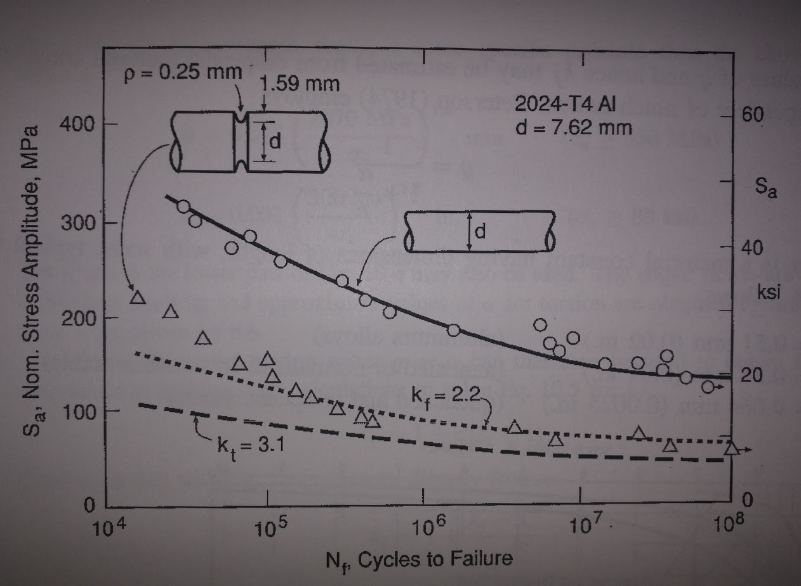
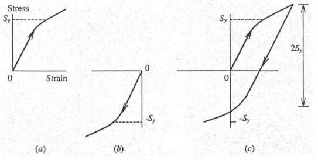
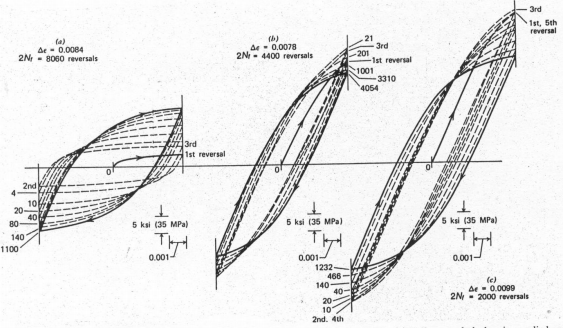
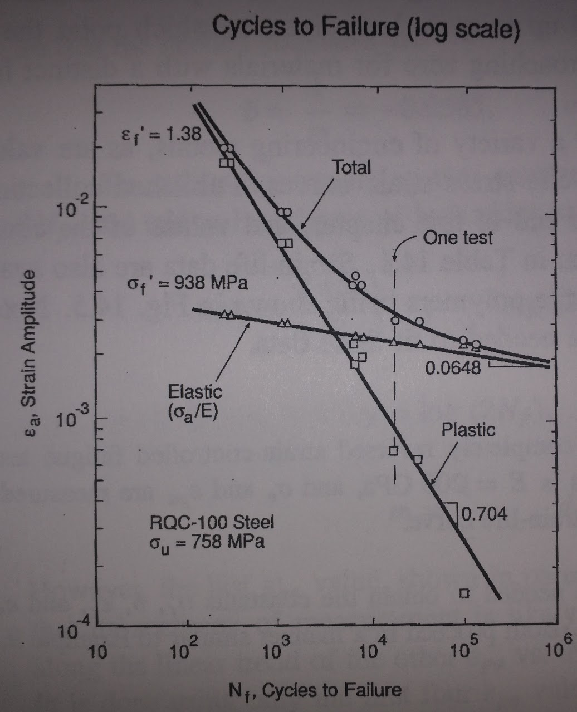
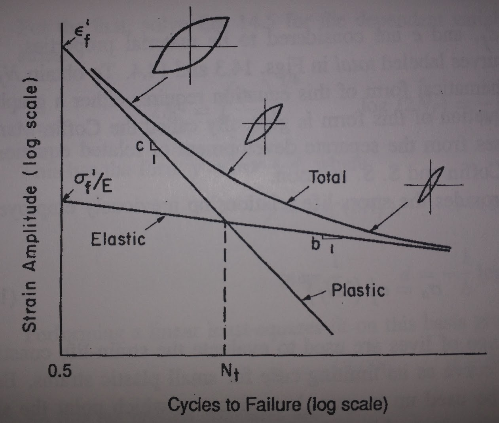
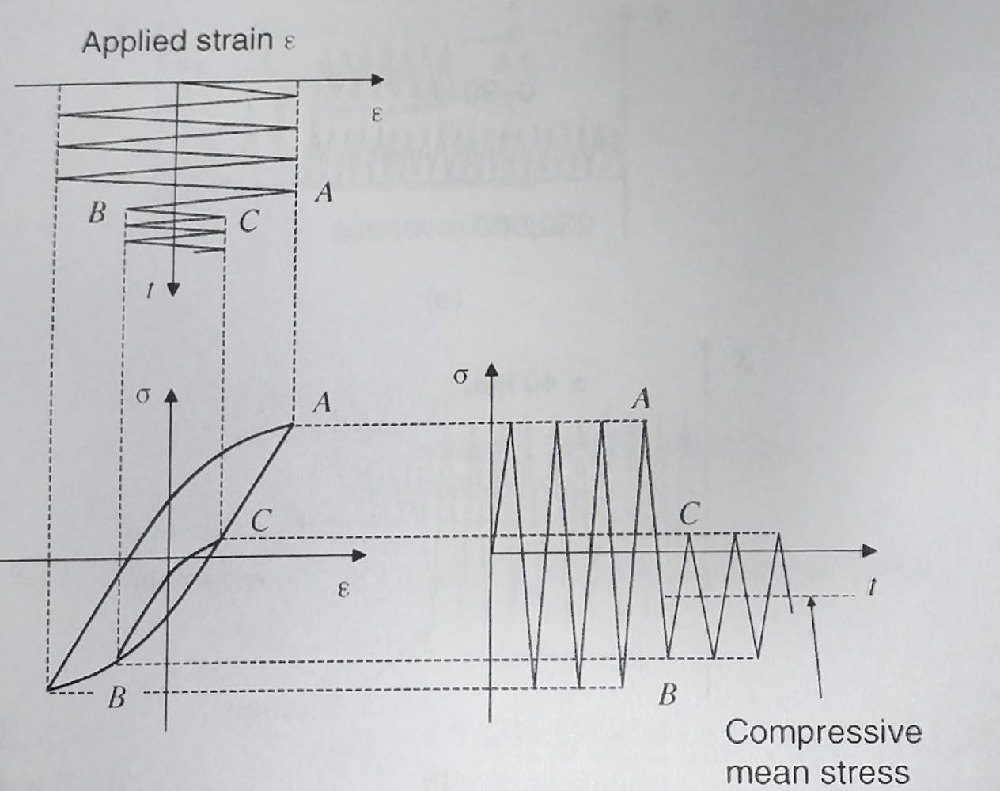
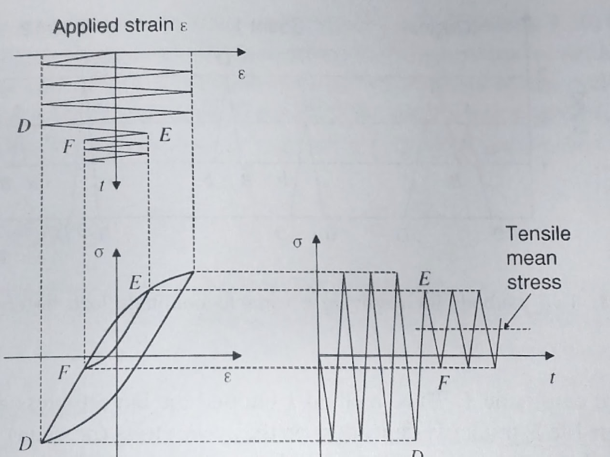
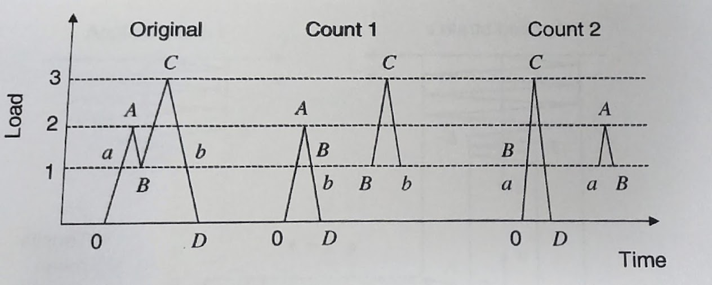

## AE 737: Mechanics of Damage Tolerance
Lecture 15 - Stress based fatigue

Dr. Nicholas Smith

Wichita State University, Department of Aerospace Engineering

March 22, 2022

----
## schedule

- 22 Mar - Strain-based Fatigue
- 24 Mar - Crack Growth, HW 6 Due, Project Abstract Due
- 29 Mar - Crack Growth

----
## outline

<!-- vim-markdown-toc GFM -->

* mean stress effects
* scatter
* general stress
* influence of notches
* fatigue review
* strain based fatigue
* variable amplitude strains
* general trends

<!-- vim-markdown-toc -->

---
# mean stress effects

----
## mean stress

-   Since mean stress has an effect on fatigue life, sometimes a family of S-N curves at varying mean stress values is created
-   S-N curves for these are reported in different ways, but commonly `$\sigma_{max}$` replaces `$\sigma_a$` on the y-axis
-   One useful way of representing these data, instead of many S-N curves, is a constant-life diagram
-   It is created by taking points from the S-N curves and plotting a line through constant *N**f* values

----
## S-N curves at variable `$\sigma_m$`

 <!-- .element width="60%" -->

----
## constant life diagram

 <!-- .element width="45%" -->

----
## normalizing

-   One very useful way to plot this data is to normalize the amplitude by the zero-mean amplitude
-   We call the zero-mean amplitude `$\sigma_{ar}$`
-   Plotting `$\sigma_a/\sigma_{ar}$` vs. `$\sigma_m$` provides a good way to group all the data together on one plot with the potential to fit a curve

----
## normalized amplitude-mean diagram

 <!-- .element width="45%" -->

----
## Goodman line

-   The first work on this problem was done by Goodman, who proposed the line

`$$\frac{\sigma_a}{\sigma_{ar}} + \frac{\sigma_m}{\sigma_u} = 1$$`

-   This equation can also be used for fatigue limits, since they are just a point on the S-N curves

`$$\frac{\sigma_e}{\sigma_{er}} + \frac{\sigma_m}{\sigma_u} = 1$$`

----
## modifications

-   While the Goodman line gives a good approximation to convert non-zero mean stress S-N curves, it is somewhat overly conservative at high mean stresses
-   It is also non-conservative for negative mean stresses
-   An alternative fit is known as the Gerber Parabola

`$$\frac{\sigma_a}{\sigma_{ar}} + \left(\frac{\sigma_m}{\sigma_u}\right)^2 = 1$$`

-   In general, the Goodman line is a good fit for brittle materials (steels) while the Gerber parabola is a better fit for more ductile materials

----
## modifications

-   The Goodman line can also be improved by replacing `$\sigma_u$` with the corrected true fracture strength `$\tilde{\sigma}_{fB}$` or the constant `$\sigma_f^\prime$` from the S-N curve fit

`$$\frac{\sigma_a}{\sigma_{ar}} + \frac{\sigma_m}{\sigma_f^\prime} = 1$$`

-   This is known as the Morrow Equation
-   For steels, `$\sigma_f^\prime \approx \tilde{\sigma}_{fB}$`, but for aluminums these values can be significantly different, and better agreement is found using `$\tilde{\sigma}_{fB}$`. 

----
## modifications

-   One more relationship that has shown particularly good results with aluminum alloys is the Smith, Watson, and Topper equations (SWT)

`$$\sigma_{ar} = \sqrt{\sigma_{max}\sigma_a}$$`

-   In general, it is best to use a form that matches your data
-   If data is lacking, the SWT and Morrow equations generally provide the best fit

---
# scatter

----
## fatigue scatter

-   One of the challenges with fatigue is that there is generally considerable scatter in the data
-   Quantifying this scatter requires many repetitions, which makes for time consuming tests
-   In general, the scatter follows a lognormal distribution (or a normal distribution in log(*N**f*))

----
## S-N-P Curve

---
# general stress

----
## general stress

-   Often combined loads from different sources introduce stresses which are not uni-axial
-   For ductile materials, good agreement has been found using an effective stress amplitude, similar to the octahedral shear yield criterion

`$$\bar{\sigma}_a = \frac{1}{\sqrt{2}}\sqrt{(\sigma_{xa}-\sigma_{ya})^2 + (\sigma_{ya}-\sigma_{za})^2 + (\sigma_{za}-\sigma_{xa})^2 + 6(\tau_{xy}^2 + \tau_{yz}^2 + \tau_{zx}^2)}$$`

-   The effective mean stress is given by

`$$\bar{\sigma}_m = \bar{\sigma}_{xm} + \bar{\sigma}_{ym} + \bar{\sigma}_{zm}$$`

----
## effective stress

-   This effective stress can be used in all other relationships, including mean stress relationships
-   Note that mean shear stress has no effect on the effective mean stress
-   This is surprising, but agrees well with experiments
-   When yielding effects do dominate behavior, the strain-based approach is more appropriate

---
# influence of notches

----
## notch effects

-   In this discussion, we use "notch" to refer to any geometric feature that increases the local stress (such as holes, fillets, grooves, etc.)
-   We discussed notches and stress concentration factors in terms of stress concentration factors
-   In our fatigue notation, `$\sigma_{max} = K_t S$`
-   This relates local stress to the average, nominal stress
-   The stress intensity factor can be used to characterize the "strength" of a notch

----
## notch effects

-   We might expect the fatigue life of a notched specimen to be similar to a pristine specimen with `$S_{a, pristine} = \sigma_{max, notched}$`
-   If we look at actual test data, however, this estimate would be overly conservative
-   Even when the stress is adjusted for some fatigue notch factor, `$k_f$` it is only valid at longer cycles (`$N_f > 10^6$`)

----
## notch effects

`$$k_f = \frac{\sigma_{ar}}{S_{ar}}$$`

-   Notches will have different effects, largely depending on their radius.
-   The maximum possible fatigue notch factor is `$k_f = k_t$`

----
## notch effects

 <!-- .element width="50%" -->

----
## notch sensitivity factor

-   To avoid generating fatigue data for every possible notch configuration, some empirical relationships have been developed
-   A useful concept in these methods is the notch sensitivity factor

`$$q = \frac{k_f - 1}{k_t -1}$$`

-   When `$k_f = 1$`, `$q=0$`, in which case the notch has no effect
-   When `$k_f = k_t$`, `$q=1$`, in which case the notch has its maximum effect

----
## peterson notch sensitivity

-   Peterson developed the following relationship

`$$q = \frac{1}{1+\frac{\alpha}{\rho}}$$`

-   Where `$\rho$` is the radius of the notch
-   `$\alpha$` is a material property

----
## peterson notch sensitivity

|           Material            | `$\alpha$` (mm) | `$\alpha$` (in) |
|:-----------------------------:|:---------------:|:---------------:|
|        Aluminum alloys        |      0.51       |      0.02       |
| Annealed or low-carbon steels |      0.25       |      0.01       |
| Quenched and tempered steels  |      0.064      |     0.0025      |

----
## peterson notch sensitivity

-   For high-strength steels, a more specific `$\alpha$` estimate can be found

`$$\begin{aligned}
  \alpha &= 0.025 \left(\frac{2070 }{\sigma_u}\right)^{1.8} & \text{mm} & \qquad \sigma_u \ge 550 \text{ MPa}\\
  \alpha &= 0.001 \left(\frac{300 }{\sigma_u}\right)^{1.8} & \text{in} & \qquad \sigma_u \ge 80 \text{ ksi}
\end{aligned}$$`

----
## peterson notch sensitivity

-   `$\alpha$` predictions are valid for bending and axial fatigue
-   For torsion fatigue, a good estimate can be found
-   `$\alpha_{torsion} = 0.6\alpha$`

----
## alternative 

-   An alternative formulation for *q* was developed by Neuber

`$$q = \frac{1}{1+\sqrt{\frac{\beta}{\rho}}}$$`

-   Where the material property `$\beta$` for steels is given by

`$$\begin{aligned}
  \log \beta &= -\frac{\sigma_u - 134}{586} & \text{mm} & \qquad \sigma_u \le 1520 \text{ MPa}\\
  \log \beta &= -\frac{\sigma_u + 100}{85}& \text{in} & \qquad \sigma_u \le 220 \text{ ksi}
\end{aligned}$$`

----
## alternative 

-   For aluminum use the chart MPa (ksi) and mm (in.)

|                   |          |             |             |
|:-----------------:|:--------:|:-----------:|:-----------:|
|      `$S_u$`      | 150 (22) |  300 (43)   |  600 (87)   |
|     `$\beta$`     | 2 (0.08) | 0.6 (0.025) | 0.5 (0.015) |

----
## notch sensitivity factors

-   While the above methods are useful, they should be regarded as estimates only
-   Physical complexities are not fully modeled by these methods
-   All of these have been developed for relatively "mild" notches
-   For sharp notches, best results are found by treating the notch as a crack

----
## example

-   Find the notch sensitivity factor for the following scenario

`$$\begin{aligned}
  \rho &= 0.25 \text{ in.}\\
  \sigma_m &= 0 \text{ ksi}\\
  K_t &= 3.0\\
  \sigma_u &= 84 \text{ ksi}
\end{aligned}$$`

---
# fatigue review

----
## group 1

-   A part from AISI 4340 in a typical "block" undergoes 100,000 cycles with `$\sigma_{min} = 0$` ksi and `$\sigma_{max} = 100$` ksi and an additional 10 cycles with `$\sigma_{min} = 50$` ksi and `$\sigma_{max} = 200$` ksi
-   How many "blocks" can this part support before failure?

----
## group 2

-   Use the S-N-P chart on p. 245 for 7075-T6 Aluminum
-   What is the probability of failure for 30 ksi at 106 cycles?
-   To ensure that 99% of parts do not fail, after how many cycles should a fully reversed load of 35 ksi be inspected?
-   How many cycles could the same part sustain if only 50% of parts are needed?

----
## group 3

-   The fatigue limit for AISI 4142 steel is 58 ksi for completely reversed fatigue loads.
-   What is the fatigue limit for fatigue loads with `$\sigma_m = 10, 20, 30$` ksi?

----
## group 4

-   A material made of 2024-T4 Aluminum undergoes the following load cycle
    -   `$\sigma_{x, min}=10$`, `$\sigma_{x, max} = 50$`
    -   `$\sigma_{y, min}=-20$`, `$\sigma_{x, max} = 20$`
    -   `$\tau_{xy, min}=0$`, `$\tau_{xy, max} = 30$`
-   How many cycles can it support before failure?

---
# strain based fatigue

----
## strain based fatigue

-   The strain based fatigue method uses local stresses and strains (instead of global, nominal values)
-   The strain-based method gives greater detail, and validity at lower cycles
-   It is still valid for high cycle fatigue (but gives same result as stress-based fatigue)
-   Does not include crack growth analysis or fracture mechanics

----
## strain life curve

-   Similar to the S-N curves in stress-based fatigue analysis, we can plot the cyclic strain amplitude vs. number of cycles to failure
-   This is most commonly done using axial test machines (instead of rotating bending tests)
-   The test is run in strain control (not load control)
-   Generally plotted on log-log scale

----
## plastic and elastic strain

-   We can separate the total strain into elastic and plastic components

`$$ \epsilon_a = \epsilon_{ea} + \epsilon_{pa}$$`

----
## plastic strain

----
## hysteresis loops

----
## cyclic stress strain curve

-   While strain-life data will generally just report `$\epsilon_a$` and `$\epsilon_{pa}$` some will also tabulate a form for the cyclic stress-strain curve

`$$\epsilon_a = \frac{\sigma_a}{E} + \left(\frac{\sigma_a}{H^\prime}\right)^{\frac{1}{n^\prime}}$$`

----
## plastic and elastic strain

-   On strain life curves, the strain is often plotted three times per each experiment
-   Once for total strain, once for plastic strain, and once for elastic strain
-   Since plastic strain and elastic strain vary by the number of cycles, a hysteresis loop from half the fatigue life is generally used
-   This is considered representative of stable behavior

----
## experimental data

 <!-- .element width="40%" -->

----
## trends

 <!-- .element width="50%" -->

----
## lines

-   We notice that the data for elastic and plastic strains are represented by straight lines, in the log-log scale
-   If we recall the form used for a straight line in log-log plots for S-N curves:
-   `$\sigma_a = \sigma_f^\prime (2 N_f)^b$`
-   We can convert this to find the elastic component of strain

`$$\epsilon_{ea} = \frac{\sigma_f^\prime}{E} (2N_f)^b$$`

----
## lines

-   We can use the same form with new constants for the plastic component of strain
-   `$\epsilon_{pa} = \epsilon_f^\prime(2N_F)^c$`
-   We can combine the elastic and plastic portions to find the total strain-life curve

`$$\epsilon_a = \frac{\sigma_f^\prime}{E} (2N_f)^b + \epsilon_f^\prime (2 N_f)^c$$`

----
## example

| `$\epsilon_a$` | `$\sigma_a$` (MPa) | `$\epsilon_{pa}$` | `$N_f$` |
|:--------------:|:------------------:|:-----------------:|--------:|
|     0.0202     |        631         |      0.01695      |     227 |
|     0.0100     |        574         |      0.00705      |    1030 |
|     0.0045     |        505         |      0.00193      |    6450 |
|     0.0030     |        472         |      0.00064      |   22250 |
|     0.0023     |        455         |     (0.00010)     |  110000 |

----
## transition life

-   With the strain-based fatigue method we are better equipped to discuss the difference between high and low-cycle fatigue
-   Low-cycle fatigue is dominated by plastic effects, while high-cycle fatigue has little plasticity
-   We can find the intersection of the plastic strain and elastic strain lines
-   This point is `$N_t$`, the transition fatigue life

`$$N_t = \frac{1}{2}\left(\frac{\sigma_f^\prime}{\epsilon_f^\prime}\right)^{\frac{1}{c-b}}$$`

----
## inconsistencies in constants

-   If we consider the equation for the cyclic stress train curve

`$$\epsilon_a = \frac{\sigma_a}{E} + \left(\frac{\sigma_a}{H^\prime}\right)^{\frac{1}{n^\prime}}$$`

-   We can consider the plastic portion and solve for `$\sigma_a$`
-   `$\sigma_a = H^\prime \epsilon_{pa}^{n^\prime}$`

----
## inconsistencies in constants

-   We can eliminate `$2N_f$` from the plastic strain equation
-   `$\epsilon_{pa} = \epsilon_f^\prime(2N_f)^c$`
-   By solving the stress-life relationship for `$2N_f$`
-   `$\sigma_a = \sigma_f^\prime (2NF)^b$`
-   and substituting that into the plastic strain

----
## inconsistencies in constants

-   We then compare with stress-life equations and find

`$$\begin{aligned}
 H^\prime &= \frac{\sigma_f^\prime}{(\epsilon_f^\prime)^{b/c}}\\
 n^\prime &= \frac{b}{c}
\end{aligned}$$`

----
## inconsistencies in constants

-   However, in practice these constants are fit from different curves
-   In some cases there can be large inconsistencies in these values
-   One cause for this is data that do not lie on a straight line in the log-log domain
-   For ductile materials at short lives, the true stresses and strains may differ significantly from engineering stress and strain

---
# variable amplitude strains

----
## variable amplitude strains

-   As with stresses, we can apply variable amplitude strains
-   However, when the change is made will affect whether there is a tensile or compressive mean stress

----
## compressive mean

 <!-- .element width="50%" -->

----
## tensile mean

 <!-- .element width="50%" -->

----
## cycle counting

-   In all fatigue methods (stress, strain, and crack propagation) the way we count load cycles can have an effect on our results
-   To avoid being non-conservative, we need to always count the largest amplitudes first
-   We will discuss some specific cycle-counting algorithms during crack propagation

----
## cycle counting

---
# general trends

----
## true fracture strength

-   We can consider a tensile test as a fatigue test with `$N_f = 0.5$`
-   We would then expect the true fracture strength `$\tilde{\sigma}_f \approx \sigma_f^\prime$`
-   And similarly for strain `$\tilde{\epsilon}_f \approx \epsilon_f^\prime$`

----
## ductile materials

-   Since ductile materials experience large strains before failure, we expect relatively large `$\epsilon_f^\prime$` and relatively small `$\sigma_f^\prime$`
-   This will cause a less steep slope in the plastic strain line
-   In turn this intersects with the elastic strain line much later, resulting a longer transition life for ductile materials

----
## brittle materials

-   Brittle materials exhibit the opposite effect, with relatively low `$\epsilon_f^\prime$` and relatively high `\sigma_f^\prime`
-   This results in a steeper plastic strain line
-   And shorter transition life

----
## tough materials

-   Tough materials have intermediate values for both `$\epsilon_f^\prime$` and `$\sigma_f^\prime$`
-   This gives a transition life somewhere between brittle and ductile materials
-   It is also noteworthy that strain-life for many metals pass through the point `$\epsilon_a = 0.01$` and `$N_f = 1000$` cycles
-   Steels also follow a trend with Brinell Hardness, the higher they are on the HB scale, the lower their transition life

----
## typical property ranges

-   Most common engineering materials have `$-0.8 < c < -0.5$`, most values being very close to *c* = -0.6
-   The elastic strain slope generally has *b* = -0.085
-   A “steep” elastic slope is around *b* = -0.12, common in soft metals
-   While “shallow” slopes are around *b* = -0.05, common for hardened metals

