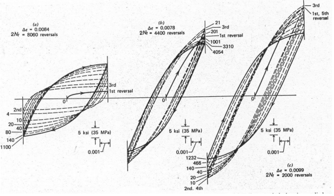
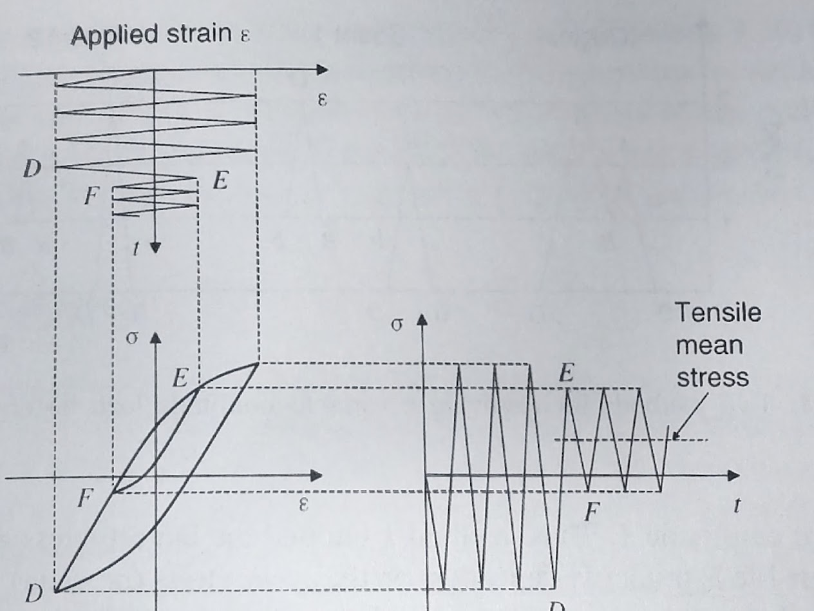
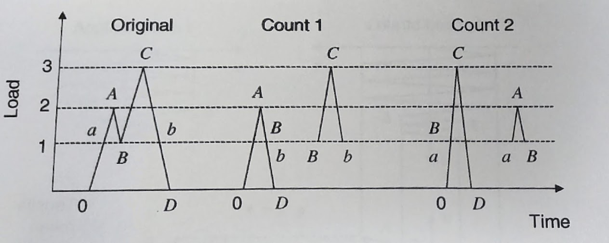

## AE 737: Mechanics of Damage Tolerance
Lecture 16 - Strain based fatigue

Dr. Nicholas Smith

Wichita State University, Department of Aerospace Engineering

2 April, 2020

----
## schedule

- 2 Apr - Strain-based fatigue, Project Abstract Due, HW6 Due
- 7 Apr - Crack growth
- 9 Apr - Boeing Method, HW7 Due
- 14 Apr - Cycle counting

----
## outline

<!-- vim-markdown-toc GFM -->

* strain based fatigue
* variable amplitude strains
* mean stress effects
* general trends
* notches
* multiaxial loading
* other factors affecting fatigue

<!-- vim-markdown-toc -->

---
# strain based fatigue

----
## strain based fatigue

-   The strain based fatigue method uses local stresses and strains (instead of global, nominal values)
-   The strain-based method gives greater detail, and validity at lower cycles
-   It is still valid for high cycle fatigue (but gives same result as stress-based fatigue)
-   Does not include crack growth analysis or fracture mechanics

----
## strain life curve

-   Similar to the S-N curves in stress-based fatigue analysis, we can plot the cyclic strain amplitude vs. number of cycles to failure
-   This is most commonly done using axial test machines (instead of rotating bending tests)
-   The test is run in strain control (not load control)
-   Generally plotted on log-log scale

----
## plastic and elastic strain

-   We can separate the total strain into elastic and plastic components
    *ϵ**a* =ϵ*ea* +ϵ*pa*

----
## plastic strain

----
## hysteresis loops

----
## cyclic stress strain curve

-   While strain-life data will generally just report *ϵ**a* and *ϵ**pa*, some will also tabulate a form for the cyclic stress-strain curve

$$\\epsilon\_a = \\frac{\\sigma\_a}{E} + \\left(\\frac{\\sigma\_a}{H^\\prime}\\right)^{\\frac{1}{n^\\prime}}$$

----
## plastic and elastic strain

-   On strain life curves, the strain is often plotted three times per each experiment
-   Once for total strain, once for plastic strain, and once for elastic strain
-   Since plastic strain and elastic strain vary by the number of cycles, a hysteresis loop from half the fatigue life is generally used
-   This is considered representative of stable behavior

----
## experimental data

 <!-- .element width="40%" -->

----
## trends

 <!-- .element width="50%" -->

----
## lines

-   We notice that the data for elastic and plastic strains are represented by straight lines, in the log-log scale
-   If we recall the form used for a straight line in log-log plots for S-N curves:
    *σ**a* = *σ**f*′(2*N**f*)*b*
-   We can convert this to find the elastic component of strain

$$\\epsilon\_{ea} = \\frac{\\sigma\_f^\\prime}{E} (2N\_f)^b$$

----
## lines

-   We can use the same form with new constants for the plastic component of strain
    *ϵ**pa* = *ϵ**f*′(2*N**f*)*c*
-   We can combine the elastic and plastic portions to find the total strain-life curve

$$\\epsilon\_a = \\frac{\\sigma\_f^\\prime}{E} (2N\_f)^b + \\epsilon\_f^\\prime (2 N\_f)^c$$

----
## example

| *ϵ**a* | *σ**a* (MPa) | *ϵ**pa* |  *N**f*|
|:-----------------:|:-----------------------:|:--------------------:|------------------:|
|       0.0202      |           631           |        0.01695       |                227|
|       0.0100      |           574           |        0.00705       |               1030|
|       0.0045      |           505           |        0.00193       |               6450|
|       0.0030      |           472           |        0.00064       |              22250|
|       0.0023      |           455           |       (0.00010)      |             110000|

----
## transition life

-   With the strain-based fatigue method we are better equipped to discuss the difference between high and low-cycle fatigue
-   Low-cycle fatigue is dominated by plastic effects, while high-cycle fatigue has little plasticity
-   We can find the intersection of the plastic strain and elastic strain lines
-   This point is *N**t*, the transition fatigue life

$$N\_t = \\frac{1}{2}\\left(\\frac{\\sigma\_f^\\prime}{\\epsilon\_f^\\prime}\\right)^{\\frac{1}{c-b}}$$

----
## inconsistencies in constants

-   If we consider the equation for the cyclic stress train curve

$$\\epsilon\_a = \\frac{\\sigma\_a}{E} + \\left(\\frac{\\sigma\_a}{H^\\prime}\\right)^{\\frac{1}{n^\\prime}}$$
-   We can consider the plastic portion and solve for *σ**a*
    *σ**a* = *H*′*ϵ**pa**n*′

----
## inconsistencies in constants

-   We can eliminate 2*N**f* from the plastic strain equation
    *ϵ**pa* = *ϵ**f*′(2*N**f*)*c*
-   By solving the stress-life relationship for 2*N**f*
    *σ**a* = *σ**f*′(2*N**f*)*b*
     and substituting that into the plastic strain

----
## inconsistencies in constants

-   We then compare with stress-life equations and find

$$\\begin{aligned}
 H^\\prime &= \\frac{\\sigma\_f^\\prime}{(\\epsilon\_f^\\prime)^{b/c}}\\\\
 n^\\prime &= \\frac{b}{c}
\\end{aligned}$$

----
## inconsistencies in constants

-   However, in practice these constants are fit from different curves
-   In some cases there can be large inconsistencies in these values
-   One cause for this is data that do not lie on a straight line in the log-log domain
-   For ductile materials at short lives, the true stresses and strains may differ significantly from engineering stress and strain

---
# variable amplitude strains

----
## variable amplitude strains

-   As with stresses, we can apply variable amplitude strains
-   However, when the change is made will affect whether there is a tensile or compressive mean stress

----
## compressive mean

 <!-- .element width="50%" -->

----
## tensile mean

 <!-- .element width="50%" -->

---
# mean stress effects

----
## mean stress in strain-based fatigue

-   In regions where plastic strain is significant, some applied mean stress is likely to be relaxed through cyclic plastic strain
-   When the plastic strain is not significant, mean stress will exist
-   Mean strain does not generally affect fatigue life

----
## morrow approach

-   Recall the Morrow approach for mean stress effects from the stress-based method

$$\\frac{\\sigma\_a}{\\sigma\_{ar}} + \\frac{\\sigma\_m}{\\sigma\_f^\\prime} = 1$$

-   We can rearrange the equation such that

$$\\sigma\_a = \\sigma\_f^\\prime\\left\[\\left(1-\\frac{\\sigma\_m}{\\sigma\_f^\\prime}\\right)^\\frac{1}{b}(2N\_f)\\right\]^b$$

----
## morrow approach

-   If we compare to the stress-life equation (*σ**a* = *σ**f*′(2*N**f*)*b*), we see that we can replace *N**f* with

$$N^\* = N\_f \\left(1-\\frac{\\sigma\_m}{\\sigma\_f^\\prime}\\right)^\\frac{1}{b}$$

-   We can now substitute *N*\* for *N**f* in the strain-life equation to find

$$\\epsilon\_a = \\frac{\\sigma\_f^\\prime}{E} \\left(1-\\frac{\\sigma\_m}{\\sigma\_f^\\prime}\\right)(2N\_f)^b + \\epsilon\_f^\\prime\\left(1-\\frac{\\sigma\_m}{\\sigma\_f^\\prime}\\right)^\\frac{c}{b} (2 N\_f)^c$$

----
## morrow approach

-   Graphically, we can use the Morrow approach very easily using only the zero-mean stress graph
-   From the zero-mean stress graph, find the point corresponding to your applied strain
-   For a non zero mean stress, this point represents (*ϵ**a*, *N*\*), we can now solve for *N**f* using the equation for $N^\*$

----
## modified morrow

-   While the Morrow equation agrees very well with many data, some are better fit with a modification
-   In the modified version, it is assumed that the mean stress has no effect on the plastic term

$$\\epsilon\_a = \\frac{\\sigma\_f^\\prime}{E}\\left(1-\\frac{\\sigma\_f}{\\sigma\_f^\\prime}\\right)(2N\_f)^b + \\epsilon\_f^\\prime (2N\_f)^c$$

-   There is no convenient solution method for this form, and it generally must be solved numerically, or plotted with many families of *σ**m*

----
## smith watson topper

-   The Smith, Watson, and Topper approach assumes that the life for any given state is dependent on the product *σ**max**ϵ**a*
-   After some manipulation, this gives

$$\\sigma\_{max} \\epsilon\_a = \\frac{\\left(\\sigma\_f^\\prime\\right)^2}{E}(2N\_f)^{2b} + \\sigma\_f^\\prime \\epsilon\_f^\\prime (2N\_f)^{b+c}$$

-   This method can also be solved graphically if a plot of *σ**max**ϵ**a* is made using zero-mean data. All we need to do is find the new *σ**max**ϵ**a* point to find a new *N**f*

----
## comparison

-   All three methods discussed are in general use
-   The Morrow method is very good for steel
-   The modified Morrow method gives improved results in many materials
-   The SWT approach is very good for general use, but is non-conservative with a compressive mean stress

----
## example p. 285

---
## cycle counting

-   In all fatigue methods (stress, strain, and crack propagation) the way we count load cycles can have an effect on our results
-   To avoid being non-conservative, we need to always count the largest amplitudes first
-   We will discuss some specific cycle-counting algorithms during crack propagation

----
## cycle counting

---
# general trends

----
## true fracture strength

-   We can consider a tensile test as a fatigue test with *N**f* = 0.5
-   We would then expect the true fracture strength $\\tilde{\\sigma}\_f \\approx \\sigma\_f^\\prime$
-   And similarly for strain $\\tilde{\\epsilon}\_f \\approx \\epsilon\_f^\\prime$

----
## ductile materials

-   Since ductile materials experience large strains before failure, we expect relatively large *ϵ**f*′ and relatively small *σ**f*′
-   This will cause a less steep slope in the plastic strain line
-   In turn this intersects with the elastic strain line much later, resulting a longer transition life for ductile materials

----
## brittle materials

-   Brittle materials exhibit the opposite effect, with relatively low *ϵ**f*′ and relatively high *σ**f*′
-   This results in a steeper plastic strain line
-   And shorter transition life

----
## tough materials

-   Tough materials have intermediate values for both *ϵ**f*′ and *σ**f*′
-   This gives a transition life somewhere between brittle and ductile materials
-   It is also noteworthy that strain-life for many metals pass through the point *ϵ**a* = 0.01 and *N**f* = 1000 cycles
-   Steels also follow a trend with Brinell Hardness, the higher they are on the HB scale, the lower their transition life

----
## typical property ranges

-   Most common engineering materials have −0.8 &lt; *c* &lt; −0.5, with most values being very close to *c* = −0.6
-   The elastic strain slope generally has *b* = −0.085
-   A “steep” elastic slope is around *b* = −0.12, common in soft metals
-   While “shallow” slopes are around *b* = −0.05, common for hardened metals

---
# notches

----
## fatigue notch factor

-   We previously found expressions for stress-based fatigue analysis when notches are present
-   Due to yielding, the notch sensitivity is not the same for stress and strain controlled fatigue analysis
-   One simple approach to find the strain fatigue notch factor is to use

$$K\_t = \\sqrt{K\_f^\\sigma K\_f^\\epsilon}$$

---
# multiaxial loading

----
## multiaxial loading

-   Multi-axial loading in strain-based fatigue analysis is still an active field of research
-   We are currently only capable of handling proportional loads that are in-phase (i.e. have the same frequency)

----
## multiaxial loading
-   If we consider the principal directions where *σ*2*a* = *λσ*1*a*, we find an expression for the strain-life as

$$\\epsilon\_{1a} = \\frac{\\frac{\\sigma\_f^\\prime}{E}(1-\\nu \\lambda)(2N\_f)^b + \\epsilon\_f^\\prime(1-0.5\\lambda)(2N\_f)^c}{\\sqrt{1-\\lambda+\\lambda^2}}$$

----
## stress triaxiality factor

-   Another approach is to consider the stress triaxiality factor

$$T = \\frac{1+\\lambda}{\\sqrt{1-\\lambda+\\lambda^2}}$$
-   Three notable cases of this are
    1.  Pure planar shear: *λ* = −1, *T* = 0
    2.  Uniaxial stress: *λ* = 0, *T* = 1
    3.  Equal biaxial stress: *λ* = 1, *T* = 2

----
## stress triaxiality factor

-   Marloff suggests the following inclusion of stress triaxiality

$$\\bar{\\epsilon\_a} = \\frac{\\sigma\_f^\\prime}{E}(2 N\_f)^b + 2^{1-T}\\epsilon\_f^\\prime(2N\_f)^c$$

---
# other factors affecting fatigue

----
## factors affecting fatigue life

-   At temperatures above one-half the melting temperature (absolute scale), creep-relaxation is significant
-   This will cause the strain/stress-life curves to become rate dependent
-   Occurs at room temperature for many materials (lead, tin, many polymers)
-   At a sufficiently elevated temperature for any material

----
## surface finish

-   High cycle fatigue is sensitive to surface finish, samples are generally polished
-   Low cycle fatigue is not sensitive to surface finish or residual stress 
-   The plastic deformation tends to remove residual stresses
-   In high-cycle fatigue, crack initiation is important (poor surface finish allows cracks to form earlier)
-   When plastic deformation is present (low-cycle fatigue), cracks form relatively quickly regardless of surface finish

----
## surface finish

-   Since low-cycle fatigue has little effect from surface finish, we could modify the strain life curve by altering only the elastic portion
-   If we define the surface effect factor, *m**s*, we can find a new *b**s* to replace *b* in the strain-life equation

$$b\_s = \\frac{\\log\\left(m\_s (2N\_e)^b\\right)}{\\log(2N\_e)}$$

----
## surface treatments

-   Treatments which decrease fatigue life:
    -   Electro-plating (chrome, +corrosion resistance, -fatigue life)
    -   Grinding improves surface finish, but introduces surface tension, and heat generated can temper quench
    -   Stamping introduces discontinuities and irregularities
    -   Forging can refine grain structure and improve physical properties, but can cause decarburization in steels, which hurts fatigue life
    -   Hot rolling can also cause decarburization

----
## surface treatments

-   Some treatments improve fatigue life:
    -   Cold rolling improves surface finish, introduces residual compressive stress on surface (slows crack initiation on surface)
    -   Shot peeing introduces many small divots on surface, which can be detrimental in corrosion, but it does cause a residual compressive stress on the surface

----
## size

-   Size can also have effects on fatigue life
-   Larger parts are more susceptible to damage/imperfections at the same stress level
-   This is why composites are often made from very small fibers (glass fiber, carbon fiber, ceramic-matrix composites)

----
## size

-   The exact effect of size will depend on material, one study for low carbon steels found

$$m\_d = \\left(\\frac{d}{25.4 \\text{mm}}\\right)^{-0.093}$$

-   Which is then used to re-calculate material constants
    *σ**fd*′ = *m**d**σ**f*′,   *ϵ**fd*′ = *m**d**ϵ**f*′

----
## thermal fatigue

-   Thermal loading can be introduced when two dissimilar parts are attached together, the coefficient of thermal expansion causes them to expand differently, introducing extra stresses due to the temperature change
-   If the temperature is significantly different between two sides of a part thermal stresses can also be introduced

----
## thermal fatigue

-   Low temperatures generally cause a material to behave in a more brittle fashion, which alters the fatigue life
-   High temperatures cause problems with creep-relaxation and can also affect the crystalline structure

