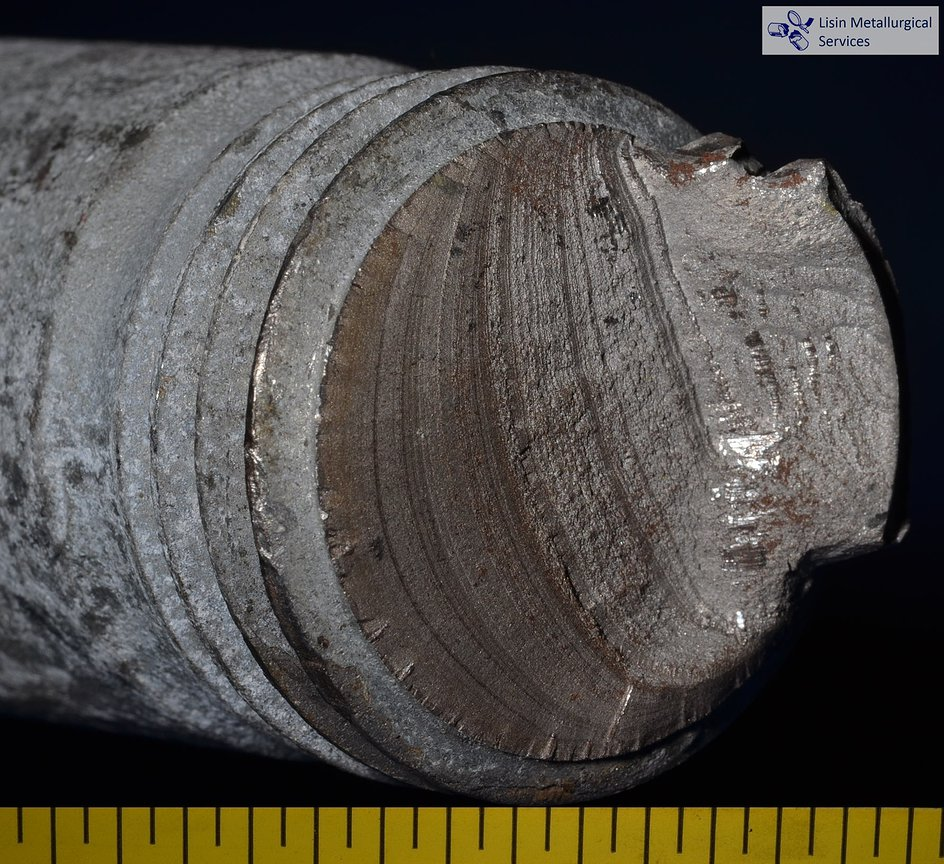
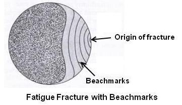
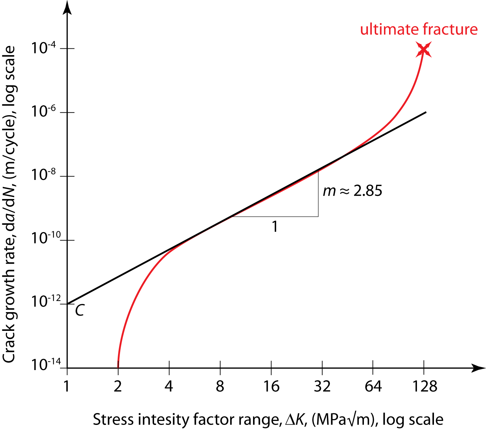
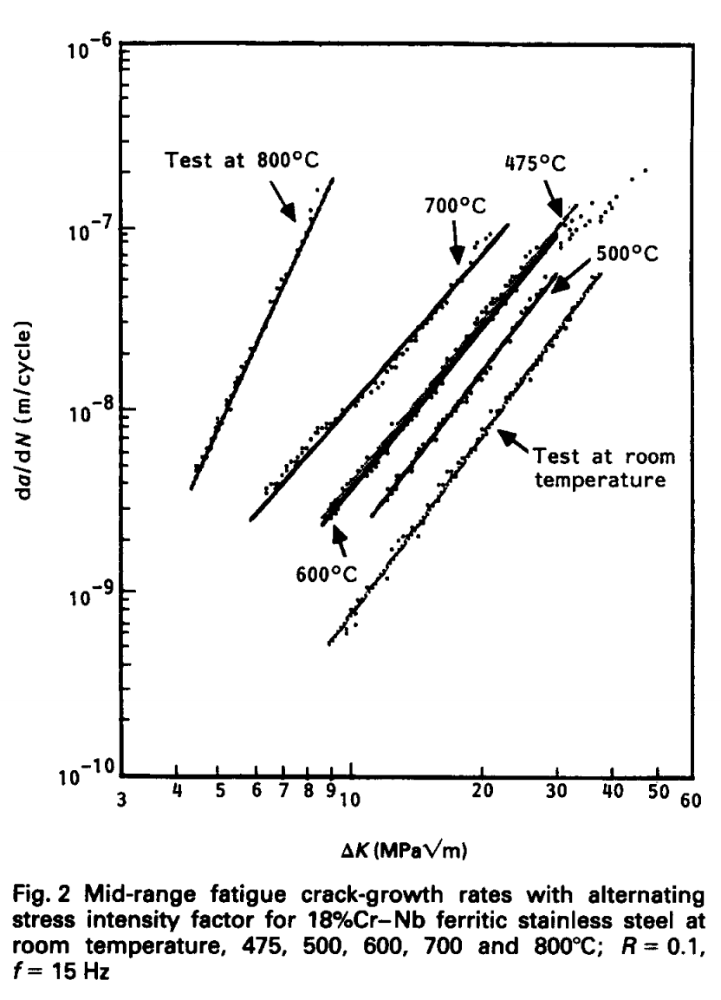

## AE 737: Mechanics of Damage Tolerance
Lecture 17 - Crack Propagation

Dr. Nicholas Smith

Wichita State University, Department of Aerospace Engineering

March 19, 2020

----
## schedule

- 19 Mar - Crack growth, HW6 Due
- 23-27 Mar - Spring Break
- 31 Mar - Crack growth
- 2 Apr - Crack growth, HW7 Due
- 7 Apr - Retardation

----
## outline

<!-- vim-markdown-toc GFM -->

* other factors affecting fatigue
* crack growth rate
* crack growth rate equations
* factors affecting crack propagation
* numerical algorithm

<!-- vim-markdown-toc -->

---
# other factors affecting fatigue

----
## factors affecting fatigue life

-   At temperatures above one-half the melting temperature (absolute scale), creep-relaxation is significant
-   This will cause the strain/stress-life curves to become rate dependent
-   Occurs at room temperature for many materials (lead, tin, many polymers)
-   At a sufficiently elevated temperature for any material

----
## surface finish

-   High cycle fatigue is sensitive to surface finish, samples are generally polished
-   Low cycle fatigue is not sensitive to surface finish or residual stress 
-   The plastic deformation tends to remove residual stresses
-   In high-cycle fatigue, crack initiation is important (poor surface finish allows cracks to form earlier)
-   When plastic deformation is present (low-cycle fatigue), cracks form relatively quickly regardless of surface finish

----
## surface finish

-   Since low-cycle fatigue has little effect from surface finish, we could modify the strain life curve by altering only the elastic portion
-   If we define the surface effect factor, *m**s*, we can find a new *b**s* to replace *b* in the strain-life equation

$$b\_s = \\frac{\\log\\left(m\_s (2N\_e)^b\\right)}{\\log(2N\_e)}$$

----
## surface treatments

-   Treatments which decrease fatigue life:
    -   Electro-plating (chrome, +corrosion resistance, -fatigue life)
    -   Grinding improves surface finish, but introduces surface tension, and heat generated can temper quench
    -   Stamping introduces discontinuities and irregularities
    -   Forging can refine grain structure and improve physical properties, but can cause decarburization in steels, which hurts fatigue life
    -   Hot rolling can also cause decarburization

----
## surface treatments

-   Some treatments improve fatigue life:
    -   Cold rolling improves surface finish, introduces residual compressive stress on surface (slows crack initiation on surface)
    -   Shot peeing introduces many small divots on surface, which can be detrimental in corrosion, but it does cause a residual compressive stress on the surface

----
## size

-   Size can also have effects on fatigue life
-   Larger parts are more susceptible to damage/imperfections at the same stress level
-   This is why composites are often made from very small fibers (glass fiber, carbon fiber, ceramic-matrix composites)

----
## size

-   The exact effect of size will depend on material, one study for low carbon steels found

$$m\_d = \\left(\\frac{d}{25.4 \\text{mm}}\\right)^{-0.093}$$

-   Which is then used to re-calculate material constants
    *σ**fd*′ = *m**d**σ**f*′,   *ϵ**fd*′ = *m**d**ϵ**f*′

----
## thermal fatigue

-   Thermal loading can be introduced when two dissimilar parts are attached together, the coefficient of thermal expansion causes them to expand differently, introducing extra stresses due to the temperature change
-   If the temperature is significantly different between two sides of a part thermal stresses can also be introduced

----
## thermal fatigue

-   Low temperatures generally cause a material to behave in a more brittle fashion, which alters the fatigue life
-   High temperatures cause problems with creep-relaxation and can also affect the crystalline structure

---
# crack growth rate

----
## fracture surface

 <!-- .element width="50%" -->

----
## fracture surface

----
## crack growth rate

-   We can observe that fatigue damage occurs through crack propagation
-   “cracks” and fracture mechanics have been omitted from all our fatigue discussion thus far
-   It would be beneficial to predict at what rate a crack will extend

----
## crack growth rate

-   Crack growth rate can be measured experimentally
-   Using a center-crack specimen, a fatigue load is applied
-   The crack length is measured and plotted vs. the number of cycles
-   The slope of this curve ($\\frac{da}{dN}$) is then plotted vs. either *K**Imax* or *ΔK**I* on a log-log scale
-   This chart is then commonly divided into three regions

----
## da-dN vs K

 <!-- .element width="50%" -->

----
## region I

-   In Region I crack growth is very slow and/or difficult to measure
-   In many cases, da/dN corresponds to the spacing between atoms!
-   The point at which the da/dN curve intersects the x-axis (usually with a relatively vertical slope) is called the fatigue threshold
-   Typically 3-15 $\\text{ ksi} \\sqrt{\\text{in}}$ for steel
-   3-6 $\\text{ ksi} \\sqrt{\\text{in}}$ for aluminum

----
## region II

-   Most important region for general engineering analysis
-   Once a crack is present, most of the growth and life occurs in Region II
-   Generally linear in the log-log scale

----
## region III

-   Unstable crack growth
-   Usually neglected (we expect failure before Region III fully develops in actual parts)
-   Can be significant for parts where we expect high stress and relatively short life

----
## crack growth rate curve

-   The crack growth rate curve is considered a material property
-   The same considerations for thickness apply as with fracture toughness (*K**c* vs. *K**Ic*)
-   Is also a function of the load ratio, *R* = *σ**min*/*σ**max*

----
## R effects

-   While the x-axis can be either *ΔK* or *K**max*, the shape of the data is the same
-   When we look at the effects of load ratio, *R*, the axis causes some differences on the plot
-   With *ΔK* on the x-axis, increasing *R* will shift the curve up and to the left, shifting the fatigue threshold and fracture toughness on the graph as well

----
## R effects

-   With *K**max* on the x-axis, increasing *R* shifts the curve down and to the right, but fatigue threshold and fracture toughness keep same values
-   In general, *R* dependence vanishes for *R* &gt; 0.8 or *R* &lt; −0.3. This effect is known as the band width

---
# crack growth rate equations

----
## crack growth rate equations

-   There are many crack growth rate equations of varying complexity
-   The “best” form to use will depend on design needs

----
## growth equations

-   The important features in curve-fit equations are
    1.  Region II curve fit (linear on log-log scale)
    2.  Region I curve fit (fatigue threshold)
    3.  Region III curve fit (critical stress intensity)
    4.  Stress ratio effects
    5.  Band width of R-curves

----
## paris law

-   The original
-   Fits the linear portion (Region II)
-   Does not fit Region I, Region III, or have R-dependence
$$\\frac{da}{dN} = C (\\Delta K)^n$$
-   Note: this assumes the x-axis is *ΔK*, but *ΔK* = (1 − *R*)*K**max*, so we can easily convert

----
## walker

-   Region II is usually all that is needed for engineering, but R-dependence is often an important effect to capture
-   Walker modified the Paris law to account for R-dependence

$$\\frac{da}{dN} = C\\left\[(1-R)^mK\_{max}\\right\]^n$$
-   Gives a good fit for Region II with R-dependence and band width

----
## forman

-   The Forman equation was developed to capture the effects of Region II and Region III
-   Also includes the effects of *R*, but does not control the band width of R effects

$$\\frac{da}{dN} = \\frac{C \\left\[(1-R)K\_{max}\\right\]^n}{(1-R)K\_c-(1-R)K\_{max}}$$

----
## modified forman

-   The Forman equation can be modified to include the effect of band width

$$\\frac{da}{dN} = \\frac{C \\left\[(1-R)^m K\_{max}\\right\]^n}{\\left\[(1-R)^mK\_c-(1-R)^m K\_{max}\\right\]^L}$$

----
## collipriest

-   The Collipriest equation fits Regions I, II and III, but has no R-dependence

$$\\frac{da}{dN} = C\_1 + C\_2 \\tanh^{-1} \\left\[\\frac{\\log \\left(\\frac{K\_{max}^2}{K\_oK\_c}\\right)}{\\log (K\_c/K\_o)}\\right\]$$

----
## modified collipriest

-   Following the same methods as before, we can modify the Collipriest equation for R-dependence and band width control

$$\\frac{da}{dN} = C\_1 + C\_2 \\tanh^{-1} \\left\[\\frac{\\log \\left(\\frac{(1-R)^mK\_{max}^2}{K\_oK\_c}\\right)}{\\log (K\_c/K\_o)}\\right\]$$
-   For a cleaner graph, experimental data at different R-values is sometimes plotted vs. *K**eff*
*K**eff* = (1 − *R*)m*K**max*

----
## nasgrow growth rate equation

-   A very complicated curve fit is provided in the NASGROW growth rate equation

$$\\frac{da}{dN} = C \\left\[\\frac{1-f}{1-R}\\Delta K\\right\]^n\\frac{\\left\[1-\\frac{\\Delta K\_{th}}{\\Delta K}\\right\]}{\\left\[1-\\frac{K\_{max}}{K\_{crit}}\\right\]}$$
-   The curve fit parameters can be found in p. 307 of your text (or the NASGROLW/AFGROW documentation)

----
## boeing-walker growth rate equation

-   The Boeing-Walker growth equation is given as (for *R* ≥ 0 )

$$\\frac{da}{dN} = 10^{-4}\\left(\\frac{1}{mT}\\right)^p\\left\[K\_{max}(1-R)^q\\right\]^p$$

----
## conversion of constants

-   Much of the data available to us is from Boeing, and given in terms of the Boeing-Walker equation
-   We can re-write some other equations to more easily convert parameters between the various equations
-   Walker-Boeing:

$$\\frac{da}{dN} = 10^{-4}\\left(\\frac{1}{mT}\\right)^p\\left\[\\Delta K(1-R)^{q-1}\\right\]^p$$
-   Walker-AFGROW:

$$\\frac{da}{dN} = C\_w\\left\[\\Delta K(1-R)^{m-1}\\right\]^{n\_w}$$
-   Forman:

$$\\frac{da}{dN} = \\frac{C\_F}{(1-R)K\_c - \\Delta K} (\\Delta K)^{n\_f}$$

----
## conversion of constants

|              Walker-Boeing              |                  Walker-AFGROW                 |                         Forman                         |
|:---------------------------------------:|:----------------------------------------------:|:------------------------------------------------------:|
| $10^{-4}\\left(\\frac{1}{mT}\\right)^p$ | $C\_w = 10^{-4}\\left(\\frac{1}{mT}\\right)^p$ | $C\_F = (K\_c-1)10^{-4}\\left(\\frac{1}{mT}\\right)^p$ |
|                    q                    |                    *m* = *q*                   |                                                        |
|                    p                    |             *n**w* = *p*            |                 *n**f* = *p*                |

----
## paris example

-   A wide center-cracked panel with *C* = 6.75 × 10−10 and *n* = 3.89 (with units in ksi and inches)
-   If the crack is initially 1 inch long, find the crack length after 5,000 cycles of 15 ksi loading
-   What if the load cycles varied from 5 ksi to 15 ksi? (*m* = 0.6)

---
# factors affecting crack propagation

----
## factors affecting crack propagation

<ul>
	<li>thickness</li>
	<li>stress ratio</li>
	<li>temperature</li>
	<li>environment</li>
</ul>

<ul>
	<li>frequency </li>
	<li>crack orientation </li>
	<li>manufacturer </li>
	<li>heat treatment </li>
</ul>

----
## thickness

-   We already discussed the effects of thickness on fracture toughness
-   The same effects are important in crack propagation
-   In thin (plane stress) plates, cracks can be treated as through cracks
-   In thick plates (plain strain), we generally need to consider the crack shape

----
## thickness

-   Cyclic life is primarily a function of *K**i*/*K**c* where *K**i* is the stress intensity factor in the first cycle
-   Other experiments indicate a relationship between $\\frac{d(a/Q)}{dN}$ and *K**max*
-   *Q* is a shape parameter for elliptical flaws

----
## temperature

-   In general (for most aluminum alloys) cracks propagate more slowly with a decrease in temperature
-   This trend is exactly opposite the trend for *K**c*
-   The effect varies in different materials
-   Most materials benefit from slightly lower temperatures, but as temperatures are further decreased the crack growth rate increases again

----
## temperature

 <!-- .element width="30%" -->

----
## temperature

-   In general, temperature effects can not be predicted well
-   Instead, materials should be tested at a range of temperatures to establish a range of operating temperatures with corresponding crack growth data

----
## environment

-   There are many conditions in the environment that can affect crack growth
-   Moisture greatly increases the crack growth rate
-   Salt water increases crack growth rate even further
-   These effects have varying strength depending on the material used

----
## environment

 <!-- .element width="90%" -->

----
## environment

-   Further, the shape of the applied load curve has a significant effect when combined with adverse environments
-   Crack growth is faster when the load increases slowly and decreases rapidly
-   Crack growth is slower when the load increases rapidly and decreases slowly

----
## environment

-   When the environment is corrosive, the test frequency is of particular importance
-   At low frequencies, a corrosive environment increases the threshold, *K**th*
-   However in Region II, crack growth is faster
-   This effect can be explained by the corrosive environment blunting the crack tip

----
## frequency

-   There is conflicting information about the effect of frequency in the absence of a corrosive environment
-   Some experiments have found a frequency dependence, while others have not
-   Many claim that the frequency dependence is due to small amounts of water in air during frequency dependence experiment

----
## crack orientation

-   For rolled plates, a crack will generally propagate faster parallel to the rolling direction
-   In many materials, however, the difference between orientations is not significant when compared to scatter, and it is often neglected
-   Some materials behave very differently with different crack orientations (i.e. the slope of the paris law curve is different), so care should be taken based on the material used

----
## manufacturer

-   Different manufacturers of the same material can produce different crack growth rates
-   Some reasons for this may be
	-   Slight variation in composition
	-   Site cleanliness (inclusions)
	-   Heat treatment/cold rolling variations

----
## heat and surface treatments

-   Different heat and surface treatments are often applied
-   They provide various benefits (corrosion resistance, residual stress, residual stress relief)
-   But they will also affect the crack growth rate

---
# numerical algorithm

----
## numerical algorith

-   While the Paris Law can be integrated directly (for simple load cases), many of the other formulas cannot
-   A simple numerical algorithm for determining incremental crack growth is

$$a\_{i+1} = a\_i + \\left(\\frac{da}{dN}\\right)\_i\\left(\\Delta N\\right)\_i$$

-   This method is quite tedious by hand (need many *a**i* values for this to be accurate)
-   But is simple to do in Excel, MATLAB, Python, or many other codes
-   For most accurate results, use *ΔN* = 1, but this is often unnecessary
-   When trying to use large *ΔN*, check convergence by using larger and smaller *Δ**N* values

----
## boeing-walker example

-   Use the Boeing-Walker equation to find the crack length after 20000 cycles of 15 ksi load on a large, center-cracked sheet of bare 2024-T3 in dry air, with an initial crack of 0.5"
-   Use the numerical algorithm with *ΔN* = 1000

----
## convergence example

-   compare the results from the previous example with *ΔN* = 10, 100, 10000 and direct integration

----
## variable load cases

-   In practice variable loads are often seen
-   The most basic way to handle these is to simply calculate the crack length after each block of loading
-   We will discuss an alternate method, which is more convenient for flight “blocks” next class
-   We will also discuss “retardation” models next class

----
## variable load example

-   For the same material as above (2024-T3, center-cracked, dry air), consider 20000 cycles with 15 ksi load followed by 10000 cycles of 5 - 20 ksi.

