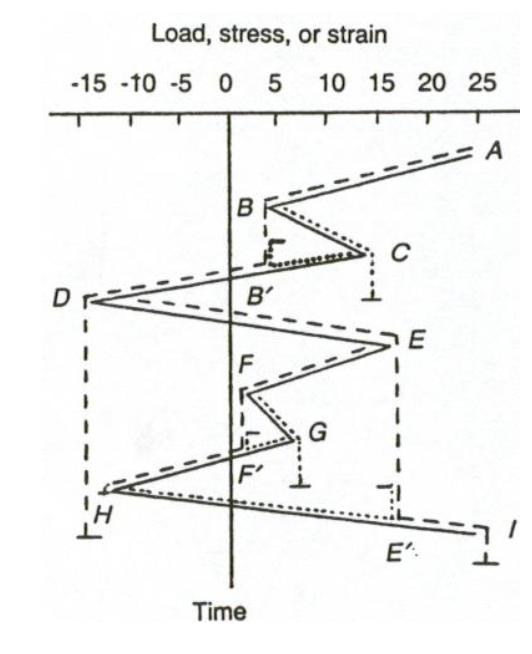
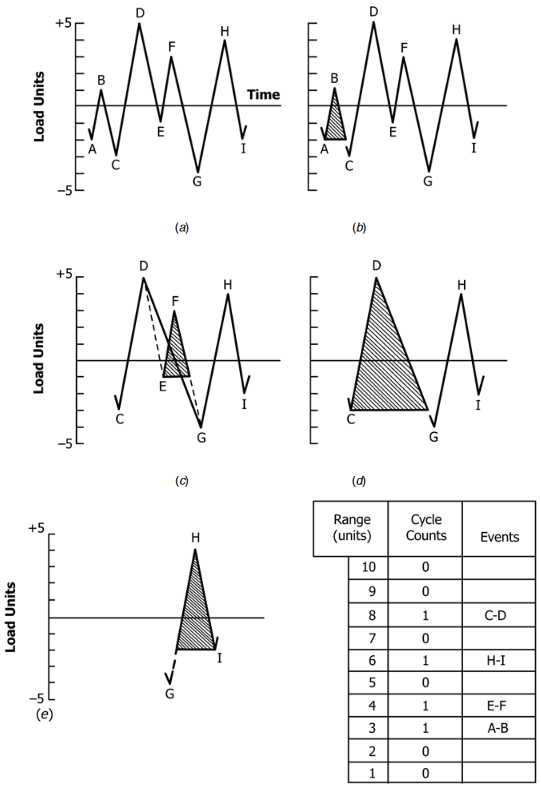

## AE 737: Mechanics of Damage Tolerance
Lecture 19 - Cycle Counting

Dr. Nicholas Smith

Wichita State University, Department of Aerospace Engineering

April 14, 2020

----
## schedule

- 14 Apr - Cycle Counting
- 16 Apr - Crack Retardation
- 21 Apr - Exam Review, HW8 Due 
- 23 Apr - Exam 2

----
## outline

<!-- vim-markdown-toc GFM -->

* cycle counting

<!-- vim-markdown-toc -->

---
# cycle counting

----
## cycle counting

-   As illustrated in our previous example, cycle counting method can make a difference for variable amplitude loads
-   Two common methods for cycle counting that give similar results are known as the “rainflow” and “range-pair” methods
-   ASTM E1049-85 “Standard Practices for Cycle Counting in Fatigue Analysis”

----
## rain-flow method

1.  Rearrange the history to start with the highest peak or lowest valley
2.  Imagine rain flowing down the slope until the next reversal, check if the drips over the edge would catch another section of roof
3.  Once you have reached the farthest point, reverse direction and follow the water to the other edge, count this as one cycle
4.  Consider all parts that have touched the path of water “erased” and repeat

----
## rain-flow method

 <!-- .element width="40%" -->

----
## range-pair method

1.  Read next peak or valley. *Y* is the first range, *X* is the second range
2.  If *X* &lt; *Y* advance points
3.  If *X* ≥ *Y*, count *Y* as 1 cycle and discard both points in *Y*, go to 1
4.  Remaining cycles are counted backwards from end of history

----
## range-pair

 <!-- .element width="30%" -->

----
## cycle counting example

-   Use the rain-flow method to count cycles
-   Use the range-pair method to count cycles

----
## further resources

-   The [Wikipedia](https://en.wikipedia.org/wiki/Rainflow-counting_algorithm) page on the Rainflow method is quite helpful and includes links to Excel, MATLAB, and Python libraries/addons for cycle counting.
-   You can also read the full ASTM standard [here](../classdocs/E1049.4269.pdf)
