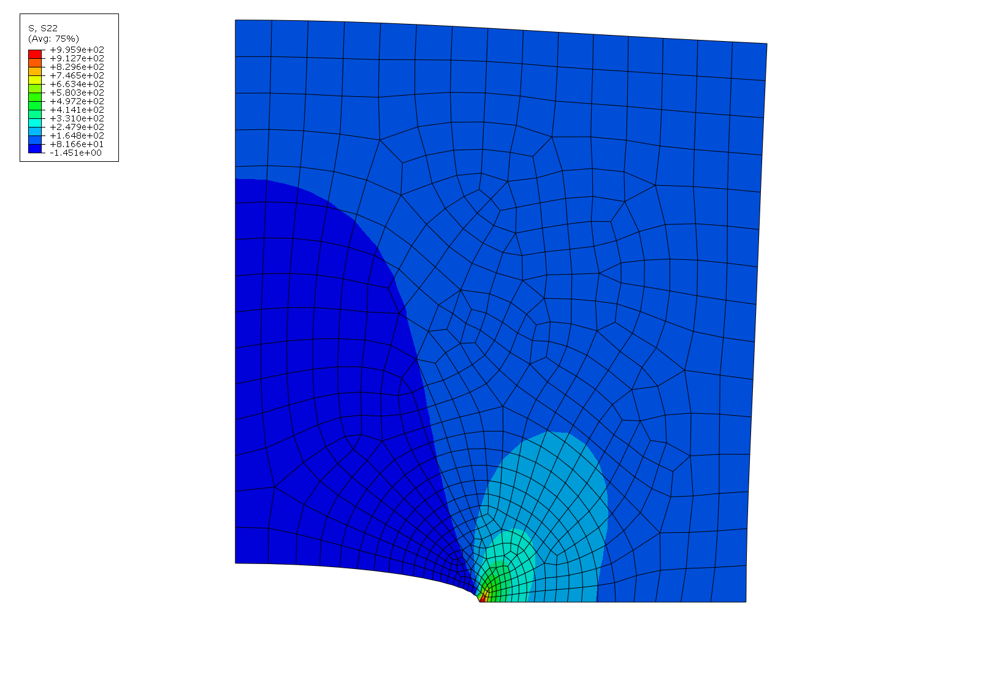
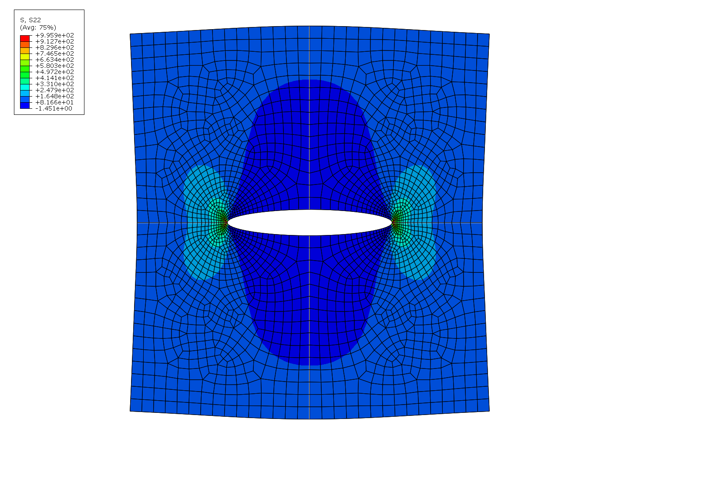

##  AE 737: Mechanics of Damage Tolerance
Lecture 23 - Finite Elements

Dr. Nicholas Smith

Wichita State University, Department of Aerospace Engineering

April 30, 2020

----
##  schedule

- 30 Apr - Finite Elements
- 5 May - Special Topics
- 7 May - Special Topics
- 14 May - Final Projects Due

---
# finite element techniques

----
## finite element methods in fracture

-   Direct method (use near-tip stress field)
    -   Requires very fine mesh near the tip to be accurate
    -   Can be made feasible with specialty elements

----
## fem in fracture

-   Crack closure method
    -   An energy based method
    -   Calculate energy to close crack one element away from crack tip
    -   Can have a courser mesh than direct method

----
## fem in fracture

- J-integral method
    - Many FE codes give a convenient method to calculate the J-integral
    - Learn about this in 837, but gives a mesh-independent way to calculate stress intensity

----
## fem in fracture

-   Cohesive elements
    -   Specialty elements act like an adhesive between two materials
    -   Used to model crack propagation when crack path (and material behavior) are known

----
## fem in fracture

-   XFEM
    -   eXtended Finite Element Method
    -   Can predict crack growth in any direction
    -   Adds extra physics model inside an element (fine mesh not necessarily required)

----
## direct method

-   We already know that the stress field near the crack tip is
    
$$\\sigma\_{yy} = \\frac{K\_I}{\\sqrt{2 \\pi x}}$$

-   We can solve this for $K_I$ and we should (in theory) be able to calculate $K_I$
-   We will get a unique $K_I$ value for every point (*x*) along crack plane

----
## direct method

-   For this method to be accurate, we need to capture the singularity at crack tip
-   This requires a very fine mesh (computationally expensive)
-   Alternatively, many FE packages include “singularity” elements which allow a coarse(r) mesh

----
## modeling tips

-   Use symmetry in your model to reduce node count
-   Center-crack can be modeled using on 1/4 of the model
-   Use biased node seeding (more nodes near tip)

----
## symmetry

 <!-- .element width="60%" -->

----
## symmetry

 <!-- .element width="60%" -->

----
## analyzing results

-   If our results are accurate, we should be able to calculate the same $K_I$ at any point
-   To ensure convergence, we plot the calculated $K_I$ vs. *x* (distance from crack tip)
-   In the region where this plot is a horizontal line, we consider a converged $K_I$

----
## analyzing results

-   It is also possible to consider the crack opening displacement

$$u\_y = \\frac{K\_I(\\kappa + 1)}{4 G \\pi}\\sqrt{-2 \\pi x}$$

-   Where $\kappa$ is to easily differentiate between plane stress and plane strain
    
$$\\begin{aligned}
  \\kappa &= 3 - 4\\nu & \\text{(plane strain)}\\\\
  \\kappa &= \\frac{3-\\nu}{1+\\nu} & \\text{(plane stress)}
\\end{aligned}$$

----
## stress results 

<!--
{
  "initialize": "function(container) {
  var trace1 = {
    x: [5.45E-02, 1.13E-01, 1.79E-01, 2.54E-01, 3.39E-01, 4.35E-01, 5.44E-01, 6.69E-01, 8.10E-01, 9.70E-01, 1.15195],	
    y: [995.851, 638.229, 524.483, 437.773, 382.712, 337.833, 303.788, 275.233, 251.72 , 231.981, 215.293],
    mode: 'lines',
    type: 'scatter',
    name: 'stress'
  };
  var trace2 = {
    x: [5.45E-02, 1.13E-01, 1.79E-01, 2.54E-01, 3.39E-01, 4.35E-01, 5.44E-01, 6.69E-01, 8.10E-01, 9.70E-01, 1.15195],
    y: [582.6797823, 537.8621906, 556.3459015, 553.0662241, 558.461596, 558.5840646, 561.8763421, 564.1008252, 567.7205204, 572.6588527, 579.2108094],
    mode: 'lines',
    type: 'scatter',
    yaxis: 'y2',
    name: 'stress intensity'
  };
  var data = [trace1, trace2];
  layout = {
    xaxis: {
      title: 'x'
    },
    yaxis: {
      title: 'stress'
    },
    yaxis2: {
      title: 'stress intensity',
      titlefont: {color: 'rgb(148, 103, 189)'},
      tickfont: {color: 'rgb(148, 103, 189)'},
      overlaying: 'y',
      side: 'right'
    }
  };
  Plotly.newPlot('stress', data, layout);
	}"
}
-->

----
## displacement results

<!--
{
  "initialize": "function(container) {
  var trace1 = {
    x: [5.56E-02, 1.10E-01, 1.76E-01, 2.48E-01, 3.32E-01, 4.26E-01, 5.33E-01, 6.55E-01, 7.94E-01, 9.51E-01, 1.13091],
    y: [2.09E-02, 2.44E-02, 3.42E-02, 3.84E-02, 4.63E-02, 5.10E-02, 5.80E-02, 6.32E-02, 6.99E-02, 7.56E-02, 8.22E-02],
    mode: 'lines',
    type: 'scatter',
    name: 'displacement'
  };
  var trace2 = {
    x: [5.56E-02, 1.10E-01, 1.76E-01, 2.48E-01, 3.32E-01, 4.26E-01, 5.33E-01, 6.55E-01, 7.94E-01, 9.51E-01, 1.13091],
    y: [5.48E+02, 4.53E+02, 5.04E+02, 4.76E+02, 4.96E+02, 4.83E+02, 4.90E+02, 4.82E+02, 4.84E+02, 4.78E+02, 4.77E+02],
    mode: 'lines',
    yaxis: 'y2',
    type: 'scatter',
    name: 'stress intensity'
  };
  var data = [trace1, trace2];
  layout = {
    xaxis: {
      title: 'x'
    },
    yaxis: {
      title: 'displacement'
    },
    yaxis2: {
      title: 'stress intensity',
      titlefont: {color: 'rgb(148, 103, 189)'},
      tickfont: {color: 'rgb(148, 103, 189)'},
      overlaying: 'y',
      side: 'right'
    }
  };
  Plotly.newPlot('disp', data, layout);
	}"
}
-->

