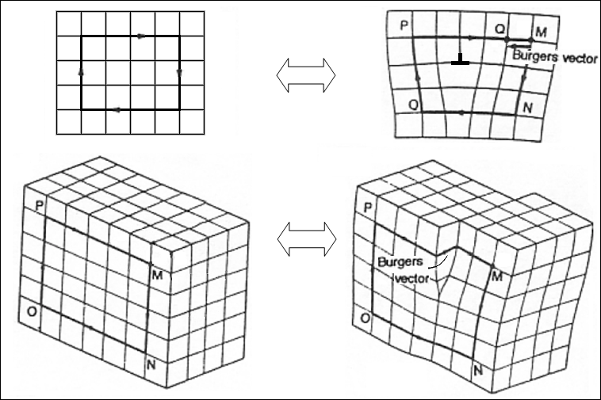

##  AE 737: Mechanics of Damage Tolerance
Lecture 27 - Damage Mechanics 

Dr. Nicholas Smith

Wichita State University, Department of Aerospace Engineering

May 9, 2019

----
##  schedule

- 9 May - Damage Mechanics, Final Projects Due

----
## outline

<!-- vim-markdown-toc GFM -->

* advanced mechanics of damage tolerance
* failure
* spherical void growth
* cylindrical void growth
* micro cracks
* fracture mechanics
* corrosion
* aging
* dislocation theory
* dislocations in linear elasticity
* peach koehler force
* discrete dislocation dynamics

<!-- vim-markdown-toc -->

---
# advanced mechanics of damage tolerance

----
## syllabus

- Elastic stress field
- Energy approach to fracture
- Finite elements
- Crack tip plasticity
- Elastic-Plastic Fracture
- Mixed-mode fracture
- Cohesive Zone modeling
- Interfacial Cracks

----
## general organization

- First 4 weeks are focused on analytical fracture mechanics
- Solving fracture problems using Elasticity
- Rest of class is more focused on finite elements, including some work days
- Final project involving crack propagation

---
# failure

----
## failure

-   Ductile fracture
    -   plastic deformation prior to failure
    -   dimpled, cup and cone fracture surface
-   Brittle fracture
    -   rapid crack propagation
    -   generally flat fracture surface
    -   common in glasses, thermoset polymers, brittle metals (BCC and HCP crystals)

----
## fracture surface

----
## ductile fracture surface

 <!-- .element width="50%" -->

----
## ductile fracture surface

 <!-- .element width="50%" -->

----
## brittle fracture surface

 <!-- .element width="50%" -->

----
## brittle fracture surface

 <!-- .element width="50%" -->

----
## transition

 <!-- .element width="50%" -->

----
## what affects failure method

-   While some materials are generally ductile or brittle, there are factors that can cause brittle failure in a ductile material
-   Strain rate (materials are often more brittle at high strain rates)
-   Temperature also affects ductility of many materials

----
## temperature effects

---
# spherical void growth

----
## void growth

-   From what we have observed on fracture surfaces, it appears that ductile materials fail due to void growth
-   Some of the earliest and simplest micromechanical damage models are for spherical void growth
-   Spherical voids are typical of uniaxial tension

----
## spherical voids in viscous materials

-   If we consider a spherical void in a linear, viscous RVE under some uniform remote stress, *σ*∞ the constitutive behavior is

$$\\sigma\_{ij} = L\_{ijkl}\\dot{\\epsilon}\_{kl}$$

-   *L* is analogous to the stiffness tensor, but relates stress to strain-rate
-   For an isotropic material, we can define *L* in terms of *η* and *ν* to give the familiar relationshiop

$$\\sigma\_{ij} = 2\\eta \\left(\\dot{\\epsilon}\_{ij}+\\frac{\\nu}{1-2\\nu} \\dot{\\epsilon}\_{kk}\\delta\_{ij}\\right)$$

----
## spherical voids in viscous materials

-   Eshelby’s model holds true for a viscous material as well as a solid, so we can find the stress inside the void as

$$\\sigma\_{ij} = L\_{ijkl}\\left(\\dot{\\epsilon}\_{kl}^\\infty + \\dot{\\epsilon}\_{kl}^d - \\dot{\\epsilon}\_{kl}^\*\\right)$$

-   But we know that there is no stress inside the void, thus we can say

$$\\dot{\\epsilon}\_{kl}^\\infty + \\dot{\\epsilon}\_{kl}^d - \\dot{\\epsilon}\_{kl}^\* = 0$$

-   Where, in this case, $\\dot{\\epsilon}\_{kl}^\*$ is the strain-rate of the void

----
## spherical voids in viscous materials

-   pp. 266-267 in the text show the details for calculating the Eshelby tensor with a spherical void
-   However, when a non-uniform load is applied (uni-axial or biaxial tension) the void will no longer be spherical
-   Also, there are not many solids that can be adequately described with a linearly viscous constitutive law

---
# cylindrical void growth

----
## mcclintock solution

-   McClintock developed the first widely-accepted void growth model
-   He assumed a cylindrical void shape (for tension along the cylinder axis)
-   He assumed the material surrounding the void was incompressible, rigid-plastic
-   In spite of the simplifications made, this model has served as a benchmark for many homogeneous schemes.

----
## mcclintock solution

-   To date, the mcClintock solution is the only exact analytic solution for void growth in non-linear solids
-   A full derivation, for some assumptions in yield criterion and plastic flow rule is in text pp. 268-271

----
## mcclintock solution

-   For the Von Mises (J2) yield criterion and the flow rule defined on p. 268, we find

$$\\frac{\\dot{a}}{a} = \\frac{\\sqrt{3}}{2}|\\dot{\\epsilon}\_z| \\sinh \\left(\\frac{\\sqrt{3}\\sigma^\\infty}{\\sigma\_{YS}}\\right) - \\frac{1}{2} \\dot{\\epsilon}\_z$$

-   McClintock predicts that void growth increases exponentially with applied stress, while the linear viscous solution predicts a linear relationship between void growth and stress

----
## mcclintock solution

-   Many damage models use the volume fraction of voids
-   In the McClintock solution, the matrix is considered incompressible
-   This means we can write the rate of change of volume fraction as

$$\\dot{f} = \\sqrt{3} f (1-f) |\\dot{\\epsilon}\_z|\\sinh\\left(\\frac{\\sqrt{3}\\sigma\_{11}}{|\\sigma\_{33}-\\sigma\_{11}|}\\right)$$

----
## gurson model

-   Gurson’s model builds on McClintock’s solution
-   He homegenizes the micro-stress to define a yield function entirely in terms of the macro-stresses
-   A full derivation (for the same assumptions as McClintock) is on pp. 273-277

----
## gurson model

-   Gurson defines several intermediate stress calculations

$$\\begin{aligned}
  \\sigma\_{eq} &= \\sqrt{\\frac{3}{2}\\sigma\_{ij}^\\prime\\sigma\_{ij}^\\prime}\\\\
  \\sigma\_{ij}^\\prime &= \\sigma\_{ij} - \\sigma\_m\\\\
  \\sigma\_m &= \\frac{1}{3} \\sigma\_{ii}
\\end{aligned}$$

----
## gurson model

-   He then finds the yield function as

$$\\left(\\frac{\\sigma\_{eq}}{\\sigma\_{YS}}\\right)^2 + 2f\\cosh\\left( \\frac{\\sqrt{3}\\sigma\_{11}}{\\sigma\_{YS}}\\right) - (1+f^2) = 0$$

-   Note: in Gurson’s assumptions, the cyldiner is along the 3 direction and an axi-symmetric state of stress with *σ*11 = *σ*22 was assumed.
-   Also, these stress quantities are volume averaged over the RVE
-   Gurson has essentially used micromechanics to define a new constitutive relation

----
## gurson tvergaard needleman

-   Some moderate improvements were made to the Gurson model and are known as the Gurson-Tvergaard-Needleman model
-   An elastic-plastic model with power-law hardening is used (instead of rigid plastic)

$$\\bar{\\sigma}\_0 = \\sigma\_{YS} \\left( 1-\\frac{E}{\\sigma\_{YS}}\\bar{\\epsilon}\_p\\right)^N$$

-   Tvergaard modified McClintock’s void growth solution with a numerical analysis for a periodic array of voids
-   Needleman introduced an equivalent damage parameter, *f*\* instead of volume fraction of voids.
-   Equivalent damage includes void growth and nucleation of new voids

----
## needleman

-   Needleman’s contribution is to account for the rapid reduction in stiffness at some critical void volume fraction

$$f^\*(f) = \\begin{cases}
  f & \\text{if } f \\le f\_c\\\\
  f\_c + \\frac{1/q\_1-f\_c}{f\_f-f\_c}(f-f\_c) & \\text{if } f\_c &lt; f \\le f\_f \\\\
  1/q-1 & \\text{if } f &gt; f\_f
\\end{cases}$$

-   Where *f**c* is the void volume fraction at the incidence of coalescence
-   *f**f* is the void volume fraction at failure

---
# micro cracks

----
## micro cracks

-   There are many micro-crack damage models
-   Some factors differentiating the models are whether they include plasticity
-   Also whether they can handle anisotropy or heterogeneity
-   Fracture mechanics becomes much more complicated in anisotropic or heterogeneous materials

----
## micro cracks

-   The Barenblatt-Dugdale model assumes micro-crack density is a measure of the damage state
-   A key assumption is that the overall damage (due to permanent crack growth) is only associated with the hydrostatic stress
-   Deviatoric stress has no effect
-   This is essentially assuming cracks only grow in Mode I

----
## fracture mechanics

-   In fracture mechanics we consider three different modes
-   Mode I is known as the “opening mode”
-   Mode II is known as the “sliding mode”
-   Mode III is known as the “tearing mode”

---
# fracture mechanics

----
## mixed-mode

-   In fracture mechanics, we can consider the effect of the deviatoric stress on a crack
-   Mixed-mode fracture analysis shows that cracks will always tend to open due to Mode I
-   Shear stresses (i.e. deviatoric stress) can effect the principal stresses near a crack tip
-   For many micro-cracks in a representative volume, we assume this effect is negligible

----
## cohesive zone

-   The Barenblatt-Dugdale model also assumes that there is a cohesive zone around the crack
-   Cohesive zones are an alternate approach to modeling cracks

----
## cohesive elements

-   Cohesive elements are one way to model crack propagation
-   We need to know the crack path in advance, we model the the crack growth using a traction-separation law
-   The cohesive zone theory assumes stress can never reach infinity, the maximum allowable stress in a material is the stress required to separate atoms
-   The stress required to separate the atoms changes as a function based on their Traction-Separation law, until the atomic bond is broken

----
## cohesive zone

 <!-- .element width="50%" -->

----
## traction separation

 <!-- .element width="50%" -->

----
## cohesive zone uses

-   In practice, the cohesive zone can be used to model crack growth
-   It is most often used to model de-bonding of adhesives
-   Also commonly used to model delamination in composites

----
## dcb

----
## single crack

-   To solve the problem of many cohesive cracks in an RVE, we first consider the case of a single crack
-   For a crack under a uniform tri-axial stress, we consider the superposition

----
## superposition

----
## cohesive stress

-   The cohesive stress, *σ*0 can be found as

$$\\frac{\\sigma\_0}{\\Sigma\_m} = \\frac{1+\\sqrt{\\left(\\frac{4}{1-2\\nu^\*}\\frac{\\sigma\_YS}{\\Sigma\_m}\\right)^2-3}}{4}$$

----
## macro strain

-   The macro strain tensor is not necessarily the volume average
-   This is due to the discontinuities (cracks)
-   The macro stress is the volume average (crack surfaces are traction free)

----
## macro strain

-   One technique for finding the macro strain involves finding some additional strain term
    ℰ*ij* = *ϵ**ij*0 + *ϵ**ij*(*add*)

-   Where *ϵ**ij*0 = *D**ijkl**σ**kl* and *ϵ**ij*(*add*) = *H**ijkl**σ**kl*

----
## additional strain

-   The additional strain is given by

$$\\epsilon\_{ij}^{(add)} = \\frac{4f(1-\\nu^\*)\\Sigma\_m\\delta\_{ij}}{3\\beta \\pi \\mu^\* \\sqrt{1-\\left(\\frac{\\Sigma\_m}{\\sigma\_0}\\right)^2}}$$

-   Where *β* is the ratio between the volume of the physical crack and the volume of the cohesive crack and *f* is the effective volume fraction of cracks
-   While cracks are assumed to be “penny-shaped” disks, their volume is treated as spherical for these purposes

----
## interaction effect

-   In the above calculations, properties with a * superscript an be calculated as either matrix or average properties
-   We can capture the interaction effect by using average properties
-   This is similar to the self-consistent model, and would need to be found iteratively
-   Note: this does not model damage growth, which is still a field of active research, particularly in micromechanics

---
# corrosion

----
## corrosion

-   Corrosion can be difficult to accelerate in a lab (like fatigue), and so is not as well-understood
-   There are several general categories of corrosion
-   General corrosion - occurs equally and globally
-   Localized corrosion - occurs at specific locations
-   Metallurgically influenced corrosion - grain boundaries, dealloying
-   Mechanically assisted degradation
-   Environmentally induced cracking

----
## general corrosion

-   Atmospheric corrosion
-   Galvanic corrosion (dissimilar metals in contact)

----
## localized corrosion

-   Similar to general corrosion, but localized
-   Can accelerate the development of fatigue cracks
-   Pitting

----
## metallurgical corrosion

-   Different concentrations of alloy constituents at grain boundaries
-   Galvanic corrosion at a grain boundary could be possible
-   Exfoliation is a form of this that can occur in aluminum alloys with elongated grains parallel to the surface
-   Fasteners with dissimilar materials can also cause metallurgical corrosion

----
## mechanically assisted degradation

-   Chemical effects combined with mechanical stress
-   Fretting corrosion (abrasive corrosion particles, like oxides, trapped can lead to more corrosion)
-   Corrosion fatigue

----
## environmentally induced cracking

-   stress corrosion cracking
-   hydrogen damage, embrittlement

---
# aging

----
## aging

-   Aging is a term often used to describe the degradation of polymers
-   Most polymers are not “pure” but contain some fraction of additives to modify the properties
-   Commonly they will have a “plasticizer” which lowers the glass transition temperature
-   As these plasticizers degrade, the polymer becomes more brittle

---
# dislocation theory

----
## damage vs. dislocation

-   We previously discussed a couple of damage models for materials
-   Void growth for ductile materials and micro-crack coalescence for brittle materials
-   Sometimes initial defects are neither voids nor micro-cracks
-   Dislocation theory attempts to model the effects of materal discontinuities that are not cracks

----
## material defects

-   There are many different types of material defects
-   0-dimensional defects
    -   Point defects (vacancies, interstitials)
    -   Impurity atoms

----
## material defects

-   1-dimensional defects
    -   Dislocations
-   2-dimensional defects
    -   Stacking faults
    -   Grain boundaries

----
## material defects

-   3-dimensional defects
    -   Voids
    -   Precipitates
    -   More complicated stacking faults

----
## material defects

----
## edge dislocations

 <!-- .element width="50%" -->

----
## screw disolcation

----
## dislocation animations

<video src="../images/c-t-stresses.mp4"/>

----
## dislocation animations

<video src="../images/shear-stresses.mp4"/>

----
## dislocation modeling

-   There are multiple ways of modeling discontinuities
-   Elasticity Theory - strong discontinuity in the displacement field
-   Peach-Koehler force
-   Discrete Dislocation Dynamics

---
# dislocations in linear elasticity

----
## screw dislocation

-   A Volterra dislocation is defined as a discontinuity of the displacement field over a line segment or surface
-   For screw dislocations, we consider the anti-plane problem with
    *u*1 = 0  *u*2 = 0  *u*3 = *w*(*x*, *y*)
-   For an isotropic material, the only non-zero stress and strain components are

$$\\epsilon\_{13} = \\frac{1}{2}\\frac{\\partial w}{\\partial x} \\qquad \\epsilon\_{23} = \\frac{1}{2}\\frac{\\partial w}{\\partial y}$$

and

$$\\sigma\_{13} = \\mu\\frac{\\partial w}{\\partial x} \\qquad \\sigma\_{23} = \\mu\\frac{\\partial w}{\\partial y}$$

----
## screw dislocation

-   There is only one non-trivial equilibrium equation in this case

$$\\frac{\\partial \\sigma\_{13}}{\\partial x\_1} + \\frac{\\partial \\sigma\_{23}}{\\partial x\_2} + \\frac{\\partial \\sigma\_{33}}{\\partial x\_3} = 0$$

-   Which gives the governing equation

$$\\frac{\\partial^2 w}{\\partial x\_1^2} + \\frac{\\partial^2 w}{\\partial x\_2^2} = \\nabla^2 w =  0$$

----
## screw dislocation

-   We can now convert the governing equation to polar coordinates

$$\\nabla^2 w = \\left( \\frac{\\partial^2}{\\partial^2 r} + \\frac{1}{r}\\frac{\\partial}{\\partial r} + \\frac{1}{r^2}\\frac{\\partial^2}{\\partial\\theta^2}\\right)w = 0$$

-   Solving by the separation of variables with *w*(*r*, *θ*)=*f*(*r*)*g*(*θ*) we find to ODE’s

$$\\begin{aligned}
  \\frac{d^2 f}{dr^2} + \\frac{1}{r}\\frac{df}{dr} - \\frac{n^2 f}{r^2} &=0\\\\
  \\frac{d^2g}{d\\theta^2} + n^2g(\\theta) &= 0
\\end{aligned}$$

----
## screw dislocation

-   The only admissible solution (with finite displacement at *r* = 0) to this is

$$\\begin{aligned}
  g(\\theta) &= A + B\\theta\\\\
  f(r) &= C \\ln r + D
\\end{aligned}$$

-   We require *C* = 0 since our solution must be valid at *r* = 0, and the jump condition means *A* = 0

-   Further, since *θ* is a “constant” in *r*, we can combine the remaining constants, *B* and *D* to find
    *w*(*r*, *θ*)=*Bθ*

----
## screw dislocation

-   The jump condition requires that
    *w*(*r*, 2*π*)−*w*(*r*, 0)=*b*

-   Hence

$$w(r,\\theta) = \\frac{\\theta b}{2\\pi}$$

$$w(x,y) = \\frac{b}{2\\pi} \\arctan \\left(\\frac{y}{x}\\right)$$

----
## edge dislocation

-   We can use an Airy stress function in plane strain to solve the edge dislocation problem
-   See derivation in text pp. 303-305
-   Elasticity solutions are not often able to model dislocations very well
-   Some simple estimates (energy per unit length) are generally useful when applied within appropriate limits of the solution

---
# peach koehler force

----
## peach koehler force

-   If we consider a dislocation loop that undergoes some virtual displacement
-   We can find the virtual work done by this virtual displacement
-   The decrease in potential energy due to the virtual displacement is the external virtual work done along the dislocation loop
    *δE* = −*F* ⋅ *δη* = −∫*L**F**l**dl* ⋅ *δη*

-   This is the Peach-Koehler equation, and it can be used to predict the direction a dislocation will move under external stresses

----
## peach koehler force

-   The Peach-Koehler force can be expressed in a simplified form as
    *F**l* = *g* × *t*

-   Where *t* is the unit vector of the dislocation line and *g* = *σ* ⋅ *b* where *b* is the Burger vector

----
## burger vector

---
# discrete dislocation dynamics

----
## discrete dislocation dynamics

-   There are many different forms of discrete dislocation dynamics analyses
-   One form is based on the Galerkin weak formulation, used in finite elements
-   The virtual work principle is used to build the formulation

----
## discrete dislocation dynamics

-   In addition to the usual virtual displacements, there are other internal work components to be considered
-   These are often lumped together with friction, but also can included chemical forces (Osmotic force)
-   Multiple dislocation loops can be discretized to transform the integral for virtual work into a summation

